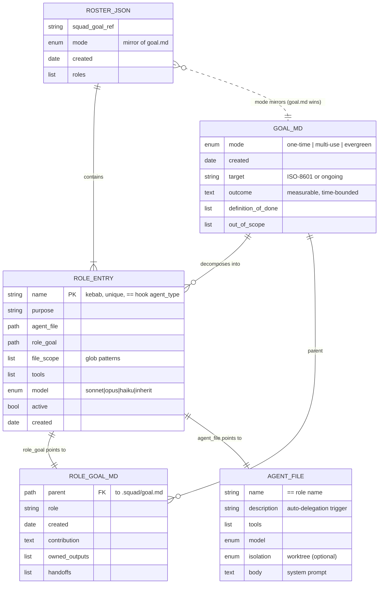
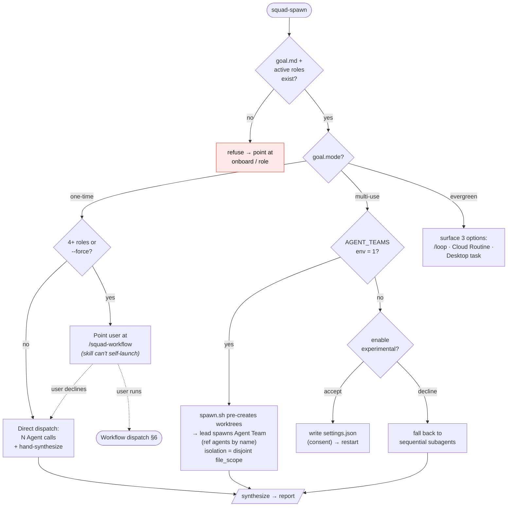
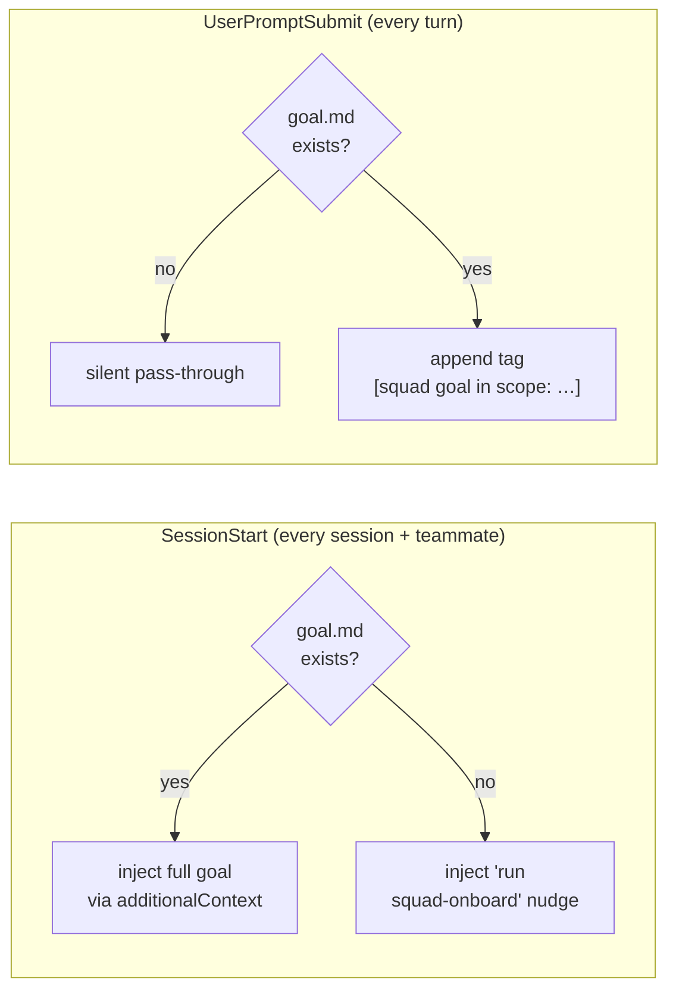
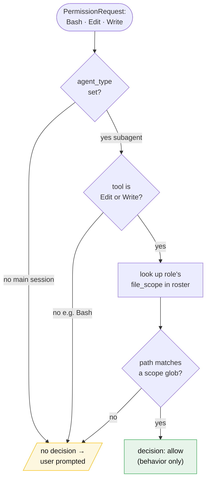
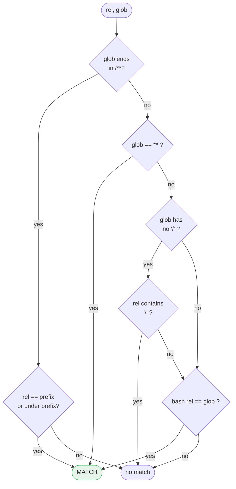
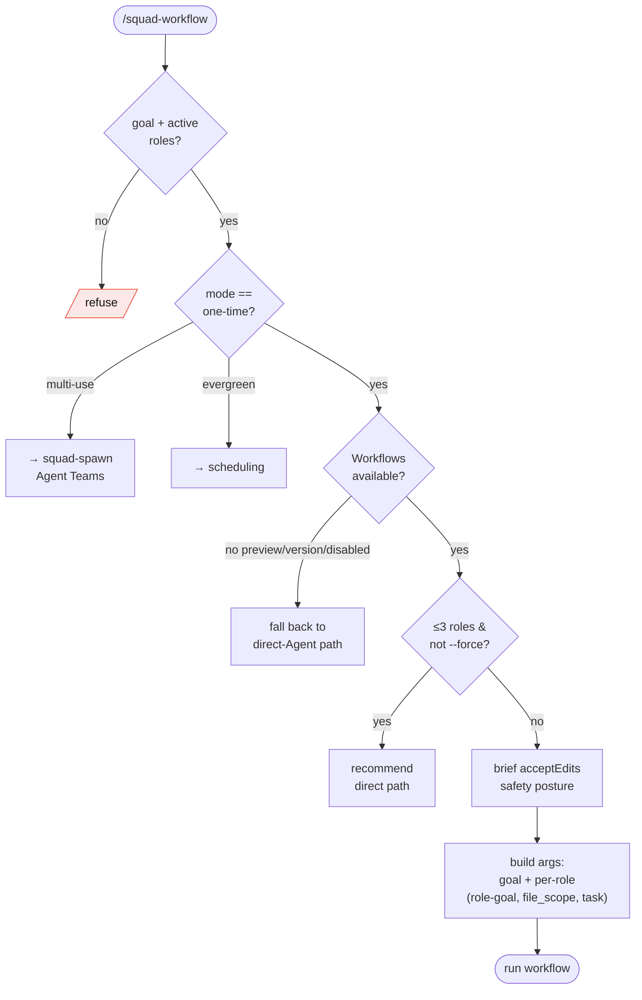
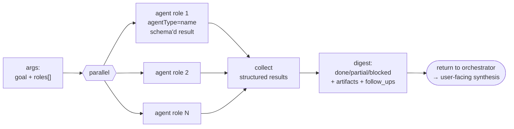
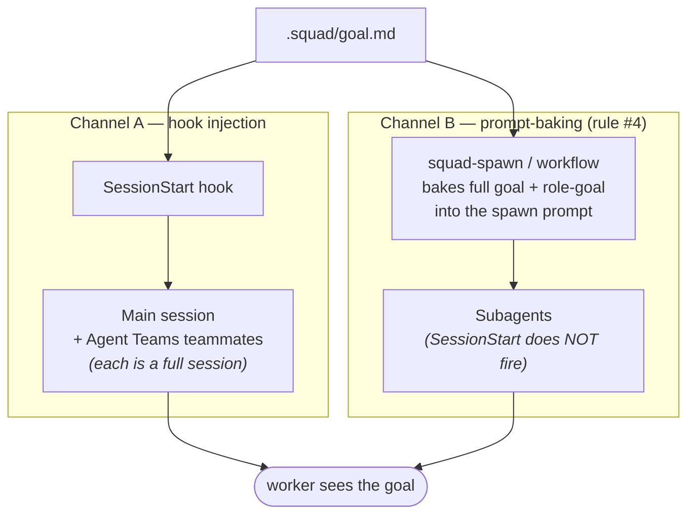
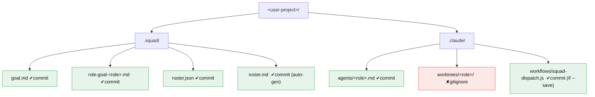

# cheeky-squad-os — Logic, Schemas & Flow

A visual companion to [`ARCHITECTURE.md`](ARCHITECTURE.md). This document shows
**what the plugin does, as diagrams**: the component map, the end-to-end
lifecycle, the data schemas and how they relate, the decision logic inside each
skill and hook, and the dispatch flows (including the optional dynamic-Workflow
backend).

> All diagrams are [Mermaid](https://mermaid.js.org/) — they render on GitHub and
> in most Markdown viewers.

---

## 1. System map

What ships in the plugin, what it generates in the user's project, and how the
pieces talk.

```mermaid
flowchart TB
    subgraph PLUGIN["📦 cheeky-squad-os (ships)"]
        direction TB
        subgraph SKILLS["skills/"]
            ONB["squad-onboard<br/><i>entry point</i>"]
            GOAL["squad-goal<br/><i>owns goal.md</i>"]
            ROLE["squad-role<br/><i>role generator</i>"]
            ROST["squad-roster<br/><i>owns roster.json</i>"]
            SPAWN["squad-spawn<br/><i>dispatch</i>"]
        end
        subgraph CMDS["commands/"]
            WF["/squad-workflow<br/><i>Workflow dispatch</i>"]
        end
        subgraph HOOKS["hooks/"]
            H1["SessionStart"]
            H2["UserPromptSubmit"]
            H3["PermissionRequest"]
        end
        subgraph TPL["templates/"]
            T1["goal.md"]
            T2["role-goal.md"]
            T3["role-definition.md"]
            T4["roster.json"]
            T5["squad-dispatch.workflow.js"]
        end
    end

    subgraph PROJECT["📂 user's project (generated)"]
        direction TB
        GMD[".squad/goal.md"]
        RGMD[".squad/role-goal-&lt;role&gt;.md"]
        RJSON[".squad/roster.json"]
        AGENTS[".claude/agents/&lt;role&gt;.md"]
        WT[".claude/worktrees/&lt;role&gt;/"]
        WFJS[".claude/workflows/squad-dispatch.js"]
    end

    ONB --> GOAL --> GMD
    ONB --> ROLE
    ROLE --> AGENTS
    ROLE --> RGMD
    ROLE --> ROST --> RJSON
    ONB --> SPAWN
    SPAWN -->|One-time| AGENTS
    SPAWN -->|Multi-use| WT
    SPAWN -.points user at.-> WF
    WF --> WFJS
    WF --> T5

    H1 -.reads.-> GMD
    H2 -.reads.-> GMD
    H3 -.reads.-> RJSON

    classDef ship fill:#e8f0fe,stroke:#4285f4,color:#111;
    classDef gen fill:#e6f4ea,stroke:#34a853,color:#111;
    class ONB,GOAL,ROLE,ROST,SPAWN,WF,H1,H2,H3,T1,T2,T3,T4,T5 ship;
    class GMD,RGMD,RJSON,AGENTS,WT,WFJS gen;
```



**Reading it:** blue = ships in the plugin (zero role files). Green = generated
per goal in the user's project. The hooks (dashed) only *read* generated state;
they never write it.

---

## 2. End-to-end lifecycle

From "I have a goal" to a synthesized deliverable.

```mermaid
sequenceDiagram
    autonumber
    actor U as User
    participant ONB as squad-onboard
    participant GOAL as squad-goal
    participant ROLE as squad-role
    participant ROST as squad-roster
    participant SPAWN as squad-spawn
    participant W as Worker(s)

    U->>ONB: I want to &lt;goal&gt;
    ONB->>U: "Do you have a goal?"
    U-->>ONB: answer
    ONB->>ONB: reformulate → outcome · infer mode · decompose
    ONB->>GOAL: write .squad/goal.md
    loop per workstream
        ONB->>ROLE: generate role
        ROLE->>U: 6 interactive questions
        ROLE->>ROST: register role
        ROLE->>ROLE: write .claude/agents/&lt;role&gt;.md + role-goal
    end
    ONB->>SPAWN: dispatch
    SPAWN->>GOAL: read goal (mode)
    SPAWN->>ROST: read active roles
    SPAWN->>W: spawn with goal+role-goal BAKED in (rule #4)
    W-->>SPAWN: deliverables (written to file_scope)
    SPAWN->>U: synthesized report
```

---

## 3. Data schemas & relationships

### 3.1 How the four artifacts relate



### 3.2 `.squad/goal.md` (the north-star — rule #1)

```markdown
---
mode: one-time | multi-use | evergreen
created: <ISO-8601>
target: <ISO-8601 deadline | "ongoing">
---

# Squad goal
<one outcome-framed paragraph — measurable, time-bounded>

## Definition of done
- <observable signal 1>
- <observable signal 2>

## Out of scope
- <explicit exclusion>
```

### 3.3 `.squad/roster.json` (source of truth for the squad)

```json
{
  "squad_goal_ref": ".squad/goal.md",
  "mode": "one-time",
  "created": "<ISO-8601>",
  "roles": [
    {
      "name": "klaviyo-data-puller",
      "purpose": "Pull Klaviyo flow performance via MCP and dump as JSON",
      "agent_file": ".claude/agents/klaviyo-data-puller.md",
      "role_goal": ".squad/role-goal-klaviyo-data-puller.md",
      "file_scope": ["reports/klaviyo/**", "data/klaviyo/**"],
      "tools": ["Read", "Write", "Bash", "mcp__claude_ai_Klaviyo__*"],
      "model": "sonnet",
      "active": true,
      "created": "<ISO-8601>"
    }
  ]
}
```

> `mode` here is a **mirror** of `goal.md` (re-derived on every roster write).
> `squad-spawn` always reads mode from `goal.md`, never from the roster.
> `.squad/roster.md` is an auto-generated human view — never read from it.

### 3.4 `.claude/agents/<role>.md` (subagent definition — dual-purpose)

```yaml
---
name: <role-name>           # kebab, == roster name == hook agent_type
description: <Use when…>    # drives auto-delegation
tools: <comma-separated>
model: sonnet|opus|haiku|inherit
isolation: worktree         # optional; One-time subagents only
---
# <body = system prompt; reads goal.md + role-goal on every run>
```

Reusable as a **subagent** (via the `Agent` tool) and as an **Agent Teams
teammate**. When used as a teammate, `tools`/`model` propagate; `skills`/
`mcpServers` do **not**; the body is appended to the teammate's system prompt.

---

## 4. `squad-spawn` decision logic

The dispatch brain. Branches on `goal.mode`, with the optional Workflow backend
on the One-time path.



---

## 5. Hook logic

The three hooks are the **mechanical enforcement** layer (skill rules are
aspirational; hooks are real). All fail **open** — they never block on error.

### 5.1 SessionStart & UserPromptSubmit (goal-in-scope)



> Subagents do **not** fire SessionStart — their goal arrives via prompt-baking
> (rule #4). See §7.

### 5.2 PermissionRequest (file-scope enforcement)



**Glob matching (`path_in_scope`)** — fails *closed* to avoid over-approval:



> The "no `/` → single segment only" branch is the fix that stops `*.md` from
> matching `src/secrets.md` and silently auto-approving an out-of-scope write.

---

## 6. Dynamic-Workflow dispatch (optional, One-time only)

The opt-in backend. A skill **cannot** launch a workflow, so `/squad-workflow`
is the user-triggered entry; it preflights, gates, bakes inputs, then runs a
script shaped like `templates/squad-dispatch.workflow.js`.



**Inside the workflow script** (fan-out → synthesize):



> ⚠️ **Safety:** workflow subagents run in `acceptEdits` — file edits are
> auto-approved, **bypassing the PermissionRequest hook (§5.2)**. So this path
> fans out **read/analyze** roles whose writes are confined to their own
> `file_scope` *by instruction in the baked prompt*. Code-mutating roles stay on
> the hook-gated `squad-spawn` path, or run as their own write-stage workflow
> with a sign-off gate.

---

## 7. Goal injection — two channels, same end state

Every worker must see the goal (rule #2). *How* it arrives depends on the worker
type.



| Worker | SessionStart fires? | Goal arrives via |
| --- | --- | --- |
| Main session | ✅ | hook `additionalContext` |
| Agent Teams teammate | ✅ (full session) | hook + baked prompt (belt & suspenders) |
| Subagent (One-time / fallback) | ❌ | **prompt-baking only** (rule #4) |
| Workflow `agent()` | ❌ | baked into `args`, re-read by the agent |

---

## 8. On-disk layout



---

## 9. The hard rules (quick reference)

The invariants every diagram above upholds (full text in
[`ARCHITECTURE.md` § Hard rules](ARCHITECTURE.md#hard-rules)):

| # | Rule |
| --- | --- |
| 1 | One north-star — `goal.md` binds every action. |
| 2 | No worker without the goal in scope. |
| 3 | Bespoke roles only — zero default role files ship. |
| 4 | Prompt-baking is the only reliable parent→worker channel. |
| 5 | Explicit `file_scope`; hook auto-approves in-scope Edit/Write. |
| 6 | Mode controls cadence, not squad size. |
| 7 | Per-role file isolation via disjoint `file_scope`. |
