# cheeky-squad-os — Logic, Schemas & Flow

A visual companion to [`ARCHITECTURE.md`](ARCHITECTURE.md). This document shows
**what the plugin does, as diagrams**: the component map, the end-to-end
lifecycle, the data schemas and how they relate, the decision logic inside each
skill and hook, and the dispatch flows (including the optional dynamic-Workflow
backend).

> All diagrams are [Mermaid](https://mermaid.js.org/) — they render on GitHub and
> in most Markdown viewers.

---

## 1. System map

What ships in the plugin, what it generates in the user's project, and how the
pieces talk.

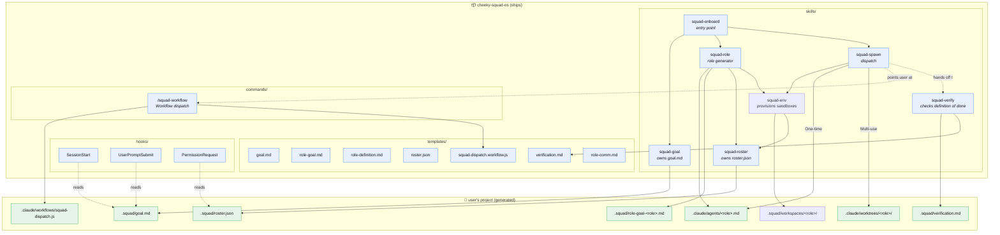
```mermaid
flowchart TB
    subgraph PLUGIN["📦 cheeky-squad-os (ships)"]
        direction TB
        subgraph SKILLS["skills/"]
            ONB["squad-onboard<br/><i>entry point</i>"]
            GOAL["squad-goal<br/><i>owns goal.md</i>"]
            ROLE["squad-role<br/><i>role generator</i>"]
            ENV["squad-env<br/><i>provisions sandboxes</i>"]
            ROST["squad-roster<br/><i>owns roster.json</i>"]
            SPAWN["squad-spawn<br/><i>dispatch</i>"]
            VER["squad-verify<br/><i>checks definition of done</i>"]
        end
        subgraph CMDS["commands/"]
            WF["/squad-workflow<br/><i>Workflow dispatch</i>"]
        end
        subgraph HOOKS["hooks/"]
            H1["SessionStart"]
            H2["UserPromptSubmit"]
            H3["PermissionRequest"]
        end
        subgraph TPL["templates/"]
            T1["goal.md"]
            T2["role-goal.md"]
            T3["role-definition.md"]
            T4["roster.json"]
            T5["squad-dispatch.workflow.js"]
            T6["verification.md"]
            T7["role-comm.md"]
        end
    end

    subgraph PROJECT["📂 user's project (generated)"]
        direction TB
        GMD[".squad/goal.md"]
        RGMD[".squad/role-goal-&lt;role&gt;.md"]
        RJSON[".squad/roster.json"]
        AGENTS[".claude/agents/&lt;role&gt;.md"]
        WT[".claude/worktrees/&lt;role&gt;/"]
        WS[".squad/workspaces/&lt;role&gt;/"]
        WFJS[".claude/workflows/squad-dispatch.js"]
        VMD[".squad/verification.md"]
    end

    ONB --> GOAL --> GMD
    ONB --> ROLE
    ROLE --> AGENTS
    ROLE --> RGMD
    ROLE --> ROST --> RJSON
    ROLE --> ENV
    ENV --> WS
    ENV --> ROST
    ONB --> SPAWN
    SPAWN --> ENV
    SPAWN -->|One-time| AGENTS
    SPAWN -->|Multi-use| WT
    SPAWN -.points user at.-> WF
    WF --> WFJS
    WF --> T5
    SPAWN -.hands off to.-> VER
    VER --> VMD
    VER --> T6

    H1 -.reads.-> GMD
    H2 -.reads.-> GMD
    H3 -.reads.-> RJSON

    classDef ship fill:#e8f0fe,stroke:#4285f4,color:#111;
    classDef gen fill:#e6f4ea,stroke:#34a853,color:#111;
    class ONB,GOAL,ROLE,ROST,SPAWN,VER,WF,H1,H2,H3,T1,T2,T3,T4,T5,T6,T7 ship;
    class GMD,RGMD,RJSON,AGENTS,WT,WFJS,VMD gen;
```

**Reading it:** blue = ships in the plugin (zero role files). Green = generated
per goal in the user's project. The hooks (dashed) only *read* generated state;
they never write it.

---

## 2. End-to-end lifecycle

From "I have a goal" to a synthesized deliverable.

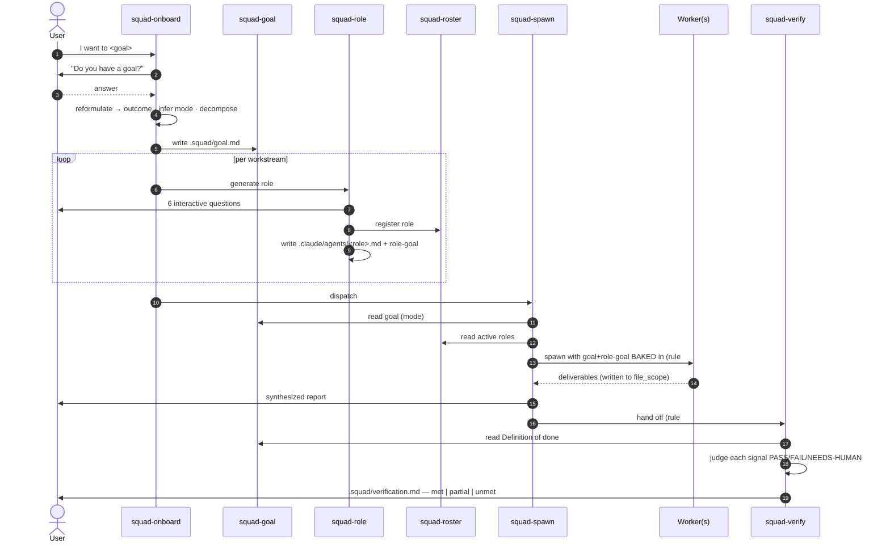
```mermaid
sequenceDiagram
    autonumber
    actor U as User
    participant ONB as squad-onboard
    participant GOAL as squad-goal
    participant ROLE as squad-role
    participant ROST as squad-roster
    participant SPAWN as squad-spawn
    participant W as Worker(s)

    U->>ONB: I want to <goal>
    ONB->>U: "Do you have a goal?"
    U-->>ONB: answer
    ONB->>ONB: reformulate → outcome · infer mode · decompose
    ONB->>GOAL: write .squad/goal.md
    loop per workstream
        ONB->>ROLE: generate role
        ROLE->>U: 6 interactive questions
        ROLE->>ROST: register role
        ROLE->>ROLE: write .claude/agents/<role>.md + role-goal
    end
    ONB->>SPAWN: dispatch
    SPAWN->>GOAL: read goal (mode)
    SPAWN->>ROST: read active roles
    SPAWN->>W: spawn with goal+role-goal BAKED in (rule #4)
    W-->>SPAWN: deliverables (written to file_scope)
    SPAWN->>U: synthesized report
    participant VER as squad-verify
    SPAWN->>VER: hand off (rule #10)
    VER->>GOAL: read Definition of done
    VER->>VER: judge each signal PASS/FAIL/NEEDS-HUMAN
    VER->>U: .squad/verification.md — met | partial | unmet
```

---

## 3. Data schemas & relationships

### 3.1 How the four artifacts relate

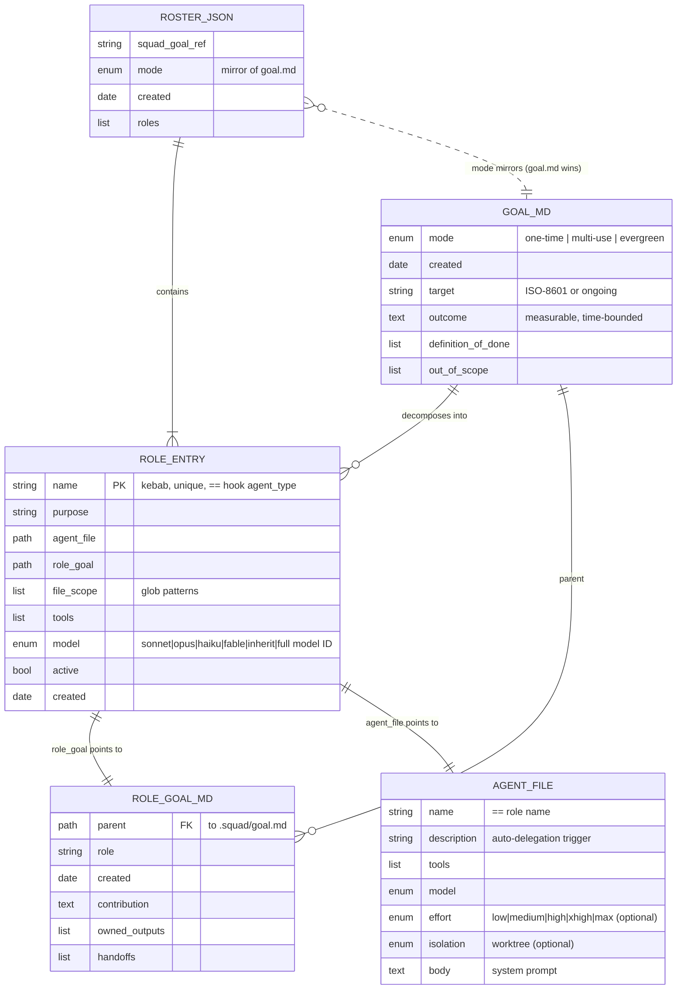
```mermaid
erDiagram
    GOAL_MD     ||--o{ ROLE_ENTRY   : "decomposes into"
    ROSTER_JSON ||--|{ ROLE_ENTRY   : "contains"
    ROLE_ENTRY  ||--|| ROLE_GOAL_MD : "role_goal points to"
    ROLE_ENTRY  ||--|| AGENT_FILE   : "agent_file points to"
    ROLE_GOAL_MD }o--|| GOAL_MD     : "parent"
    ROSTER_JSON }o..|| GOAL_MD      : "mode mirrors (goal.md wins)"

    GOAL_MD {
        enum   mode               "one-time | multi-use | evergreen"
        date   created
        string target             "ISO-8601 or ongoing"
        text   outcome            "measurable, time-bounded"
        list   definition_of_done
        list   out_of_scope
    }
    ROSTER_JSON {
        string squad_goal_ref
        enum   mode               "mirror of goal.md"
        date   created
        list   roles
    }
    ROLE_ENTRY {
        string name      PK        "kebab, unique, == hook agent_type"
        string purpose
        path   agent_file
        path   role_goal
        list   file_scope          "glob patterns"
        list   tools
        enum   model               "sonnet|opus|haiku|fable|inherit|full model ID"
        bool   active
        date   created
    }
    ROLE_GOAL_MD {
        path   parent    FK        "to .squad/goal.md"
        string role
        date   created
        text   contribution
        list   owned_outputs
        list   handoffs
    }
    AGENT_FILE {
        string name                "== role name"
        string description         "auto-delegation trigger"
        list   tools
        enum   model
        enum   effort              "low|medium|high|xhigh|max (optional)"
        enum   isolation           "worktree (optional)"
        text   body                "system prompt"
    }
```

### 3.2 `.squad/goal.md` (the north-star — rule #1)

```markdown
---
mode: one-time | multi-use | evergreen
created: <ISO-8601>
target: <ISO-8601 deadline | "ongoing">
---

# Squad goal
<one outcome-framed paragraph — measurable, time-bounded>

## Definition of done
- <observable signal 1>
- <observable signal 2>

## Out of scope
- <explicit exclusion>
```

### 3.3 `.squad/roster.json` (source of truth for the squad)

```json
{
  "squad_goal_ref": ".squad/goal.md",
  "mode": "one-time",
  "created": "<ISO-8601>",
  "roles": [
    {
      "name": "klaviyo-data-puller",
      "purpose": "Pull Klaviyo flow performance via MCP and dump as JSON",
      "agent_file": ".claude/agents/klaviyo-data-puller.md",
      "role_goal": ".squad/role-goal-klaviyo-data-puller.md",
      "file_scope": ["reports/klaviyo/**", "data/klaviyo/**", ".squad/workspaces/klaviyo-data-puller/**"],
      "tools": ["Read", "Write", "Bash", "mcp__claude_ai_Klaviyo__*"],
      "model": "sonnet",
      "environment": {
        "workspace": ".squad/workspaces/klaviyo-data-puller/",
        "dirs": ["inputs", "outputs", "scratch"],
        "env": { "REPORT_DIR": "outputs" },
        "context": [{ "from": "data/klaviyo/**", "into": "inputs", "kind": "copy" }],
        "tools": [{ "name": "jq", "kind": "system", "verify": "command -v jq" }]
      },
      "active": true,
      "created": "<ISO-8601>"
    }
  ]
}
```

> `mode` here is a **mirror** of `goal.md` (re-derived on every roster write).
> `squad-spawn` always reads mode from `goal.md`, never from the roster.
> `.squad/roster.md` is an auto-generated human view — never read from it.
> `environment` is **optional** — the role's sandbox spec, materialized by
> `squad-env` / `provision.sh` into `.squad/workspaces/<role>/` (gitignored).
> `workspace` must be project-relative (no `..`) and covered by `file_scope`.
> Contained parts (dirs, sourced `env`, local `context`, `kind:"local"` tools)
> are materialized; `kind:"system"`/`"mcp"`/network needs become `global_needs`
> proposed to the user — never run by the provisioner.

### 3.4 `.claude/agents/<role>.md` (subagent definition — dual-purpose)

```yaml
---
name: <role-name>           # kebab, == roster name == hook agent_type
description: <Use when…>    # drives auto-delegation
tools: <comma-separated>
model: sonnet|opus|haiku|fable|inherit|<full-id>
effort: low|medium|high|xhigh|max   # optional; defaults to session effort
isolation: worktree         # optional; One-time subagents only
---
# <body = system prompt; reads goal.md + role-goal on every run>
```

Reusable as a **subagent** (via the `Agent` tool) and as an **Agent Teams
teammate**. When used as a teammate, `tools`/`model` propagate; `skills`/
`mcpServers` — and `hooks` — do **not**; the body is appended to the
teammate's system prompt as additional instructions rather than replacing it.
Hook-based enforcement for a teammate must live in project-level hooks, not
role frontmatter. Teammates inherit the lead's **effort** level, but not its
`/model` selection.

---

## 4. `squad-spawn` decision logic

The dispatch brain. Branches on `goal.mode`, with the optional Workflow backend
on the One-time path.

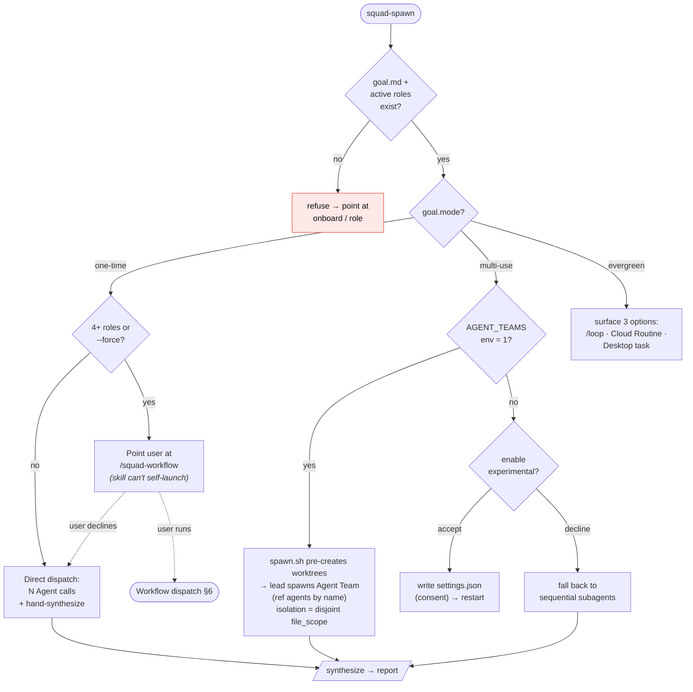
```mermaid
flowchart TD
    START([squad-spawn]) --> PRE{goal.md +<br/>active roles<br/>exist?}
    PRE -->|no| REFUSE["refuse → point at<br/>onboard / role"]
    PRE -->|yes| MODE{goal.mode?}

    MODE -->|one-time| OT{4+ roles or<br/>--force?}
    OT -->|no| DIRECT["Direct dispatch:<br/>N Agent calls<br/>+ hand-synthesize"]
    OT -->|yes| OFFER["Point user at<br/>/squad-workflow<br/><i>(skill can't self-launch)</i>"]
    OFFER -.user runs.-> WF([Workflow dispatch §6])
    OFFER -.user declines.-> DIRECT

    MODE -->|multi-use| ENV{AGENT_TEAMS<br/>env = 1?}
    ENV -->|yes| TEAM["spawn.sh pre-creates worktrees<br/>→ lead spawns Agent Team<br/>(ref agents by name)<br/>isolation = disjoint file_scope"]
    ENV -->|no| ASK{enable<br/>experimental?}
    ASK -->|accept| WRITE["write settings.json<br/>(consent) → restart"]
    ASK -->|decline| FALL["fall back to<br/>sequential subagents"]

    MODE -->|evergreen| SCHED["surface 3 options:<br/>/loop · Cloud Routine ·<br/>Desktop task"]

    DIRECT --> SYN[/synthesize → report/]
    TEAM --> SYN
    FALL --> SYN

    classDef warn fill:#fce8e6,stroke:#ea4335,color:#111;
    class REFUSE warn;
```

---

## 5. Hook logic

The three hooks are the **mechanical enforcement** layer (skill rules are
aspirational; hooks are real). All fail **open** — they never block on error.

### 5.1 SessionStart & UserPromptSubmit (goal-in-scope)

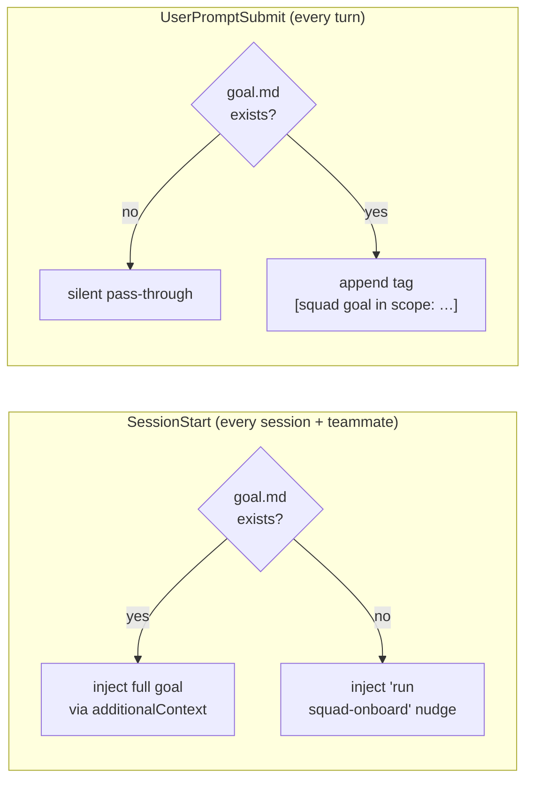
```mermaid
flowchart LR
    subgraph SS["SessionStart (every session + teammate)"]
        A1{goal.md<br/>exists?} -->|yes| A2[inject full goal<br/>via additionalContext]
        A1 -->|no| A3[inject 'run<br/>squad-onboard' nudge]
    end
    subgraph UP["UserPromptSubmit (every turn)"]
        B1{goal.md<br/>exists?} -->|no| B2[silent pass-through]
        B1 -->|yes| B3["append tag<br/>[squad goal in scope: …]"]
    end
```

> Subagents do **not** fire SessionStart — their goal arrives via prompt-baking
> (rule #4). See §7.

### 5.2 PermissionRequest (file-scope + sandbox enforcement)

Two narrow auto-approve surfaces; everything else defers. Surface 1 is in-scope
Edit/Write (rule #5); Surface 2 is in-sandbox Bash scaffolding (rule #8).
Ahead of both sits the **`.squad/` structural reservation** (rule #7, v0.4.1):
squad *state* never consults `file_scope`, so a broad scope cannot reach another
role's state. Both surfaces are further gated on the **plan gate** (rule #11,
v1.0): a role's engagement record must exist at
`.squad/role-plan-<agent_type>.md` before either auto-approves — and so must the
role's own outbox grant, since publishing a hand-off is acting. Exactly two
grants stay ungated: the record's own path (the bootstrap, `R1a` below) and the
role's own sandbox (rule #8, `R4`). See §5.3 for the record's full lifecycle.

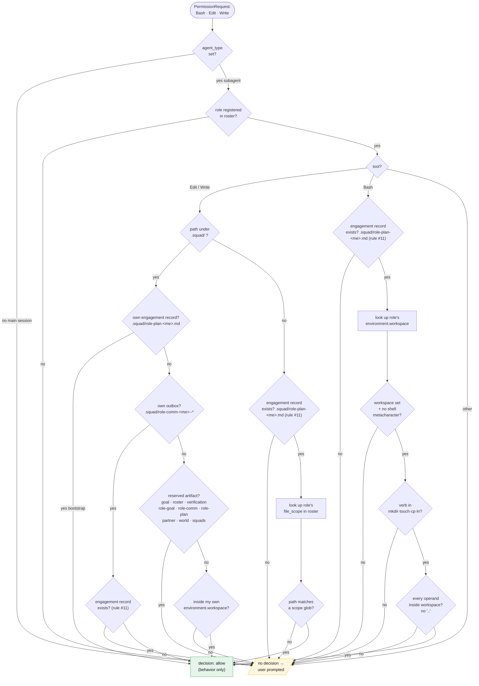
```mermaid
flowchart TD
    P0([PermissionRequest:<br/>Bash · Edit · Write]) --> P1{agent_type<br/>set?}
    P1 -->|no main session| DEFER[/no decision →<br/>user prompted/]
    P1 -->|yes subagent| P1a{role registered<br/>in roster?}
    P1a -->|no| DEFER
    P1a -->|yes| P2{tool?}
    P2 -->|Edit / Write| R1{path under<br/>.squad/ ?}
    R1 -->|yes| R1a{"own engagement record?<br/>.squad/role-plan-&lt;me&gt;.md"}
    R1a -->|yes bootstrap| ALLOW["decision: allow<br/>(behavior only)"]
    R1a -->|no| R2{"own outbox?<br/>.squad/role-comm-&lt;me&gt;--*"}
    R2 -->|yes| PG0{"engagement record<br/>exists? (rule #11)"}
    PG0 -->|no| DEFER
    PG0 -->|yes| ALLOW
    R2 -->|no| R3{reserved artifact?<br/>goal · roster · verification<br/>role-goal · role-comm · role-plan<br/>partner · world · squads}
    R3 -->|yes| DEFER
    R3 -->|no| R4{inside my own<br/>environment.workspace?}
    R4 -->|no| DEFER
    R4 -->|yes| ALLOW
    R1 -->|no| PG1{"engagement record<br/>exists? .squad/role-plan-<br/>&lt;me&gt;.md (rule #11)"}
    PG1 -->|no| DEFER
    PG1 -->|yes| P3[look up role's<br/>file_scope in roster]
    P3 --> P4{path matches<br/>a scope glob?}
    P4 -->|no| DEFER
    P4 -->|yes| ALLOW
    P2 -->|Bash| PG2{"engagement record<br/>exists? .squad/role-plan-<br/>&lt;me&gt;.md (rule #11)"}
    PG2 -->|no| DEFER
    PG2 -->|yes| B1[look up role's<br/>environment.workspace]
    B1 --> B2{workspace set<br/>+ no shell<br/>metacharacter?}
    B2 -->|no| DEFER
    B2 -->|yes| B3{verb in<br/>mkdir·touch·cp·ln?}
    B3 -->|no| DEFER
    B3 -->|yes| B4{every operand<br/>inside workspace?<br/>no '..'}
    B4 -->|no| DEFER
    B4 -->|yes| ALLOW
    P2 -->|other| DEFER

    classDef ok fill:#e6f4ea,stroke:#34a853,color:#111;
    classDef neu fill:#fef7e0,stroke:#fbbc04,color:#111;
    class ALLOW ok;
    class DEFER neu;
```

Both surfaces share the same primitives: normalize-to-relative, reject `..`
traversal, fail closed on doubt. Installs / network / global mutations are **not**
on the Bash list — they are the provisioner's *propose* path (rule #9), not the
running role's.

**The `.squad/` reservation (v0.4.1).** Every grant under `.squad/` is *derived
from the role's own `agent_type`*, never from what its `file_scope` declares —
which is what makes it unforgeable. A role gets its own outbox and its own
sandbox; the squad goal, the roster, `verification.md`, and every other role's
goal, outbox, and sandbox all defer to the human, at any scope. Before v0.4.1
these were matched against `file_scope`, so a role scoped `**` auto-approved all
of them — see the CHANGELOG's v0.4.1 security note.

**The plan gate (rule #11, v1.0).** `PG0`/`PG1`/`PG2` above are the same bare
file-existence check on `.squad/role-plan-<agent_type>.md` — no schema
validation, because a hook that could fail closed on a malformed record would be
deny-shaped. `PG1`/`PG2` run *after* the `.squad/` reservation branch has had
first refusal (`R1`), so the gate never overrides a reservation decision; it
only adds a precondition to what falls through to `P3` (file-scope matching)
and to the entire `Bash` surface. `PG0` is the third instance, inside the
reservation: the role's own outbox is granted only once its record exists,
because publishing a hand-off is acting. `R1a` is the one grant that precedes
everything — **unconditional**, because a role cannot publish its plan if
publishing the plan required a plan.

Ordering inside the reservation is load-bearing and matches `squad_grant`'s
case order: record (`R1a`) → outbox (`R2`) → reserved artifact (`R3`) →
sandbox (`R4`). `R3` sits before `R4` so a roster that declares
`environment.workspace` as `.squad/` itself cannot swallow another role's
contract paths through the sandbox grant.

### 5.3 Engagement-record lifecycle

The record that `PG1`/`PG2` check for — from Step 0's write to the point
`squad-verify` reads it as process evidence.

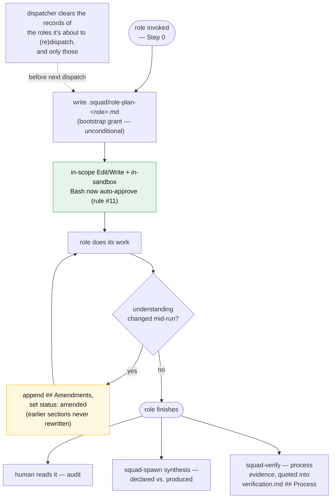
```mermaid
flowchart TD
    S0([role invoked<br/>— Step 0]) --> W1["write .squad/role-plan-&lt;role&gt;.md<br/>(bootstrap grant — unconditional)"]
    W1 --> UNLOCK["in-scope Edit/Write + in-sandbox<br/>Bash now auto-approve (rule #11)"]
    UNLOCK --> WORK[role does its work]
    WORK --> CHG{understanding<br/>changed mid-run?}
    CHG -->|yes| AMEND["append ## Amendments,<br/>set status: amended<br/>(earlier sections never rewritten)"]
    AMEND --> WORK
    CHG -->|no| DONE([role finishes])

    DONE --> RD1[human reads it — audit]
    DONE --> RD2["squad-spawn synthesis —<br/>declared vs. produced"]
    DONE --> RD3["squad-verify — process<br/>evidence, quoted into<br/>verification.md ## Process"]

    CLEAR["dispatcher clears the records of<br/>the roles it's about to (re)dispatch,<br/>and only those"] -.before next dispatch.-> W1

    classDef ok fill:#e6f4ea,stroke:#34a853,color:#111;
    classDef neu fill:#fef7e0,stroke:#fbbc04,color:#111;
    class UNLOCK ok;
    class AMEND neu;
```

> Gitignored throughout — nothing above is committed. `squad-verify` is what
> makes any of it outlive the engagement: whatever must survive gets quoted,
> verbatim, into the committed `.squad/verification.md`.

**Glob matching (`path_in_scope`)** — fails *closed* to avoid over-approval:

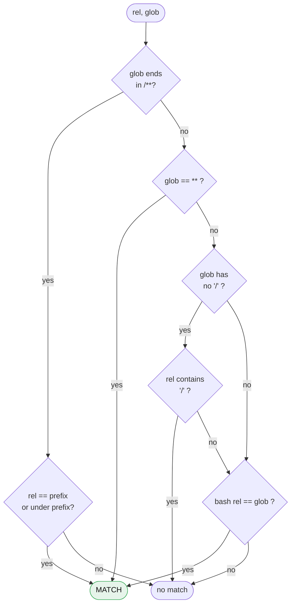
```mermaid
flowchart TD
    G0([rel, glob]) --> G1{glob ends<br/>in /**?}
    G1 -->|yes| G2{rel == prefix<br/>or under prefix?} -->|yes| M([MATCH])
    G2 -->|no| N([no match])
    G1 -->|no| G3{glob == ** ?}
    G3 -->|yes| M
    G3 -->|no| G4{glob has<br/>no '/' ?}
    G4 -->|yes| G5{rel contains<br/>'/' ?}
    G5 -->|yes| N
    G5 -->|no| G6
    G4 -->|no| G6{bash rel == glob ?}
    G6 -->|yes| M
    G6 -->|no| N

    classDef ok fill:#e6f4ea,stroke:#34a853,color:#111;
    class M ok;
```

> The "no `/` → single segment only" branch is the fix that stops `*.md` from
> matching `src/secrets.md` and silently auto-approving an out-of-scope write.

### 5.4 Escalation lifecycle

Hard rules #14–#15. Declared in the role goal, fired mid-run by the role
itself, blocked mechanically, closed only by the human — never by a role.

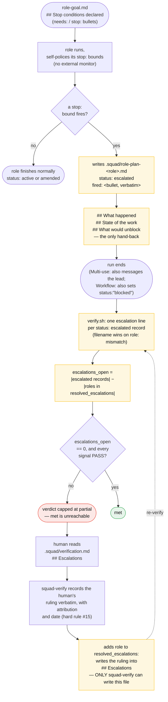
```mermaid
flowchart TD
    D0(["role-goal.md<br/>## Stop conditions declared<br/>(needs: / stop: bullets)"]) --> D1["role runs,<br/>self-polices its stop: bounds<br/>(no external monitor)"]
    D1 --> D2{"a stop:<br/>bound fires?"}
    D2 -->|no| D3(["role finishes normally<br/>status: active or amended"])
    D2 -->|yes| E1["writes .squad/role-plan-&lt;role&gt;.md<br/>status: escalated<br/>fired: &lt;bullet, verbatim&gt;"]
    E1 --> E2["## What happened<br/>## State of the work<br/>## What would unblock<br/>— the only hand-back"]
    E2 --> E3(["run ends<br/>(Multi-use: also messages the lead;<br/>Workflow: also sets status:&quot;blocked&quot;)"])

    E3 --> V1["verify.sh: one escalation line<br/>per status: escalated record<br/>(filename wins on role: mismatch)"]
    V1 --> V2["escalations_open =<br/>|escalated records| −<br/>|roles in resolved_escalations|"]
    V2 --> V3{"escalations_open<br/>== 0, and every<br/>signal PASS?"}
    V3 -->|no| BLOCK(["verdict capped at partial<br/>— met is unreachable"])
    V3 -->|yes| MET(["met"])

    BLOCK --> H1["human reads<br/>.squad/verification.md<br/>## Escalations"]
    H1 --> H2["squad-verify records the human's<br/>ruling verbatim, with attribution<br/>and date (hard rule #15)"]
    H2 --> H3["adds role to resolved_escalations:<br/>writes the ruling into<br/>## Escalations<br/>— ONLY squad-verify can write this file"]
    H3 -.re-verify.-> V1

    classDef ok fill:#e6f4ea,stroke:#34a853,color:#111;
    classDef warn fill:#fce8e6,stroke:#ea4335,color:#111;
    classDef neu fill:#fef7e0,stroke:#fbbc04,color:#111;
    class MET ok;
    class BLOCK warn;
    class E1,E2,V1,V2,H3 neu;
```

> **The load-bearing invariant.** `H3` is the only write that closes an
> escalation, and no role can reach it — `.squad/verification.md` is
> reserved (§5.2's `R3`), and the engagement record's own status enum stops
> at `active | amended | escalated` (no `resolved`, no `resolution:`
> anywhere a role writes). **Residual hole, stated honestly:** a role can
> still flip its own `status: escalated` at `E1` back to `active` — nothing
> in this diagram stops that, and it is behaviorally identical to `D2`
> never having fired at all. That is the acknowledged aspirational half of
> hard rule #14. What a role cannot do, under any status it writes, is
> reach `H3` and mint the human's ruling.

---

## 6. Dynamic-Workflow dispatch (optional, One-time only)

The opt-in backend. A skill **cannot** launch a workflow, so `/squad-workflow`
is the user-triggered entry; it preflights, gates, bakes inputs, then runs a
script shaped like `templates/squad-dispatch.workflow.js`.

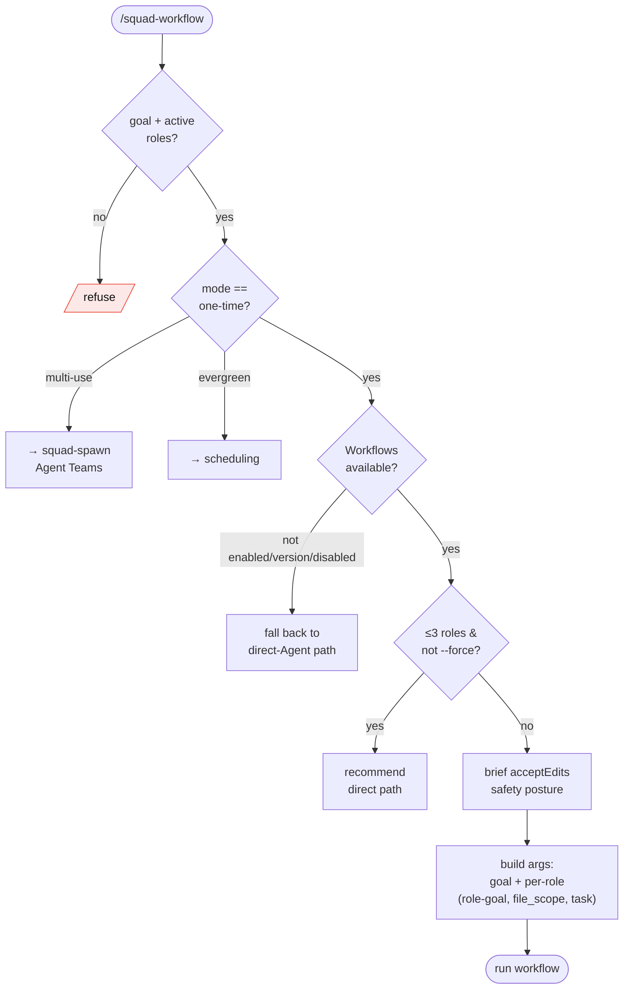
```mermaid
flowchart TD
    C0([/squad-workflow]) --> C1{goal + active<br/>roles?}
    C1 -->|no| CR[/refuse/]
    C1 -->|yes| C2{mode ==<br/>one-time?}
    C2 -->|multi-use| CM[→ squad-spawn<br/>Agent Teams]
    C2 -->|evergreen| CE[→ scheduling]
    C2 -->|yes| C3{Workflows<br/>available?}
    C3 -->|not enabled/version/disabled| CF[fall back to<br/>direct-Agent path]
    C3 -->|yes| C4{≤3 roles &<br/>not --force?}
    C4 -->|yes| CREC[recommend<br/>direct path]
    C4 -->|no| C5[brief acceptEdits<br/>safety posture]
    C5 --> C6["build args:<br/>goal + per-role<br/>(role-goal, file_scope, task)"]
    C6 --> C7([run workflow])

    classDef warn fill:#fce8e6,stroke:#ea4335,color:#111;
    class CR warn;
```

**Inside the workflow script** (fan-out → synthesize):

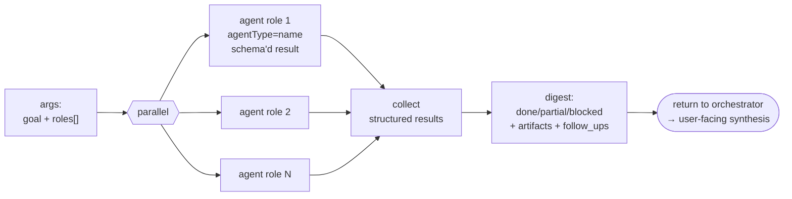
```mermaid
flowchart LR
    A["args:<br/>goal + roles[]"] --> FAN{{parallel}}
    FAN --> R1["agent role 1<br/>agentType=name<br/>schema'd result"]
    FAN --> R2["agent role 2"]
    FAN --> R3["agent role N"]
    R1 --> COL[collect<br/>structured results]
    R2 --> COL
    R3 --> COL
    COL --> DIG["digest:<br/>done/partial/blocked<br/>+ artifacts + follow_ups"]
    DIG --> OUT([return to orchestrator<br/>→ user-facing synthesis])
```

> ⚠️ **Safety:** workflow subagents always run in `acceptEdits` and inherit
> the invoking session's tool allowlist, regardless of the session's own mode
> — file edits are auto-approved and therefore **not gated by `file_scope`**.
> Do not rely on file-scope enforcement (§5.2) on this path. So this path
> fans out **read/analyze** roles whose writes are confined to their own
> `file_scope` *by instruction in the baked prompt*. Code-mutating roles stay on
> the hook-gated `squad-spawn` path, or run as their own write-stage workflow
> with a sign-off gate.

---

## 7. Goal injection — two channels, same end state

Every worker must see the goal (rule #2). *How* it arrives depends on the worker
type.

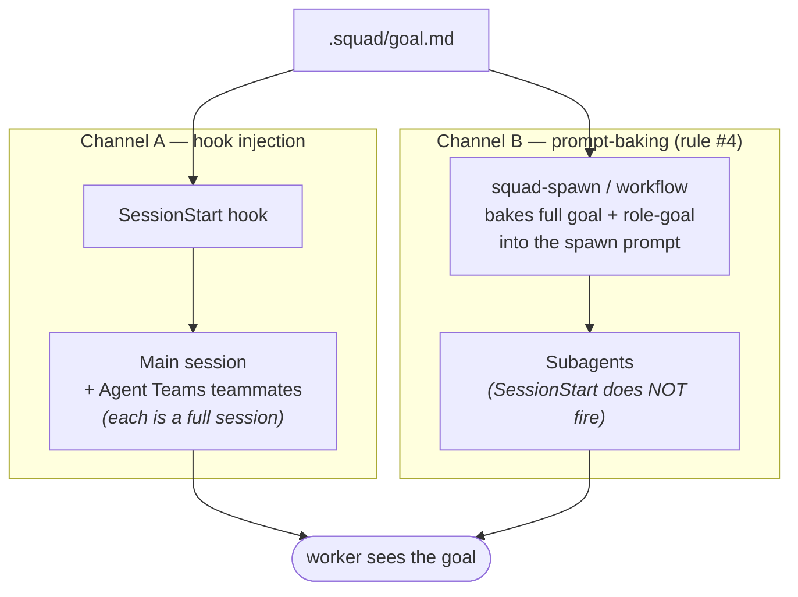
```mermaid
flowchart TD
    G[".squad/goal.md"] --> M1
    G --> M2

    subgraph CH1["Channel A — hook injection"]
        M1["SessionStart hook"] --> W1["Main session<br/>+ Agent Teams teammates<br/><i>(each is a full session)</i>"]
    end
    subgraph CH2["Channel B — prompt-baking (rule #4)"]
        M2["squad-spawn / workflow<br/>bakes full goal + role-goal<br/>into the spawn prompt"] --> W2["Subagents<br/><i>(SessionStart does NOT fire)</i>"]
    end

    W1 --> END([worker sees the goal])
    W2 --> END
```

| Worker | SessionStart fires? | Goal arrives via |
| --- | --- | --- |
| Main session | ✅ | hook `additionalContext` |
| Agent Teams teammate | ✅ (full session) | hook + baked prompt (belt & suspenders) |
| Subagent (One-time / fallback) | ❌ | **prompt-baking only** (rule #4) |
| Workflow `agent()` | ❌ | baked into `args`, re-read by the agent |

**Worker↔worker** context travels as hand-off manifests
(`.squad/role-comm-<from>--<to>.md`, shape: `templates/role-comm.md`): the
producer publishes to its own outbox (auto-approved — `squad-role` registers
`.squad/role-comm-<name>--*` in `file_scope`; another role's outbox defers),
and delivery reuses the channels above — baked into the consumer's spawn
prompt for subagents (Channel B), read directly + announced via Agent Teams
messaging for teammates (Channel A workers).

---

## 8. On-disk layout

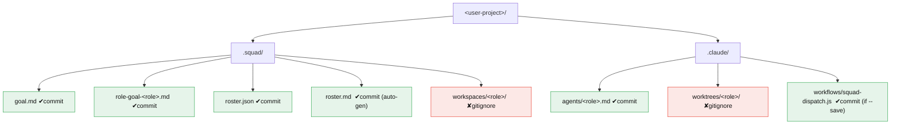
```mermaid
flowchart TD
    ROOT["&lt;user-project&gt;/"] --> SQ[".squad/"]
    ROOT --> CL[".claude/"]
    SQ --> G["goal.md  ✔commit"]
    SQ --> RG["role-goal-&lt;role&gt;.md  ✔commit"]
    SQ --> RJ["roster.json  ✔commit"]
    SQ --> RM["roster.md  ✔commit (auto-gen)"]
    CL --> AG["agents/&lt;role&gt;.md  ✔commit"]
    CL --> WTREE["worktrees/&lt;role&gt;/  ✘gitignore"]
    SQ --> WSP["workspaces/&lt;role&gt;/  ✘gitignore"]
    CL --> WFD["workflows/squad-dispatch.js  ✔commit (if --save)"]

    classDef commit fill:#e6f4ea,stroke:#34a853,color:#111;
    classDef ignore fill:#fce8e6,stroke:#ea4335,color:#111;
    class G,RG,RJ,RM,AG,WFD commit;
    class WTREE,WSP ignore;
```

---

## 9. The hard rules (quick reference)

The invariants every diagram above upholds (full text in
[`ARCHITECTURE.md` § Hard rules](ARCHITECTURE.md#hard-rules)):

| # | Rule |
| --- | --- |
| 1 | One north-star — `goal.md` binds every action. |
| 2 | No worker without the goal in scope. |
| 3 | Bespoke roles only — zero default role files ship. |
| 4 | Prompt-baking is the only reliable parent→worker channel. |
| 5 | Explicit `file_scope`; hook auto-approves in-scope Edit/Write. |
| 6 | Mode controls cadence, not squad size. |
| 7 | Per-role file isolation via disjoint `file_scope`. |
| 8 | Sandbox-scoped autonomy — hook auto-approves in-sandbox scaffolding inside `environment.workspace`. |
| 9 | Propose what can't be contained — system/MCP/network/global needs go to the user, never auto-run. |
| 10 | Synthesis summarizes, verification decides — `.squad/verification.md` is the only authority for "goal met". |
| 11 | Plan before act — a role publishes `.squad/role-plan-<role>.md` before its first write elsewhere; the hook gates auto-approval on it, deferring, never denying. |
| *(12, 13)* | *Reserved for a later PR — not shipped, not documented here. Numbering is append-only, so the gap is deliberate.* |
| 14 | Declared bounds — a fired `stop:` bound ends the run with `status: escalated`; an open escalation blocks `met`; only the human's ruling in `verification.md` closes one. |
| 15 | The human meets the same evidence bar — a NEEDS-HUMAN row or escalation converts to PASS only against a verbatim, attributed, dated ruling — never blocked, always put on the record. |
