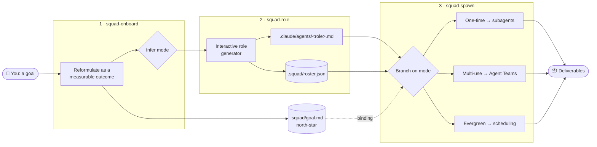
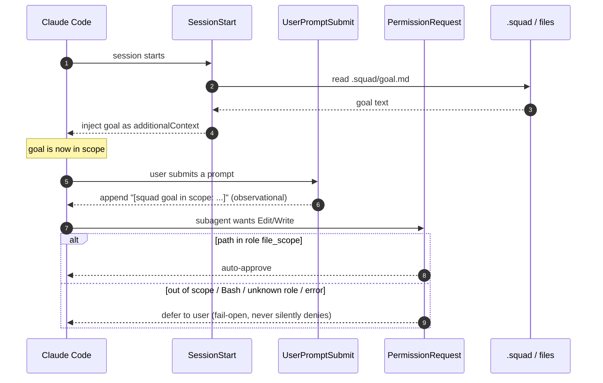
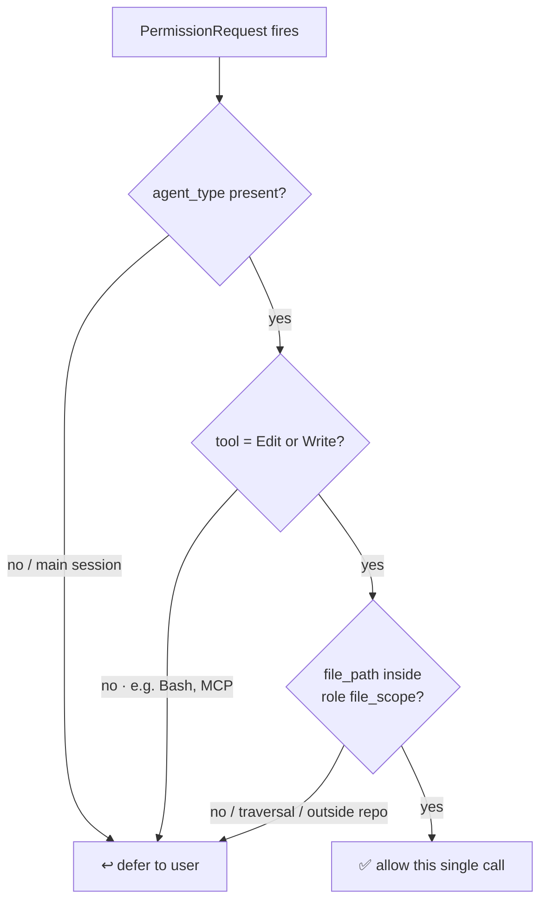
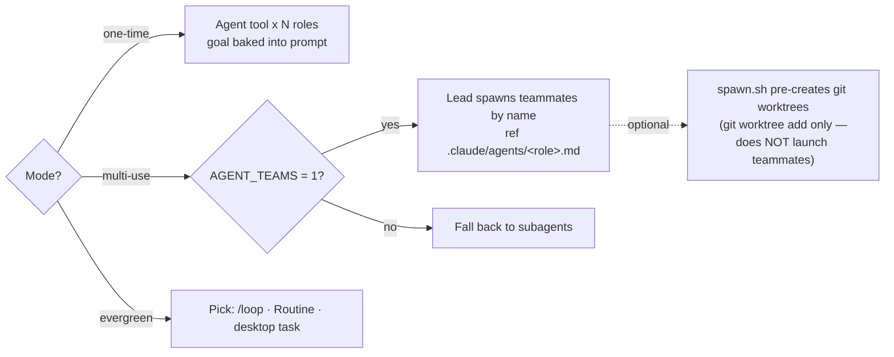

# cheeky-squad-os

> All Claude Code work — engineering, operational, agentic business infrastructure, knowledge work — goes better when you treat your AI session like a team with roles, responsibilities, communication, and supervision. **cheeky-squad-os ships the discipline, not the team.**

Your goal generates the team. Every squad is bespoke to the goal that spawned it. The plugin contains zero opinionated roles — no `frontend-dev`, no `backend-dev`, no defaults. The role generator builds what each goal needs, when the goal needs it, in the shape the goal demands.

---

## Why this matters across domains

The same primitives serve four distinct kinds of work:

| Domain | What it covers | Example goal |
| --- | --- | --- |
| 🛠️ **Engineering** | features, refactors, migrations | *"Ship a new homepage that converts at >5% by end of sprint."* |
| 🔁 **Operational agents** | weekly reports, scheduled audits, alert handling | *"Every Monday produce a 1-page competitor movement summary."* |
| 📊 **Business infrastructure** | lifecycle audits, recurring research, content | *"Deliver a ranked Klaviyo lifecycle fix list with revenue impact in a week."* |
| 🧠 **Knowledge work** | audits, analyses, decision memos | *"Draft a build-vs-buy memo for the analytics stack by Friday."* |

The role generator is domain-neutral. A Klaviyo audit gets `klaviyo-data-puller` + `compliance-checker` + `report-writer`. A homepage redesign gets `brand-voice-editor` + `conversion-ux-designer` + `frontend-builder` + `qa-runner`. Every squad is named for what it does — not for what default the framework happens to ship.

---

## How it works

Four skills carry you from a vague intent to a dispatched, supervised team. Three hooks keep every turn anchored to the goal.



1. **Set a north-star goal** with `/cheeky-squad-os:squad-onboard`. It asks *"Do you have a goal?"*, reformulates your answer as a measurable, time-bounded outcome, infers the mode (one-time / multi-use / evergreen), and decomposes the work into parallel workstreams. The confirmed goal is saved to `.squad/goal.md`.
2. **Generate the roles your goal needs** with `/cheeky-squad-os:squad-role`. For each workstream, an interactive flow asks what the role does, what files it owns, what tools it needs, what model fits. Each role is written to `.claude/agents/<role-name>.md` and registered in `.squad/roster.json`.
3. **Spawn the squad** with `/cheeky-squad-os:squad-spawn`. It branches on the squad's mode (see below).
4. **The hooks enforce the contract every turn** (see below).

---

## The three hooks

Registered inline in `plugin.json`; they fire on the next session start.



- **`SessionStart`** — reads `.squad/goal.md` and injects it as additional context on every session start. If no goal is set, prints a one-line nudge to run `squad-onboard`.
- **`UserPromptSubmit`** — appends `[squad goal in scope: <first 80 chars>]` to every turn so drift is visible. Observational only in v1 — does not block.
- **`PermissionRequest`** — when a subagent or teammate calls Edit/Write inside its registered file scope, auto-approves. Outside scope, unknown role, or any other tool (**including Bash**), defers to the user. Fail-open on errors — never silently denies.

### How the permission hook decides



Bash always defers. Auto-approval only ever widens to a subagent writing inside the files its role owns — nothing more.

---

## The three modes

`squad-spawn` branches on the mode that `squad-onboard` inferred.



- **One-time** — bounded deliverable, single push. Uses subagents. The full text of `.squad/goal.md` and the role's role-goal is baked into every spawn prompt — the only reliable parent→worker channel (the SessionStart hook does **not** fire for subagents).
  *Example: "Deliver a ranked list of Klaviyo lifecycle fixes within one week." See `examples/klaviyo-audit.md`.*
- **Multi-use** — ongoing build over multiple workstreams. Uses Agent Teams (experimental, env-gated by `CLAUDE_CODE_EXPERIMENTAL_AGENT_TEAMS=1`; falls back to sequential subagents when unset). Teammate file isolation is enforced by giving each role a **disjoint `file_scope`**. The team lead spawns each teammate by referencing its `.claude/agents/<role>.md` **by name**. As an optional convenience, `skills/squad-spawn/scripts/spawn.sh` can pre-create one git worktree per role — it only runs `git worktree add`; it does **not** launch teammates, and there is **no `--worktree` teammate-launch flag**.
  *Example: "Ship a new homepage that converts at >5%, deployed by end of sprint." See `examples/landing-page-redesign.md`.*
- **Evergreen** — recurring, scheduled. The plugin sets up the goal and roles, then surfaces three scheduling options (`/loop`, cloud Routine, desktop scheduled task) for you to pick.
  *Example: "Every Monday produce a 1-page competitor summary." See `examples/weekly-competitive-intel.md`.*

---

## Dynamic Workflows (optional, One-time mode)

For larger One-time squads, dispatch can run as a Claude Code **dynamic Workflow** — run `/cheeky-squad-os:squad-workflow`. You get deterministic fan-out, schema'd hand-offs, intermediate results held off the main context, and in-session resume.


> ⚠️ **Caveat:** workflow subagents run with file edits auto-approved, which bypasses the file-scope hook. So this path fans out **read/analyze** roles with self-policed scoped writes, while code-mutating roles stay on the hook-gated `squad-spawn` path. It's opt-in, approved per run, and falls back to standard dispatch when Workflows aren't available. Full design: [ARCHITECTURE.md](ARCHITECTURE.md#dynamic-workflows--where-they-fit-and-where-they-dont).

---

## Installation

```text
/plugin marketplace add cheeky-amit/cheeky-squad-os
/plugin install cheeky-squad-os@cheeky-squad-os
```

*(Replace `cheeky-amit` with your own org if you've forked the repo.)*

After install, the `SessionStart` hook fires on the **next** session start — open a fresh session, or run `/reload-plugins` if you installed mid-session, to pick the hooks up. Then set your first goal:

```text
/cheeky-squad-os:squad-onboard
```

### Setup steps

1. **Check prerequisites** — Claude Code with plugin support, plus `jq` and `git` on your `PATH`:
   ```bash
   claude --version
   which jq      # brew install jq   (macOS)  /  apt-get install jq  (Linux)
   git --version
   ```
   The hooks and `spawn.sh` degrade gracefully without `jq`, but full goal injection and the Multi-use worktree helper require it.
2. **Add the marketplace & install** (commands above).
3. **Reload hooks** — start a fresh session or run `/reload-plugins`.
4. **Verify** — run `/hooks` and confirm all three hooks are wired; ask *"What's our squad goal?"* and you should get the "no goal set" nudge from the `SessionStart` hook.
5. **Onboard** — run `/cheeky-squad-os:squad-onboard` and answer the goal question.
6. **Generate roles** — run `/cheeky-squad-os:squad-role` for each proposed workstream.
7. **Spawn** — run `/cheeky-squad-os:squad-spawn` to dispatch the squad.

See [`tests/smoke-test.md`](tests/smoke-test.md) for a copy-pasteable end-to-end walkthrough that exercises every skill and hook.

---

## The five skills & three hooks

| Component | Kind | What it does |
| --- | --- | --- |
| `squad-onboard` | skill | Reformulates a goal as an outcome, infers mode, proposes a bespoke squad. |
| `squad-goal` | skill | Manages `.squad/goal.md` as the binding north-star. |
| `squad-role` | skill | Interactive role generator → `.claude/agents/<role>.md` + roster. |
| `squad-spawn` | skill | Dispatches the squad, branching on mode. |
| `squad-roster` | skill | Manages `roster.json` + auto-generated `roster.md`. |
| `SessionStart` | hook | Injects the goal into every session. |
| `UserPromptSubmit` | hook | Tags each turn with the goal (observational). |
| `PermissionRequest` | hook | Auto-approves in-scope Edit/Write; defers everything else. |

---

## What this plugin does NOT ship

- ✕ **Zero role files.** No `frontend-dev`, no `backend-dev`, no `qa-engineer`. The generator builds what your goal needs.
- ✕ **No fixed team structure.** A 3-role audit and a 6-role build are both valid squads — size comes from decomposition.
- ✕ **No assumption you're an engineer.** An ops loop and a marketing audit use the same primitives as a feature build.

This is intentional. Defaults bias every goal toward the shape the defaults assume. The plugin's design forces you to think about what your goal actually needs — and then build exactly that.

---

## Plugin contents at a glance

```text
cheeky-squad-os/
├── .claude-plugin/
│   ├── plugin.json                  # metadata + inline hook registration
│   └── marketplace.json
├── skills/
│   ├── squad-onboard/SKILL.md
│   ├── squad-goal/SKILL.md
│   ├── squad-role/SKILL.md
│   ├── squad-spawn/
│   │   ├── SKILL.md
│   │   └── scripts/spawn.sh         # multi-use worktree pre-creation helper
│   └── squad-roster/SKILL.md
├── commands/
│   └── squad-workflow.md            # optional Workflow dispatch (One-time)
├── hooks/
│   ├── session-start.sh
│   ├── user-prompt-submit.sh
│   └── permission-request.sh
├── templates/
│   ├── goal.md
│   ├── role-goal.md
│   ├── role-definition.md
│   ├── roster.json
│   └── squad-dispatch.workflow.js   # canonical fan-out + synthesize script
├── examples/
│   ├── klaviyo-audit.md
│   ├── landing-page-redesign.md
│   └── weekly-competitive-intel.md
├── tests/
│   └── smoke-test.md
├── ARCHITECTURE.md
├── CONTRIBUTING.md
├── LICENSE (MIT)
└── README.md
```

---

## License

MIT. Author: amit-cheeky.
