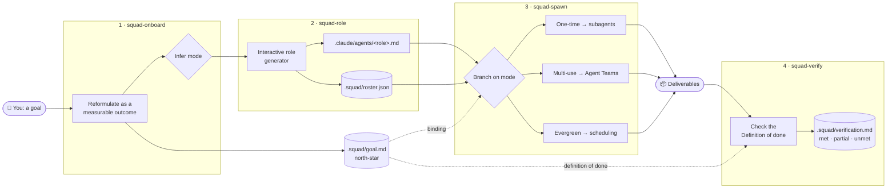
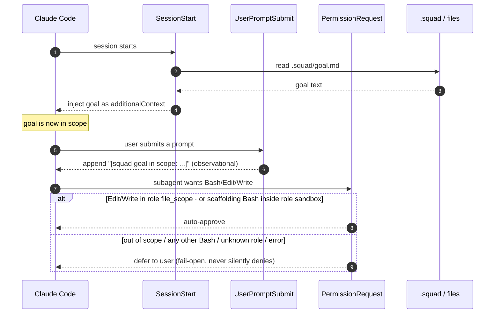
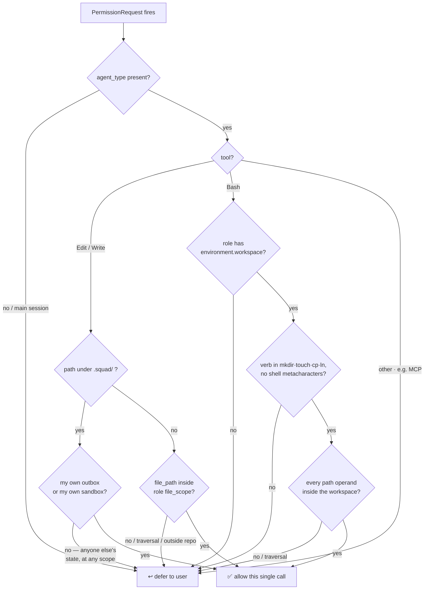
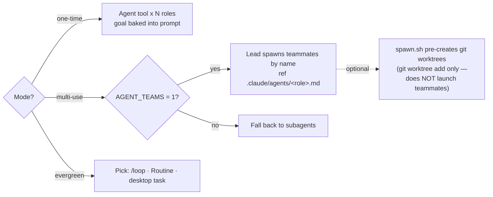
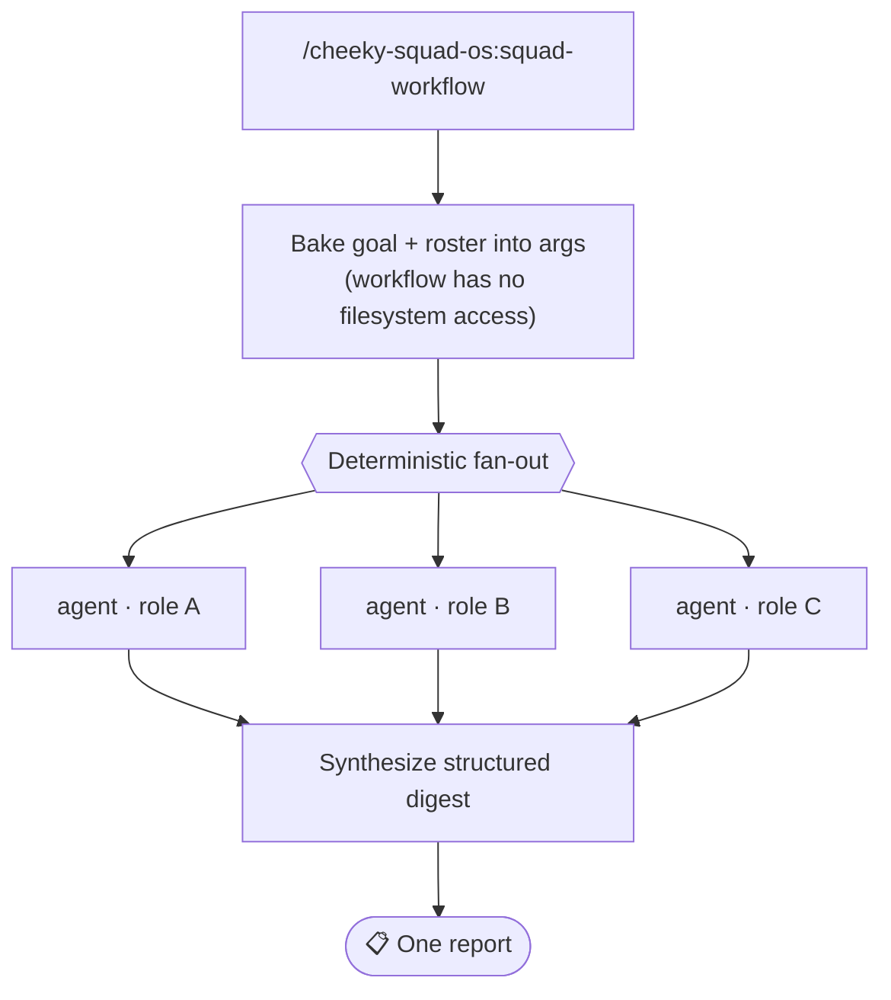

<div align="center">

# 🪖 cheeky-squad-os

### Ship the discipline, not the team.

*Turn any Claude Code goal — engineering, ops, business infrastructure, knowledge work — into a **bespoke squad of roles generated from the goal itself**. Zero opinionated roles shipped.*

<br/>

[](https://github.com/cheeky-amit/cheeky-squad-os/actions/workflows/ci.yml)
[](LICENSE)
[](.claude-plugin/plugin.json)
[](https://code.claude.com/docs/en/plugins)
[](CONTRIBUTING.md)
[](CONTRIBUTING.md)

<br/>

**[Why](#why-this-matters-across-domains)** ·
**[How it works](#how-it-works)** ·
**[Hooks](#the-three-hooks)** ·
**[Modes](#the-three-modes)** ·
**[Workflows](#dynamic-workflows-optional-one-time-mode)** ·
**[Install](#installation)** ·
**[Components](#the-nine-skills--three-hooks)** ·
**[Roadmap](docs/ROADMAP.md)** ·
**[Contributing](CONTRIBUTING.md)**

</div>

---

> All Claude Code work — engineering, operational, agentic business infrastructure, knowledge work — goes better when you treat your AI session like a team with roles, responsibilities, communication, and supervision. **cheeky-squad-os ships the discipline, not the team.**

Your goal generates the team. Every squad is bespoke to the goal that spawned it. The plugin contains zero opinionated roles — no `frontend-dev`, no `backend-dev`, no defaults. The role generator builds what each goal needs, when the goal needs it, in the shape the goal demands.

---

## Why this matters across domains

The same primitives serve four distinct kinds of work:

| Domain | What it covers | Example goal |
| --- | --- | --- |
| 🛠️ **Engineering** | features, refactors, migrations | *"Ship a new homepage that converts at >5% by end of sprint."* |
| 🔁 **Operational agents** | weekly reports, scheduled audits, alert handling | *"Every Monday produce a 1-page competitor movement summary."* |
| 📊 **Business infrastructure** | lifecycle audits, recurring research, content | *"Deliver a ranked Klaviyo lifecycle fix list with revenue impact in a week."* |
| 🧠 **Knowledge work** | audits, analyses, decision memos | *"Draft a build-vs-buy memo for the analytics stack by Friday."* |

The role generator is domain-neutral. A Klaviyo audit gets `klaviyo-data-puller` + `compliance-checker` + `report-writer`. A homepage redesign gets `brand-voice-editor` + `conversion-ux-designer` + `frontend-builder` + `qa-runner`. Every squad is named for what it does — not for what default the framework happens to ship.

---

## How it works

One skill chain — onboard → role → env → spawn → verify, with the goal and roster as shared state — carries you from a vague intent to a dispatched, supervised, **verified** team. Three hooks keep every turn anchored to the goal.


```mermaid
flowchart LR
  U(["🧑 You: a goal"]) --> ON

  subgraph S1["1 · squad-onboard"]
    ON["Reformulate as a<br/>measurable outcome"] --> MODE{"Infer mode"}
  end
  ON --> GOAL[(".squad/goal.md<br/>north-star")]

  MODE --> ROLE

  subgraph S2["2 · squad-role"]
    ROLE["Interactive role<br/>generator"] --> AG[".claude/agents/&lt;role&gt;.md"]
    ROLE --> ROST[(".squad/roster.json")]
  end

  AG --> SPAWN
  ROST --> SPAWN

  subgraph S3["3 · squad-spawn"]
    SPAWN{"Branch on mode"} --> ONE["One-time → subagents"]
    SPAWN --> MUL["Multi-use → Agent Teams"]
    SPAWN --> EVR["Evergreen → scheduling"]
  end

  ONE --> OUT(["📦 Deliverables"])
  MUL --> OUT
  EVR --> OUT

  subgraph S4["4 · squad-verify"]
    VER["Check the<br/>Definition of done"] --> VMD[(".squad/verification.md<br/>met · partial · unmet")]
  end

  OUT --> VER

  GOAL -. binding .-> SPAWN
  GOAL -. definition of done .-> VER
```

1. **Set a north-star goal** with `/cheeky-squad-os:squad-onboard`. It asks *"Do you have a goal?"*, reformulates your answer as a measurable, time-bounded outcome, infers the mode (one-time / multi-use / evergreen), and decomposes the work into parallel workstreams. The confirmed goal is saved to `.squad/goal.md`.
2. **Generate the roles your goal needs** with `/cheeky-squad-os:squad-role`. For each workstream, an interactive flow asks what the role does, what files it owns, what tools it needs, what model fits. Each role is written to `.claude/agents/<role-name>.md` and registered in `.squad/roster.json`.
3. **Spawn the squad** with `/cheeky-squad-os:squad-spawn`. It branches on the squad's mode (see below). Roles hand work to each other through structured manifests (`.squad/role-comm-<from>--<to>.md` — what's ready, how to consume, caveats): each role publishes to its own outbox (auto-approved by the hook; another role's outbox defers, so hand-offs can't be forged), and `squad-spawn` bakes ready manifests into downstream spawn prompts.
4. **Verify the work** with `/cheeky-squad-os:squad-verify`. When the squad reports done, it checks every Definition-of-done signal against the deliverables (PASS / FAIL / NEEDS-HUMAN — never guessed), computes a met / partial / unmet verdict, and writes `.squad/verification.md`. Synthesis summarizes; verification decides.
5. **The hooks enforce the contract every turn** (see below).

---

## The three hooks

Registered inline in `plugin.json`; they fire on the next session start.


```mermaid
sequenceDiagram
  autonumber
  participant CC as Claude Code
  participant SS as SessionStart
  participant UP as UserPromptSubmit
  participant PR as PermissionRequest
  participant FS as .squad / files

  CC->>SS: session starts
  SS->>FS: read .squad/goal.md
  FS-->>SS: goal text
  SS-->>CC: inject goal as additionalContext
  Note over CC: goal is now in scope

  CC->>UP: user submits a prompt
  UP-->>CC: append "[squad goal in scope: ...]" (observational)

  CC->>PR: subagent wants Bash/Edit/Write
  alt Edit/Write in role file_scope · or scaffolding Bash inside role sandbox
    PR-->>CC: auto-approve
  else out of scope / any other Bash / unknown role / error
    PR-->>CC: defer to user (fail-open, never silently denies)
  end
```

- **`SessionStart`** — reads `.squad/goal.md` and injects it as additional context on every session start. If no goal is set, prints a one-line nudge to run `squad-onboard`.
- **`UserPromptSubmit`** — appends `[squad goal in scope: <first 80 chars>]` to every turn so drift is visible. Observational only in v1 — does not block.
- **`PermissionRequest`** — auto-approves two narrow surfaces for registered subagents: (a) Edit/Write inside the role's registered `file_scope`, and (b) in-sandbox scaffolding Bash — verbs `mkdir`/`touch`/`cp`/`ln` only, no shell metacharacters, every path operand inside the role's `environment.workspace`. Everything else — out of scope, any other Bash, any other tool, main session, unknown role — defers to the user. Fail-open on errors — never silently denies.
- **`.squad/` is structurally reserved** (v0.4.1). Squad state never consults `file_scope`: a role is auto-approved only for the `.squad/` paths *derived from its own identity* — its own hand-off outbox and its own sandbox — and everything else there (the goal, the roster, `verification.md`, every other role's state) defers to you no matter how broad its scope. Before v0.4.1 a role scoped `**` could write all of them; see the [CHANGELOG](CHANGELOG.md) security note.

### How the permission hook decides


```mermaid
flowchart TD
  A["PermissionRequest fires"] --> B{"agent_type present?"}
  B -- "no / main session" --> D["↩️ defer to user"]
  B -- yes --> C{"tool?"}
  C -- "Edit / Write" --> R{"path under .squad/ ?"}
  R -- "yes" --> R2{"my own outbox<br/>or my own sandbox?"}
  R2 -- "no — anyone else's<br/>state, at any scope" --> D
  R2 -- yes --> F["✅ allow this single call"]
  R -- "no" --> E{"file_path inside<br/>role file_scope?"}
  E -- "no / traversal / outside repo" --> D
  E -- yes --> F
  C -- Bash --> G{"role has<br/>environment.workspace?"}
  G -- no --> D
  G -- yes --> H{"verb in mkdir·touch·cp·ln,<br/>no shell metacharacters?"}
  H -- no --> D
  H -- yes --> I{"every path operand<br/>inside the workspace?"}
  I -- "no / traversal" --> D
  I -- yes --> F
  C -- "other · e.g. MCP" --> D
```

Bash defers unless it is pure scaffolding fully contained in the role's declared sandbox. Auto-approval only ever widens to a subagent writing inside the files its role owns — or scaffolding inside its own sandbox.

---

## The three modes

`squad-spawn` branches on the mode that `squad-onboard` inferred.


```mermaid
flowchart LR
  M{"Mode?"} -->|one-time| O["Agent tool x N roles<br/>goal baked into prompt"]
  M -->|multi-use| T{"AGENT_TEAMS = 1?"}
  M -->|evergreen| E["Pick: /loop · Routine · desktop task"]

  T -->|yes| TT["Lead spawns teammates by name<br/>ref .claude/agents/&lt;role&gt;.md"]
  T -->|no| O2["Fall back to subagents"]
  TT -. optional .-> WT["spawn.sh pre-creates git worktrees<br/>(git worktree add only —<br/>does NOT launch teammates)"]
```

- **One-time** — bounded deliverable, single push. Uses subagents. The full text of `.squad/goal.md` and the role's role-goal is baked into every spawn prompt — the only reliable parent→worker channel (the SessionStart hook does **not** fire for subagents).
  *Example: "Deliver a ranked list of Klaviyo lifecycle fixes within one week." See `examples/klaviyo-audit.md`.*
- **Multi-use** — ongoing build over multiple workstreams. Uses Agent Teams (experimental, env-gated by `CLAUDE_CODE_EXPERIMENTAL_AGENT_TEAMS=1`; falls back to sequential subagents when unset). Teammate file isolation is enforced by giving each role a **disjoint `file_scope`**. The team lead spawns each teammate by referencing its `.claude/agents/<role>.md` **by name** — a role's own `hooks:` frontmatter does not fire for a teammate (same gap as `skills:`/`mcpServers:`), so enforcement here rests on this plugin's project-level hooks, which do still fire for a teammate since it's a full session. As an optional convenience, `skills/squad-spawn/scripts/spawn.sh` can pre-create one git worktree per role — it only runs `git worktree add`; it does **not** launch teammates, and there is **no `--worktree` teammate-launch flag**.
  *Example: "Ship a new homepage that converts at >5%, deployed by end of sprint." See `examples/landing-page-redesign.md`.*
- **Evergreen** — recurring, scheduled. The plugin sets up the goal and roles, then surfaces three scheduling options (`/loop`, cloud Routine, desktop scheduled task) for you to pick.
  *Example: "Every Monday produce a 1-page competitor summary." See `examples/weekly-competitive-intel.md`.*

---

## Dynamic Workflows (optional, One-time mode)

For larger One-time squads, dispatch can run as a Claude Code **dynamic Workflow** — run `/cheeky-squad-os:squad-workflow`. You get deterministic fan-out, schema'd hand-offs, intermediate results held off the main context, and in-session resume.


```mermaid
flowchart TD
  CMD["/cheeky-squad-os:squad-workflow"] --> BAKE["Bake goal + roster into args<br/>(workflow has no filesystem access)"]
  BAKE --> FAN{{"Deterministic fan-out"}}
  FAN --> R1["agent · role A"]
  FAN --> R2["agent · role B"]
  FAN --> R3["agent · role C"]
  R1 --> SY["Synthesize structured digest"]
  R2 --> SY
  R3 --> SY
  SY --> REP(["📋 One report"])
```

> ⚠️ **Caveat:** the subagents a workflow dispatches always run in `acceptEdits` mode — file edits are auto-approved and therefore **not gated by `file_scope`**. So this path fans out **read/analyze** roles with self-policed scoped writes, while code-mutating roles stay on the hook-gated `squad-spawn` path. It's opt-in, approved per run, and falls back to standard dispatch when Workflows aren't available. Full design: [ARCHITECTURE.md](ARCHITECTURE.md#dynamic-workflows--where-they-fit-and-where-they-dont). Runtime contract details (the Workflow DSL behind `templates/squad-dispatch.workflow.js`): [docs/workflows-runtime-reference.md](docs/workflows-runtime-reference.md).

---

## Installation

```text
/plugin marketplace add cheeky-amit/cheeky-squad-os
/plugin install cheeky-squad-os@cheeky-squad-os
```

*(Replace `cheeky-amit` with your own org if you've forked the repo.)*

After install, the `SessionStart` hook fires on the **next** session start — open a fresh session, or run `/reload-plugins` if you installed mid-session, to pick the hooks up. Then set your first goal:

```text
/cheeky-squad-os:squad-onboard
```

### Setup steps

1. **Check prerequisites** — Claude Code with plugin support, plus `jq` and `git` on your `PATH`:
   ```bash
   claude --version
   which jq      # brew install jq   (macOS)  /  apt-get install jq  (Linux)
   git --version
   ```
   The hooks and `spawn.sh` degrade gracefully without `jq`, but full goal injection and the Multi-use worktree helper require it.
2. **Add the marketplace & install** (commands above).
3. **Reload hooks** — start a fresh session or run `/reload-plugins`.
4. **Verify** — run `/hooks` and confirm all three hooks are wired; ask *"What's our squad goal?"* and you should get the "no goal set" nudge from the `SessionStart` hook.
5. **Onboard** — run `/cheeky-squad-os:squad-onboard` and answer the goal question.
6. **Generate roles** — run `/cheeky-squad-os:squad-role` for each proposed workstream.
7. **Provision environments** *(optional)* — run `/cheeky-squad-os:squad-env` to build each role's sandbox (workspace, env, seeded reference material, tools) before dispatch. `squad-spawn` also triggers this automatically for roles that declare an `environment`.
8. **Spawn** — run `/cheeky-squad-os:squad-spawn` to dispatch the squad.
9. **Verify** — run `/cheeky-squad-os:squad-verify` when the squad reports done; it checks the Definition of done and writes `.squad/verification.md`.

See [`tests/smoke-test.md`](tests/smoke-test.md) for a copy-pasteable end-to-end walkthrough that exercises every skill and hook.

---

## The nine skills & three hooks

| Component | Kind | What it does |
| --- | --- | --- |
| `squad-onboard` | skill | Reformulates a goal as an outcome, infers mode, offers one optional pass of guided domain research, proposes a bespoke squad. |
| `squad-goal` | skill | Manages `.squad/goal.md` as the binding north-star; parks/switches whole squads (`.squad/squads/<slug>/`) so one project can hold several initiatives. |
| `squad-role` | skill | Interactive role generator → `.claude/agents/<role>.md` + roster. |
| `squad-env` | skill | Provisions each role's sandbox (workspace, env, tools) from the goal; proposes what it can't contain. |
| `squad-spawn` | skill | Dispatches the squad, branching on mode. |
| `squad-roster` | skill | Manages `roster.json` + auto-generated `roster.md`. |
| `squad-verify` | skill | Verifies deliverables against the goal's Definition of done; writes `.squad/verification.md` with a met/partial/unmet verdict. |
| `squad-world` | skill | The shared belief ledger (`.squad/world/claims-<owner>.md`, hard rule #13) — seed a belief, inspect what the squad believes, adjudicate two owners who disagree, retire what stopped being true, and **research** the domain before the goal is decomposed, behind two human gates. |
| `squad-partner` | skill | The partner model (`.squad/partner.md`, hard rule #12) — the human's own standing brief: what to decide without them, what to always ask first, the constraints that bind every squad in the project, and the beliefs of theirs a role should check rather than inherit. **Told, not inferred**: every sentence is one the human confirmed in the same turn it was written, and this skill is the file's only writer. |
| `SessionStart` | hook | Injects the goal into every session — and the partner model right after it, when one exists. |
| `UserPromptSubmit` | hook | Tags each turn with the goal (observational). |
| `PermissionRequest` | hook | Auto-approves in-scope Edit/Write + in-sandbox scaffolding; defers everything else. |

---

## What v1.0 adds

Hard rules #11–#15 shipped this release, each with a mechanism behind it. This table states only what the cited bats case proves — the full "what's enforced vs. what's asked" breakdown for each rule is in [ARCHITECTURE.md's honesty table](ARCHITECTURE.md#the-honesty-table).

| Rule | What actually happens | Proven by |
| --- | --- | --- |
| **#11** — Autonomy is purchased with intent. | The `PermissionRequest` hook defers a role's in-scope Edit/Write and in-sandbox Bash until `.squad/role-plan-<role>.md` exists, then auto-approves the same call once it does. | `permission-request.bats`: *"gate: in-scope Write DEFERS until the engagement record exists"* / *"…is auto-approved once the record exists"* |
| **#12** — Told, not inferred. | `.squad/partner.md`, when present and non-empty, is appended into session context after the goal — the literal file content, never a summary. | `session-start.bats`: *"partner model is appended after the goal, when present and non-empty"* |
| **#13** — A belief with no source is a rumor. | A `.squad/world/claims-<owner>.md` block missing `Claim`, `Source`, `Grade`, or `Observed` is excluded from every index `world.sh` projects. | `world.bats`: *"missing Source is invalid and excluded"* (and the matching cases for `Claim` / `Grade` / `Observed`) |
| **#14 + #15** — Stopping well is a deliverable · the human meets the same evidence bar. | An engagement record with `status: escalated` keeps `verify.sh`'s `escalations_open` count above zero until the role is named in `.squad/verification.md`'s `resolved_escalations`. | `verify.bats`: *"escalated record is detected: status surfaces and it counts toward escalations_open"* / *"a resolved escalation drops out, an unresolved one stays open"* |

---

## What this plugin does NOT ship

- ✕ **Zero role files.** No `frontend-dev`, no `backend-dev`, no `qa-engineer`. The generator builds what your goal needs.
- ✕ **No fixed team structure.** A 3-role audit and a 6-role build are both valid squads — size comes from decomposition.
- ✕ **No assumption you're an engineer.** An ops loop and a marketing audit use the same primitives as a feature build.

This is intentional. Defaults bias every goal toward the shape the defaults assume. The plugin's design forces you to think about what your goal actually needs — and then build exactly that.

---

> ### Why we say "squad" — and what we mean by it
>
> Collins et al. (arXiv:2408.03943, §5.3) warn that the words we choose for AI partners set expectations: *"teammate implies the machine and human are on equal footing."* We read that critique, kept the word **squad**, and answer it on its own terms.
>
> A squad is not a circle of peers. It is a unit that exists to serve an outcome someone else owns, under someone else's command. That someone is you. Every mechanism here encodes the asymmetry: you set the goal and confirm every reformulation of it; nothing global runs without your same-turn consent; every out-of-scope action defers to you rather than being decided for you; every judgment the machine cannot evidence is routed to NEEDS-HUMAN — to you. The squad has obligations: to declare its intent before acting (#11), to source what it claims (#13), to stop at its declared bounds (#14). It has no standing. Authority and accountability never leave the human.
>
> The squad's model of *you* is subject to *your* authority too: `.squad/partner.md` holds only sentences you confirmed, is written by one skill, and its creation proposes keeping it out of your repo (#12). And you are not exempt from the discipline you imposed — rule #15 holds you to the same evidence bar you hold the machine to.
>
> These are **human-centric** partners, not **human-like** ones. Roles are bespoke functions with a file scope, a goal slice, and refusal conditions — not personalities. The plugin never gives a role a face, a feeling, or a claim of intent; roles are named for their work (`klaviyo-data-puller`), never for a person. Where our docs say "teammate," it names Claude Code's Agent Teams primitive: machine-to-machine coordination, never machine-to-human parity.
>
> We use organizational language because coordination, hand-offs, and supervision are real. We refuse anthropomorphic language because minds on equal footing is not.

---

## Plugin contents at a glance

```text
cheeky-squad-os/
├── .claude-plugin/
│   ├── plugin.json                  # metadata + inline hook registration
│   └── marketplace.json
├── skills/
│   ├── squad-onboard/SKILL.md
│   ├── squad-goal/SKILL.md
│   ├── squad-role/SKILL.md
│   ├── squad-env/
│   │   ├── SKILL.md
│   │   └── scripts/provision.sh     # per-role sandbox provisioner
│   ├── squad-spawn/
│   │   ├── SKILL.md
│   │   └── scripts/spawn.sh         # multi-use worktree pre-creation helper
│   ├── squad-verify/
│   │   ├── SKILL.md
│   │   └── scripts/verify.sh        # definition-of-done evidence scaffold
│   ├── squad-world/
│   │   ├── SKILL.md
│   │   └── scripts/world.sh         # belief-ledger parser + projection
│   ├── squad-partner/SKILL.md       # the partner model (hard rule #12)
│   └── squad-roster/SKILL.md
├── commands/
│   └── squad-workflow.md            # optional Workflow dispatch (One-time)
├── hooks/
│   ├── session-start.sh
│   ├── user-prompt-submit.sh
│   └── permission-request.sh
├── templates/
│   ├── goal.md
│   ├── role-goal.md
│   ├── role-definition.md
│   ├── role-plan.md                 # engagement record (hard rule #11)
│   ├── roster.json
│   ├── role-comm.md                 # hand-off manifest (worker↔worker channel)
│   ├── verification.md              # squad-verify report skeleton
│   ├── world-claims.md              # belief-ledger block schema (hard rule #13)
│   ├── partner.md                   # the human's standing brief (hard rule #12)
│   └── squad-dispatch.workflow.js   # canonical fan-out + synthesize script
├── docs/
│   ├── ROADMAP.md                   # measurable path to the north star, ranked gaps
│   └── workflows-runtime-reference.md  # verified Workflow DSL runtime reference
├── examples/
│   ├── klaviyo-audit.md
│   ├── landing-page-redesign.md
│   └── weekly-competitive-intel.md
├── tests/
│   ├── smoke-test.md                # manual end-to-end walkthrough
│   ├── permission-request.bats      # automated: hook allow/defer matrix
│   ├── spawn.bats                   # automated: spawn.sh preflight + worktrees
│   ├── provision.bats               # automated: provision.sh sandbox build
│   ├── verify.bats                  # automated: verify.sh evidence scaffold
│   ├── session-start.bats           # automated: goal + partner + escalation notice
│   ├── world.bats                   # automated: world.sh parser + projection
│   └── mermaid-lint.sh              # automated: diagram structural check
├── .github/
│   └── workflows/ci.yml             # shellcheck + bats + lints on push/PR
├── ARCHITECTURE.md
├── LOGIC.md
├── CONTRIBUTING.md
├── CHANGELOG.md
├── LICENSE (MIT)
└── README.md
```

### `.squad/` runtime state (created in *your* project, not this repo)

This repo ships no `.squad/` directory — it's the state the plugin writes into whatever project you run it in. The shipped `.gitignore` (mirror it into your own project's) draws the commit/ignore line as follows:

| Artifact | Written by | Status |
| --- | --- | --- |
| `.squad/goal.md` | `squad-onboard` / `squad-goal` | Commit |
| `.squad/partner.md` | `squad-partner` (hard rule #12) | **Gitignore by default** — offered as one half of the create write set, not enforced; decline the offer to commit it |
| `.squad/role-goal-<role>.md` | `squad-role` | Commit |
| `.squad/roster.json` / `.squad/roster.md` | `squad-role` / `squad-roster` | Commit |
| `.squad/verification.md` | `squad-verify` (hard rules #14–#15) | Commit — overwritten on each re-verify |
| `.squad/world/claims-<owner>.md` | `squad-world` (hard rule #13) | Commit — never cleared, accumulates |
| `.squad/squads/<slug>/` | `squad-goal` park/switch | Commit — parked squads, same grade as active |
| `.squad/role-plan-<role>.md` | the role itself, before its first act (hard rule #11) | Gitignore — per-engagement, cleared on redispatch |
| `.squad/role-comm-<from>--<to>.md` | the publishing role | Gitignore — per-run hand-off manifest, cleared on redispatch |
| `.squad/workspaces/<role>/` | `provision.sh` | Gitignore — ephemeral sandbox; `roster.json` is the source of truth |

Full rationale for every row: [ARCHITECTURE.md § Version control](ARCHITECTURE.md#version-control).

---

## License

[MIT](LICENSE) © cheeky-amit.

<div align="center">
<br/>

**Ship the discipline, not the team.**

<sub>Built as a Claude Code plugin · skills + hooks, no fixed roster · <a href="#-cheeky-squad-os">back to top ↑</a></sub>

</div>
