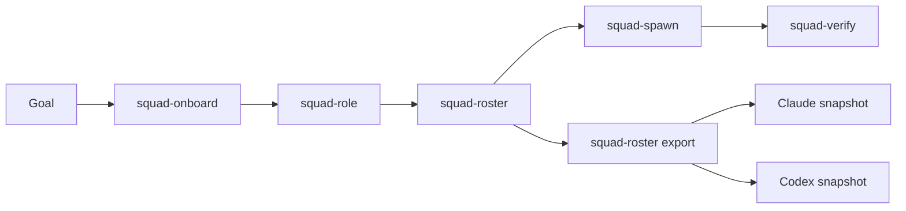

<div align="center">

# cheeky-squad-os

### Ship the discipline, not the team.

*Turn a goal into a bespoke squad, supervise it against evidence, and carry the same
roles to Claude Code, Codex, or both.*

[](https://github.com/cheeky-amit/cheeky-squad-os/actions/workflows/ci.yml)
[](LICENSE)
[](.claude-plugin/plugin.json)
[](docs/compatibility-security.md)

**[Why](#why-squads)** · **[Quickstart](#quickstart)** ·
**[Export](#export-a-squad)** · **[Destinations](#four-destinations)** ·
**[Compatibility](docs/compatibility-security.md)** ·
**[Architecture](ARCHITECTURE.md)** · **[Roadmap](docs/ROADMAP.md)**

</div>

---

> Your goal generates the team. The framework supplies the contract: one north-star,
> explicit responsibilities, mode-appropriate dispatch, structured hand-offs, and an
> artifact of record for “done.” Version 1.1.0 makes that contract portable.

cheeky-squad-os still ships zero opinionated roles. A lifecycle audit gets different
roles from a homepage migration; a weekly intelligence loop gets different roles from
both. The new exporter compiles the resulting provider-neutral roster into a vendored,
immutable snapshot. The generator does not need to remain installed for that snapshot
to work.

## Why squads

The same primitives serve engineering, operations, business infrastructure, and
knowledge work:

| Domain | Example outcome | Bespoke role shape |
| --- | --- | --- |
| Engineering | Ship a measured homepage migration | brand editor, UI builder, QA runner |
| Operations | Produce a weekly competitor movement memo | source reader, analyst, editor |
| Business infrastructure | Rank lifecycle fixes by revenue impact | data puller, compliance checker, report writer |
| Knowledge work | Deliver a build-vs-buy decision | evidence reader, modeler, decision writer |

“Squad” describes disciplined coordination, not magical autonomy. The system does not
make providers equivalent where they are not, and it does not turn a written ownership
boundary into enforcement by saying it more confidently.

## The two independent choices

Execution cadence and export destination answer different questions:

| Choice | Values | Question answered |
| --- | --- | --- |
| Execution cadence | `one-time`, `multi-use`, `evergreen` | How often and by which dispatch path does the squad run? |
| Export destination | `session`, `project`, `user`, `plugin` | Where may this exact snapshot be discovered? |

Adding a destination does not create a fourth mode. Existing Claude squads with a
legacy roster keep their current cadence and behavior. Migration happens in memory;
the exporter never relocates, renames, or rewrites an existing squad before showing the
complete plan and receiving a matching confirmation.

## How authoring works

The existing lifecycle remains the authoring surface:


```mermaid
flowchart LR
  GOAL["Goal"] --> ON["squad-onboard"]
  ON --> ROLE["squad-role"]
  ROLE --> ROSTER["squad-roster"]
  ROSTER --> SPAWN["squad-spawn"]
  SPAWN --> VERIFY["squad-verify"]
  ROSTER --> EXPORT["squad-roster export"]
  EXPORT --> CLAUDE["Claude snapshot"]
  EXPORT --> CODEX["Codex snapshot"]
```

1. `squad-onboard` writes a measurable north-star goal and selects the cadence.
2. `squad-role` derives only the roles the goal needs.
3. `squad-roster` owns the canonical roster and its human-readable view.
4. `squad-env`, `squad-spawn`, `squad-world`, `squad-partner`, and
   `squad-verify` provision, dispatch, ground, supervise, and judge the work.
5. `squad-roster export` previews a provider-specific snapshot. Export is a verb on
   the existing lifecycle skill, not a second role-authoring system.

The Claude plugin still provides three lifecycle hooks: `SessionStart` loads the goal,
`UserPromptSubmit` makes drift visible, and `PermissionRequest` narrowly auto-approves
eligible writes for registered Claude roles. Their exact behavior is documented in
[ARCHITECTURE.md](ARCHITECTURE.md). Codex exports do not register an equivalent
file-scope blocking hook in v1.1.

## Quickstart

### Use the Claude lifecycle plugin

```text
/plugin marketplace add cheeky-amit/cheeky-squad-os
/plugin install cheeky-squad-os@cheeky-squad-os
/cheeky-squad-os:squad-onboard
```

Start a fresh Claude Code session (or reload plugins), then generate roles, spawn, and
verify:

```text
/cheeky-squad-os:squad-role
/cheeky-squad-os:squad-spawn
/cheeky-squad-os:squad-verify
```

Claude Code, `jq`, Git, and Bash are the runtime prerequisites for the full Claude
lifecycle. Hooks degrade safely when optional tooling is absent.

### Install the export CLI for this checkout

```bash
python3 -m pip install -e .
squad-export --help
```

The Python package supports Python 3.11 or newer. `plan`, `apply`, `validate`, and
`uninstall` are deterministic commands; provider artifacts are plain Markdown, JSON,
and TOML plus vendored Bash runtime where required.

## Export a squad

Create `.squad/manifest.json` using schema v2. This example exports both providers to
the selected repository while Claude owns shared runtime behavior:

```json
{
  "schema_version": 2,
  "squad": {
    "id": "acme-release-readiness",
    "name": "Release readiness",
    "description": "Review evidence and prepare the release decision"
  },
  "execution_mode": "one-time",
  "destination": "project",
  "providers": ["claude", "codex"],
  "runtime_owner": "claude",
  "export_version": "1.1.0"
}
```

Then preview the exact mutation set:

```bash
squad-export plan \
  --manifest .squad/manifest.json \
  --roster .squad/roster.json \
  --target "$PWD" \
  --plan-file /tmp/release-readiness-plan.json
```

Review every write and delete plus the printed `plan_id`. Apply only that plan by
repeating the same inputs and supplying the exact ID:

```bash
squad-export apply \
  --manifest .squad/manifest.json \
  --roster .squad/roster.json \
  --target "$PWD" \
  --plan-file /tmp/release-readiness-plan.json \
  --confirm-plan-id '<plan_id from preview>'
```

Any source byte, target state, manifest, roster, or generated artifact change makes the
confirmation stale and application stops. After application:

```bash
squad-export validate \
  --target "$PWD" \
  --destination project \
  --squad-id acme-release-readiness
```

See [docs/portability.md](docs/portability.md) for every destination and the receipt
contract. A complete walkthrough lives in
[examples/portable-export.md](examples/portable-export.md).

## Four destinations

| Destination | Discovery scope | Write boundary | Extra rule |
| --- | --- | --- | --- |
| `session` | Current invocation only | No filesystem discovery or global writes | Returns a prompt-baked squad definition |
| `project` | Selected Git repository only | Inside that repository root | Never touches another checkout or the user home |
| `user` | Explicit user-level installation | Exactly the passed home directory | Requires a second `--confirm-global-write`; every artifact is namespaced and receipted |
| `plugin` | None until the creator activates it | Existing creator-selected directory | Generates both standalone provider packages when selected; never installs or enables them |

`user` is never the default. `project` and `plugin` are not synonyms: project output is
repository-local discovery state; plugin output is a transportable package awaiting a
separate activation decision. Generation and installation are always different acts.

## Portable contracts

`.squad/manifest.json` schema v2 records squad identity, cadence, destination, selected
providers, one runtime owner, and export version. `.squad/roster.json` schema v2 records
provider-neutral roles:

- `purpose` and discovery `description`;
- `file_ownership.include` and `.exclude`;
- portable `capabilities`;
- a reasoning profile and effort;
- optional environment needs and provider overrides.

Legacy Claude rosters are accepted through deterministic, in-memory migration. Existing
files are left where they are until a preview explicitly names a change and the user
confirms the matching content-addressed plan.

Provider adapters own syntax:

- Claude compiles namespaced Markdown agents and, for plugin output, a self-contained
  Claude plugin with the selected runtime owner’s hooks, skills, scripts, and templates.
- Codex project/user output compiles namespaced TOML agents (`name`, `description`,
  `developer_instructions`) and repository-local skills. The standalone package has a
  native `.codex-plugin/plugin.json` and prompt-baked roles because Codex plugins do not
  directly package custom-agent discovery.

## Safety and truthful governance

Every snapshot is vendored and immutable until an explicit re-export. A receipt records
only files the exporter owns. Re-export and uninstall may replace or remove only those
receipt-owned files when their hashes still match; modified files are preserved and
reported. Unowned collisions, path traversal, symlink escapes, filesystem roots,
home-directory misuse, and ambiguous overwrites fail safely.

Private or live state is excluded by default, including `.squad/partner.md`, `.env*`,
role workspaces, engagement records, secrets, and other live squad state.

Capability labels are deliberate:

- **mechanically enforced** — the exporter or provider runtime rejects a violating act;
- **sandbox-enforced** — the active provider sandbox limits the act;
- **instructional** — the role is told the boundary, but no blocking mechanism proves it;
- **unsupported** — the provider does not offer the claimed behavior in this release.

The detailed cross-provider matrix is in
[docs/compatibility-security.md](docs/compatibility-security.md). The important v1.1
boundary is simple: Codex mutating roles dispatch sequentially, and Codex file ownership
is instructional. We do not claim mechanical scope enforcement for it.

## Platform and compatibility

- macOS and Linux are supported.
- Windows is unsupported while the shared runtime depends on Bash.
- Claude and Codex are first-class outputs; creators may select either one or both.
- Existing Claude squads without manifest v2 retain legacy behavior.

Provider activation guides:

- [Claude Code](docs/providers/claude.md), based on Claude’s official
  [subagent](https://code.claude.com/docs/en/sub-agents) and
  [plugin](https://code.claude.com/docs/en/plugins-reference) contracts.
- [Codex](docs/providers/codex.md), including the standalone
  [plugin package](https://developers.openai.com/plugins/build/plugins) and prompt-baked
  dispatch boundary.

## Repository map

| Path | Responsibility |
| --- | --- |
| `schemas/` | v2 manifest, roster, role, and export-plan JSON Schemas |
| `src/cheeky_squad_portability/contracts.py` | frozen provider-neutral dataclasses and boundary validation |
| `migration.py` | pure legacy-to-v2 migration |
| `adapters/` | Claude and Codex byte compilers |
| export engine and CLI | plan, apply, validate, uninstall, receipts, rollback |
| `skills/` | the nine existing lifecycle/authoring skills |
| `hooks/` | Claude lifecycle hooks |
| `templates/` | generated Claude lifecycle artifacts and workflow template |
| `tests/` | Bats, pytest, goldens, schemas, smoke tests, and docs checks |

## Development

```bash
ruff check src tests/python
ruff format --check src tests/python
PYTHONDONTWRITEBYTECODE=1 python3 -m pytest -q -p no:cacheprovider tests
shellcheck hooks/*.sh skills/**/scripts/*.sh tests/*.sh
bats tests/*.bats
bash tests/mermaid-lint.sh
node --check templates/squad-dispatch.workflow.js
```

Read [CONTRIBUTING.md](CONTRIBUTING.md) before changing contracts, adapters, generated
artifacts, or enforcement language. Releases require code, security, and documentation
review; no specialist approves their own work.

## License

MIT. See [LICENSE](LICENSE).
