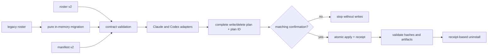

# Portable squad exports

Version 1.1.0 turns an authored squad into a content-addressed, vendored snapshot for
Claude Code, Codex, or both. Export does not create roles and does not change execution
cadence. It is an `export` verb on the lifecycle skill that already owns the roster.

## Contract in one diagram



Adapters render bytes. Destination policy decides where those bytes may go. This keeps
Claude Markdown/TOML/plugin syntax out of the neutral role contract and keeps path,
confirmation, collision, receipt, and rollback logic out of provider adapters.

## Manifest v2

`.squad/manifest.json` is the export decision record:

```json
{
  "schema_version": 2,
  "squad": {
    "id": "acme-release-readiness",
    "name": "Release readiness",
    "description": "Prepare an evidence-backed release decision"
  },
  "execution_mode": "one-time",
  "destination": "project",
  "providers": ["claude", "codex"],
  "runtime_owner": "claude",
  "export_version": "1.1.0"
}
```

- `squad.id` is the stable namespace used in discoverable role IDs and receipts.
- `execution_mode` remains `one-time`, `multi-use`, or `evergreen`.
- `destination` is `session`, `project`, `user`, or `plugin`.
- `providers` selects one or both first-class outputs.
- `runtime_owner` must be selected in `providers`; exactly one provider owns shared
  lifecycle behavior so dual-provider packages do not register duplicate runtimes.
- `export_version` identifies the snapshot format and generated package version.

The canonical schema is [schemas/manifest.schema.json](../schemas/manifest.schema.json).

## Provider-neutral roster v2

The role contract describes intent rather than provider syntax:

```json
{
  "id": "report-writer",
  "purpose": "Write the evidence-backed release report",
  "description": "Use when the squad needs its final release report",
  "file_ownership": {
    "include": ["reports/release/**"],
    "exclude": ["reports/release/private/**"]
  },
  "capabilities": ["filesystem.read", "filesystem.write"],
  "reasoning": {"profile": "deep", "effort": "high"},
  "active": true
}
```

Optional environment and provider-override blocks express a real provider difference
without weakening the shared role. A provider override is not a second source of role
truth; it is a compilation hint for model, tool, reasoning, sandbox, or legacy path
mapping.

Environment variable values are provisioning input, not role-prompt content. Provider
artifacts may name required variables, but exports do not embed their values. Credentials
belong outside the roster and are never vendored.

Legacy rosters remain valid input. Migration is deterministic and pure: it maps legacy
Claude tools/models/file scopes into the neutral structure in memory. The source roster,
legacy Claude agent files, and their locations are untouched until an export plan names
an operation and the creator confirms its exact ID.

## Plan, confirm, apply

`plan` validates all inputs and prints the complete mutation set. It includes:

- the normalized manifest and target root;
- source and output hashes;
- every file to write, delete, or mark executable;
- a deterministic `plan_id` covering the complete plan.

```bash
squad-export plan \
  --manifest .squad/manifest.json \
  --roster .squad/roster.json \
  --target "$PWD" \
  --plan-file /tmp/squad-export-plan.json
```

`apply` recompiles the snapshot, compares it byte-for-byte with the saved plan, checks
that the filesystem has not changed since preview, and requires the exact plan ID:

```bash
squad-export apply \
  --manifest .squad/manifest.json \
  --roster .squad/roster.json \
  --target "$PWD" \
  --plan-file /tmp/squad-export-plan.json \
  --confirm-plan-id '<reviewed plan_id>'
```

Application uses a staging transaction and rolls back installed/replaced files if an
operation fails. A plan is authorization for one exact state, not permission to “make
the export work” after the state changes.

## Destination policy

### Session

The manifest uses `"destination": "session"`. Do not pass a filesystem target.
`apply` emits a prompt containing active, canonical roles and the dispatch policy. It
creates no `.claude`, `.codex`, `.agents`, receipt, or user-level file.

Session is useful for a current run that should leave no discoverable agents behind.

### Project

The target must be the explicit absolute path of an existing Git repository root. The
export writes provider discovery artifacts and canonical contracts only under that root.
It rejects a home directory, a filesystem root, symlink components, and paths outside
the selected repository.

Claude agents mount under `.claude/agents/`. Codex agents mount under `.codex/agents/`
and Codex skills under `.agents/skills/`. All discoverable IDs are squad-namespaced.

### User

The target and `--home` must be the same explicit absolute home directory. Planning is
read-only; applying requires both the matching plan ID and an independent global-write
confirmation:

```bash
squad-export apply \
  --manifest .squad/manifest.json \
  --roster .squad/roster.json \
  --target "$HOME" \
  --home "$HOME" \
  --plan-file /tmp/squad-export-plan.json \
  --confirm-plan-id '<reviewed plan_id>' \
  --confirm-global-write
```

Every artifact is namespaced, and the receipt lives in the namespaced user installation.
User scope is never inferred and never the default.

### Plugin

The target must be an existing, explicit, creator-selected directory that is neither a
filesystem root nor the home directory. The package contains:

- canonical manifest and roster;
- activation instructions, license, and receipt;
- Claude agents and a self-contained Claude plugin when Claude is selected;
- a native Codex plugin, local marketplace wrapper, role prompts, and prompt-baked dispatch
  skills when Codex is selected;
- vendored shared runtime selected by the manifest’s one runtime owner.

The command stops after generation. It never registers, installs, enables, publishes,
or submits the package. Codex activation is explicitly two steps: register the generated
directory with `codex plugin marketplace add`, then install the namespaced selector with
`codex plugin add <plugin>@<marketplace>`. See the provider guides for exact commands.

## Validate

Validation reads the receipt, re-hashes every owned file, checks executable modes,
parses canonical contracts, rejects unresolved template placeholders, and verifies the
selected provider artifacts:

```bash
squad-export validate \
  --target "$PWD" \
  --destination project \
  --squad-id acme-release-readiness
```

Session has no installed artifacts and therefore has nothing to validate on disk.

## Re-export and uninstall

A receipt is an ownership ledger, not a broad directory claim. Re-export may update or
delete a receipt-owned file only while its current hash still matches the previous
receipt. An unowned collision or modified owned file stops the plan so the creator can
decide what to preserve.

Preview the exact receipt-authorized delete/write set first:

```bash
squad-export uninstall \
  --target "$PWD" \
  --destination project \
  --squad-id acme-release-readiness \
  --plan-file /tmp/acme-uninstall-plan.json
```

After reviewing the saved preview, apply only its exact plan ID:

```bash
squad-export uninstall \
  --target "$PWD" \
  --destination project \
  --squad-id acme-release-readiness \
  --plan-file /tmp/acme-uninstall-plan.json \
  --confirm-plan-id '<reviewed plan_id>'
```

Uninstall removes only receipt-owned, unmodified files. Modified files are preserved and
reported, and the receipt remains when preservation means ownership cannot be fully
released. A changed receipt or filesystem invalidates the saved preview. User uninstall
additionally requires `--home "$HOME"` and `--confirm-global-write` on apply.

## Snapshot exclusions

Exported artifacts are immutable vendored snapshots until re-exported. They do not
import this generator at runtime. Static skills, scripts, hooks, templates, and role
contracts may be vendored; live/private state is excluded by default:

- `.squad/partner.md`;
- `.env`, `.env.*`, and credentials;
- role workspaces and generated worktrees;
- role engagement/communication records;
- secrets and unrelated live squad state.

Portable roster copies retain environment structure and expected variable names, but
redact variable values, context-source locations, and tool install/verification commands.
Only canonical authored squad and role goals enter the dedicated context snapshot. These
exclusions prevent a portable package from becoming an accidental archive of a person, an
engagement, or a local machine.
