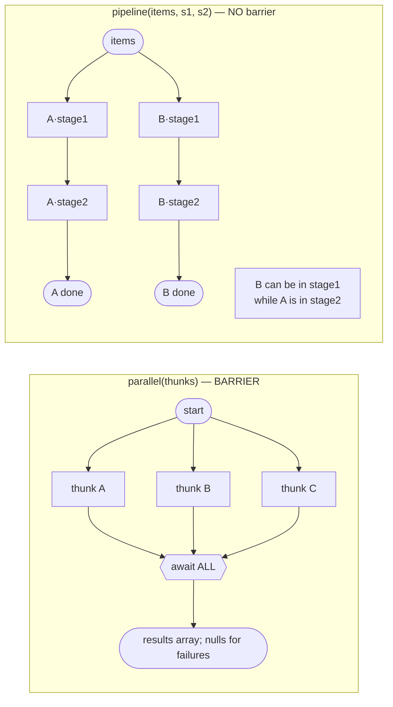
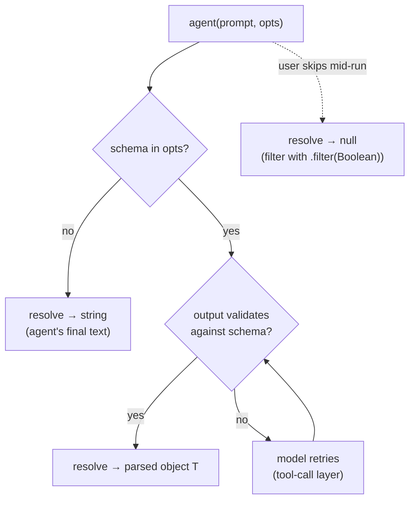
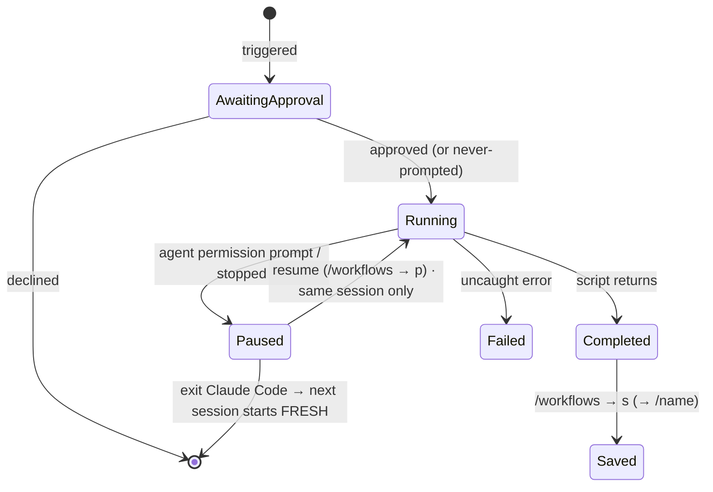
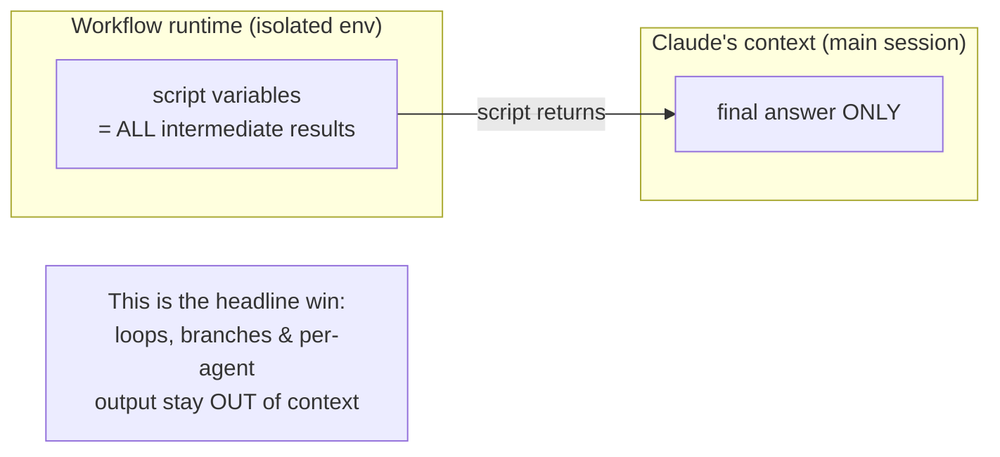

# Claude Code Dynamic Workflows — Zod Schema Reference

A detailed, schema-first explanation of **Claude Code's own dynamic-Workflow
feature** — the JavaScript orchestration runtime (`agent()` / `parallel()` /
`pipeline()` …), not the squad-dispatch workflow this repo ships. Use it to
understand exactly what the runtime is, how it is triggered and gated, how the
script talks to its agents, and the small details that bite.

Schemas are written in [Zod](https://zod.dev) (`z.*`). They are a *model* of the
contract for reading and validation — copy them into a `.ts` file to typecheck
your understanding.

---

## ⚠️ Provenance — two tiers of truth

This feature has an unusual documentation split. Read this first.

| Tier | What | Source | Confidence |
| --- | --- | --- | --- |
| 🟢 **Operational** | triggers, approval matrix, limits, resume, permission mode, save, availability | **Publicly documented** at `code.claude.com/docs/en/workflows` + `/agents`, verified 2026-05-31 | High — quoted below |
| 🔵 **Script DSL** | `meta`, `agent()`, `parallel()`, `pipeline()`, `phase()`, `log()`, `workflow()`, `budget`, `args`, the `schema` option | **NOT publicly documented.** The docs say "Claude writes the script" and treat the calling API as opaque. The signatures here come from the **runtime contract the authoring model operates under** (authoritative for execution, but not a published spec). | High for behavior, but treat names/shapes as runtime-internal, not a stable public API |

> The official docs deliberately present the workflow script as Claude-authored
> JavaScript you can *read* (`View raw script` / `Ctrl+G`) and *save*, but never
> publish the primitives it calls. So everything in §3–§6 below is the real DSL,
> flagged 🔵 — just don't expect to find it on `code.claude.com`.

---

## 1. What it is (🟢)

```ts
/**
 * A dynamic workflow = a JavaScript script that orchestrates subagents at scale.
 * Claude writes the script for the task you describe; a runtime executes it in
 * the BACKGROUND, in an ISOLATED environment separate from your conversation.
 * Intermediate results stay in SCRIPT VARIABLES — Claude's context holds only
 * the final answer.
 */
export const WorkflowConcept = z.object({
  authoredBy: z.literal("claude"),                 // you describe; Claude writes the JS
  executedBy: z.literal("workflow-runtime"),       // background, isolated env
  worker: z.literal("subagent"),                   // every worker is a subagent (a Claude session)
  intermediateResultsLiveIn: z.literal("script-variables"),
  mainContextRetains: z.literal("final-answer-only"),
});
```

> *"A dynamic workflow is a JavaScript script that orchestrates subagents at
> scale. Claude writes the script for the task you describe, and a runtime
> executes it in the background while your session stays responsive."*
> — `docs/en/workflows`

**Where it sits among the parallel-agent surfaces** (`docs/en/agents`):

| Surface | Coordinator | Intermediate results | Interruption | Scale |
| --- | --- | --- | --- | --- |
| **Subagents** | Claude, turn by turn | Claude's context window | Restarts the turn | a few per turn |
| **Skills** | Claude | Claude's context window | Restarts the turn | — |
| **Agent teams** | a lead, via mailbox | shared task list | interactive | a team |
| **Dynamic workflows** | **the script** | **script variables** | **resumable in session** | **dozens–hundreds** |
| Routines | scheduler (cloud) | — | — | *not parallel — a scheduled session* |

---

## 2. Triggers, approval & availability (🟢)

### 2.1 How a run is launched

```ts
export const WorkflowTrigger = z.enum([
  "keyword",          // include the word "workflow" anywhere in a prompt (one task)
  "ultracode",        // /effort ultracode → Claude plans a workflow per substantive task
  "bundled-command",  // e.g. /deep-research (ships with Claude Code)
  "saved-command",    // /<name> for a workflow you saved (see §7)
]);
```

- *Keyword:* `alt+w` ignores the highlight for one prompt; backspace right after
  the word cancels it; `/config` → **Workflow keyword trigger** turns it off.
- *Ultracode:* combines `xhigh` reasoning effort **and** automatic workflow
  orchestration. **Session-only**; resets next session. Only on models that
  support `xhigh` (Opus 4.8/4.7). One request can spawn several workflows in a row.

> **A skill cannot launch a workflow programmatically.** There is no
> skill→workflow call; the four triggers above are the only entry points, and
> each non-bypassed run is user-approved (§2.2). (This is exactly why this repo's
> `squad-spawn` *points the user at* `/cheeky-squad-os:squad-workflow` instead of
> invoking a workflow itself.)

### 2.2 Approval matrix — keyed by your session's permission mode

```ts
export const PermissionMode = z.enum([
  "default",
  "acceptEdits",
  "auto",
  "bypassPermissions",
  "headless",   // claude -p
  "agentSdk",
]);

export const LaunchApproval = z.enum([
  "every-run-unless-dont-ask-again", // per workflow, per project
  "first-launch-only",               // Yes recorded in user settings; later launches silent
  "never-prompted",                  // run starts immediately
]);

/** The verified mapping (docs/en/workflows). */
export const APPROVAL_BY_MODE = z.record(PermissionMode, LaunchApproval).parse({
  default:            "every-run-unless-dont-ask-again",
  acceptEdits:        "every-run-unless-dont-ask-again",
  auto:               "first-launch-only", // skipped entirely when ultracode is on
  bypassPermissions:  "never-prompted",
  headless:           "never-prompted",    // no one to prompt; follows permission rules
  agentSdk:           "never-prompted",
});
```

### 2.3 Availability gate

```ts
export const WorkflowAvailability = z.object({
  status: z.literal("research-preview"),
  minVersion: z.literal("2.1.154"),                 // Claude Code v2.1.154+
  plans: z.array(z.string()).default(["pro", "max", "team", "enterprise"]), // all paid; Pro via /config
  surfaces: z.array(z.enum(["api", "bedrock", "vertex", "foundry"])),
  disable: z.object({
    configToggle: z.boolean(),                       // /config → Dynamic workflows row
    userSetting: z.literal('"disableWorkflows": true'), // ~/.claude/settings.json
    envVar: z.literal("CLAUDE_CODE_DISABLE_WORKFLOWS=1"),
    managedOrgWide: z.boolean(),                      // managed settings / admin toggle
  }),
});
```

> When workflows are disabled: bundled commands vanish, the `workflow` keyword
> stops triggering, and `ultracode` is removed from the `/effort` menu.
> **Always design a fallback** (this repo falls back to direct `Agent` calls).

---

## 3. The script contract — `meta` (🔵)

Every workflow script begins with `export const meta = {...}`.

```ts
export const ModelTier = z.enum(["sonnet", "opus", "haiku"]);

export const PhaseMeta = z.object({
  /** Title — matched EXACTLY (string equality) to phase() calls and opts.phase. */
  title: z.string(),
  /** One-line description shown in the /workflows progress view. */
  detail: z.string().optional(),
  /** Note the model a phase uses, when overridden. */
  model: ModelTier.optional(),
});

export const WorkflowMeta = z.object({
  name: z.string().regex(/^[a-z0-9-]+$/),  // kebab id; becomes /<name> if saved
  description: z.string(),                 // one-liner shown in the permission dialog
  whenToUse: z.string().optional(),        // shown in the saved-workflow list
  phases: z.array(PhaseMeta).optional(),   // one entry per logical phase
  model: ModelTier.optional(),
});
```

> **Hard constraint not expressible in Zod:** `meta` must be a **pure literal** —
> no variables, function calls, spreads, or template interpolation. The runtime
> reads it statically before executing the body. Phase titles in `meta.phases`
> must match the `phase()` / `opts.phase` strings exactly to group progress.

---

## 4. The runtime primitives (🔵)

The script body runs in an **async context** (top-level `await` and `return` are
valid — the runtime wraps it in an async function). Standard JS built-ins are
available **except** `Date.now()`, `Math.random()`, and arg-less `new Date()`,
which **throw** (they would break deterministic resume). The script has **no
filesystem or shell access** — only the agents it spawns do.

```ts
/** A deferred unit of async work passed to parallel(). */
const Thunk = z.function().args().returns(z.promise(z.unknown()));

/** opts for agent(). */
export const AgentOptions = z.object({
  label:     z.string().optional(),                 // display label in /workflows
  phase:     z.string().optional(),                 // assign to a progress group (match meta.phases.title)
  schema:    z.record(z.unknown()).optional(),      // a JSON Schema → forces structured output (§5)
  model:     ModelTier.optional(),                  // per-agent model; omit = inherit session model
  isolation: z.literal("worktree").optional(),      // run agent in a throwaway git worktree
  agentType: z.string().optional(),                 // use a named subagent type (e.g. "Explore", a role)
});

/**
 * RuntimeApi — the globals available inside the script body. z.function() shapes
 * are approximate (Zod can't express variadics/generics cleanly); the TS type in
 * each comment is the precise signature.
 */
export const RuntimeApi = z.object({
  // agent(prompt, opts?) => Promise<string | T | null>
  //   - no schema  → resolves to the agent's final text (string)
  //   - schema     → resolves to the validated object (T)
  //   - user skips → resolves to null  (filter with .filter(Boolean))
  agent: z.function()
    .args(z.string(), AgentOptions.optional())
    .returns(z.promise(z.union([z.string(), z.record(z.unknown()), z.null()]))),

  // parallel(thunks) => Promise<any[]>   — BARRIER: awaits all; a thrown/errored
  //   thunk resolves to null in the array (the call never rejects).
  parallel: z.function()
    .args(z.array(Thunk))
    .returns(z.promise(z.array(z.unknown()))),

  // pipeline(items, ...stages) => Promise<any[]>  — NO barrier between stages;
  //   each item flows through all stages independently. Stage cb gets
  //   (prevResult, originalItem, index). A throwing stage drops that item to null.
  pipeline: z.function()
    .args(z.array(z.unknown()), z.function()) // + N more stage fns (variadic)
    .returns(z.promise(z.array(z.unknown()))),

  // phase(title) => void   — start a progress group; later agent()s join it.
  phase: z.function().args(z.string()).returns(z.void()),

  // log(message) => void   — emit a narrator line above the progress tree.
  log: z.function().args(z.string()).returns(z.void()),

  // workflow(nameOrRef, args?) => Promise<any>  — run another workflow inline,
  //   ONE LEVEL deep (nesting throws). Shares the run's concurrency cap & budget.
  workflow: z.function()
    .args(z.union([z.string(), z.object({ scriptPath: z.string() })]), z.unknown().optional())
    .returns(z.promise(z.unknown())),
});
```

### 4.1 `budget` and `args` globals (🔵)

```ts
/** budget — the turn's token target from a "+500k"-style directive. */
export const Budget = z.object({
  total:     z.number().nullable(),                 // null if no target set
  spent:     z.function().args().returns(z.number()),     // output tokens spent this turn (shared pool)
  remaining: z.function().args().returns(z.number()),     // max(0, total - spent()) or Infinity
});
// HARD CEILING: once spent() reaches total, further agent() calls THROW.
// Guard dynamic loops on budget.total (remaining() is Infinity when unset).

/** args — the value passed into the run, verbatim (undefined if none). */
export const Args = z.unknown();
// Pass real JSON values, not a JSON-encoded string, or args.map/.filter break.
```

> ⚠️ The public docs publish **no numeric budget primitive** — they only mention
> qualitative `ultracode` (= `xhigh`) and per-stage model routing for cost. The
> `budget` object above is 🔵 runtime-contract: real for the authoring model,
> absent from the public spec.

---

## 5. Structured output — the `schema` option (🔵 mechanism)

```ts
/**
 * When agent() is given `schema` (a JSON Schema), the subagent is FORCED to emit
 * validated JSON matching it, and agent() returns the parsed object — no string
 * parsing, and the model retries on mismatch (validation at the tool-call layer).
 */
export const StructuredAgentCall = z.object({
  prompt: z.string(),
  opts: AgentOptions.extend({ schema: z.record(z.unknown()) }), // schema present
});
// Returns: z.infer<typeof YourSchema>  (validated), or null if the user skipped it.
```

**Provenance nuance (verified):** ordinary Claude Code *subagents* return
**free-text** summaries — there is no subagent frontmatter field for a schema.
The public *Agent SDK* exposes structured output via `outputFormat` /
`output_format` (a JSON Schema → a `structured_output` result field). The
workflow runtime's `schema` option is implemented by wrapping your schema as a
**synthetic `StructuredOutput` tool** the model is forced to call — that exact
name is reported externally, not on `code.claude.com`. Net: the *capability* is
real and authoritative in the runtime; the *naming* is internal.

---

## 6. `parallel()` vs `pipeline()` — the core logic (🔵)

This is the decision that defines a workflow's wall-clock and correctness.



```ts
export const ConcurrencyChoice = z.discriminatedUnion("kind", [
  z.object({
    kind: z.literal("parallel"),
    semantics: z.literal("barrier"),       // awaits every thunk before returning
    failedThunk: z.literal("becomes-null"), // never rejects; .filter(Boolean) after
    useWhen: z.literal("you-need-ALL-results-together (dedup/merge/early-exit-on-zero)"),
  }),
  z.object({
    kind: z.literal("pipeline"),
    semantics: z.literal("no-barrier"),    // item A in stage 3 while B still in stage 1
    stageCallback: z.literal("(prevResult, originalItem, index)"),
    failedStage: z.literal("drops-item-to-null, skips its remaining stages"),
    useWhen: z.literal("default for multi-stage work; transform inside a stage, not between"),
  }),
]);
```

**Rule of thumb:** `pipeline()` is the default. Reach for a `parallel()` barrier
only when stage N genuinely needs *all* of stage N−1 at once (dedup across the
whole set, early-exit on zero, "compare against the other findings").

### 6.1 Runtime limits (🟢)

```ts
export const RUNTIME_LIMITS = z.object({
  maxConcurrentAgents: z.literal(16),      // fewer on machines with limited CPU cores
  maxAgentsPerRun:     z.literal(1000),    // runaway-loop backstop
  scriptFilesystemAccess: z.literal(false),
  scriptShellAccess:      z.literal(false),
  midRunUserInput:        z.literal(false),// only agent permission prompts can pause
}).parse({
  maxConcurrentAgents: 16, maxAgentsPerRun: 1000,
  scriptFilesystemAccess: false, scriptShellAccess: false, midRunUserInput: false,
});
```

> Pass 100 items to `pipeline()`/`parallel()` freely — only ~16 run at once; the
> rest queue. For sign-off **between** stages, run each stage as its **own**
> workflow (there is no mid-run input).

---

## 7. Save & resume (🟢)

```ts
export const SaveLocation = z.enum([
  ".claude/workflows/",   // project — shared with everyone who clones the repo
  "~/.claude/workflows/", // home    — every project, visible only to you
]);
// /workflows → select run → press s → Tab toggles location. Project wins on name clash.
// A saved script runs as /<name>.

export const ResumeSemantics = z.object({
  scope: z.literal("same-session-only"),               // exit Claude Code → next session starts FRESH
  completedAgents: z.literal("return-cached-results"),
  remainingAgents: z.literal("run-live"),
  howTo: z.enum([
    "/workflows → select → press p",
    "ask Claude to relaunch with the same script",
  ]),
});
```

> The press coverage of "multi-day jobs that pick up where they left off" is
> **tempered by reality**: resume is *session-scoped*. Quitting mid-run loses the
> in-flight run. There is no public `runId` concept — runs are referenced by
> selecting them in `/workflows`.

---

## 8. Permission & safety model (🟢) — the detail that bites

```ts
export const AgentPermissionModel = z.object({
  /** Spawned subagents ALWAYS run in acceptEdits, regardless of session mode. */
  mode: z.literal("acceptEdits"),
  fileEdits: z.literal("auto-approved"),               // bypasses any file-scope hook gating
  inheritsToolAllowlist: z.literal(true),
  /** Non-allowlisted shell/web/MCP can still PROMPT mid-run. */
  canStillPrompt: z.array(z.enum(["bash", "web-fetch", "mcp"])),
  mitigation: z.literal("pre-add needed commands to the allowlist before a long run"),
});
```

> 🔴 **Key gotcha:** the only thing your session's permission mode controls is the
> *launch* prompt. Once running, every workflow subagent has **file edits
> auto-approved**. If you rely on a `PermissionRequest`/file-scope hook for write
> discipline (as this repo does), a workflow **bypasses it** — so confine
> workflow agents to read/analyze + self-scoped writes, and keep code-mutating
> work on a hook-gated path.

---

## 9. Communication flows

### 9.1 End-to-end: trigger → approve → background run → result

```mermaid
sequenceDiagram
    autonumber
    actor U as User
    participant CLA as Claude (main session)
    participant RT as Workflow runtime (isolated)
    participant A as Subagent(s) (acceptEdits)

    U->>CLA: prompt containing "workflow" (or /effort ultracode, /deep-research)
    CLA->>CLA: author the JS script (meta + body)
    CLA->>U: approval prompt (per §2.2 matrix)
    U-->>CLA: Yes / Yes-don't-ask-again
    CLA->>RT: hand off script (+ args); returns immediately
    Note over CLA,U: session stays responsive — run is background
    RT->>A: agent(prompt, opts) → spawn subagent
    A-->>RT: final text  (or validated JSON if schema)  (or null if skipped)
    Note over RT: result stored in a SCRIPT VARIABLE (not Claude's context)
    RT->>RT: parallel()/pipeline() orchestrate more agents (≤16 concurrent)
    RT-->>CLA: script return value (the FINAL answer only)
    CLA->>U: synthesized result
```

### 9.2 Return-value semantics (what flows back from `agent()`)



### 9.3 Run lifecycle (state machine)



### 9.4 What the parent retains vs the runtime holds



---

## 10. Quick-reference cheat sheet

```ts
export const WorkflowCheatSheet = z.object({
  triggers:           WorkflowTrigger.options,                 // keyword · ultracode · bundled · saved
  skillCanInvoke:     z.literal(false),                        // must be user-triggered
  concurrency:        z.literal("≤16 (CPU-bound), 1000 total/run"),
  scriptCanTouchFS:   z.literal(false),                        // agents can; script can't
  forbiddenInScript:  z.array(z.string()).default(["Date.now()", "Math.random()", "new Date()"]),
  intermediateState:  z.literal("script variables"),
  contextRetains:     z.literal("final answer only"),
  agentReturn:        z.literal("string | validated-object | null"),
  parallel:           z.literal("BARRIER, nulls on failure"),
  pipeline:           z.literal("NO barrier, item-independent, default"),
  agentsRunIn:        z.literal("acceptEdits (file edits auto-approved)"),
  resume:             z.literal("same session only"),
  budgetCeiling:      z.literal("hard — agent() throws past budget.total"),
  availability:       z.literal("research preview · v2.1.154+ · paid plans · /config on Pro"),
  disable:            z.literal('"disableWorkflows": true | CLAUDE_CODE_DISABLE_WORKFLOWS=1'),
});
```

---

## Sources

🟢 facts verified 2026-05-31 against:
- `https://code.claude.com/docs/en/workflows`
- `https://code.claude.com/docs/en/agents`
- `https://code.claude.com/docs/en/sub-agents`
- `https://code.claude.com/docs/en/model-config`
- `https://code.claude.com/docs/en/agent-sdk/structured-outputs`

🔵 script-DSL signatures are sourced from the **Workflow tool runtime contract**
the authoring model operates under — accurate for execution, but **not published**
on `code.claude.com` (the docs treat the script as Claude-authored and opaque).
Treat DSL names/shapes as runtime-internal rather than a frozen public API.
