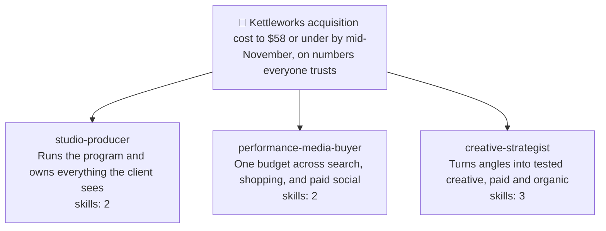

# Worked example — a full-funnel marketing agency squad (Multi-use)

A walkthrough of using **cheeky-squad-os** to build a five-seat marketing agency for a
direct-to-consumer brand. This is the flagship example for two behaviors that landed
together: the **5-seat cap** (hard rule #16) and **skill onboarding** (`squad-role`'s Q8).

What this example is here to show:

- A decomposition that honestly produces **eight** workstreams, the cap firing at Step 5,
  and the consolidation that follows — including the moment the builder asks for a sixth
  seat and does not get one.
- **Q8 in full for two seats** — the research pass across real open-source repositories,
  the numbered proposal, and the auto-approval record — and summarized for the other
  three. Eleven skills are onboarded in total.
- The **squad card** (text plus mermaid squad map) printed twice: mid-build at three
  seats with no hand-off edges, and as final state after dispatch with the hand-off edges
  the manifests actually justify.
- The `# Your onboarded skills` section of a real spawn prompt, with the absolute-path
  convention.

Everything the transcript below claims exists as a real artifact in
[`full-funnel-agency/`](full-funnel-agency/) — the roster, all eleven adapted skills, and
a one-command validation of the roster against this repo's own contract loader.

Guided domain research is deliberately **skipped** in this run; it is worked end to end,
both gates included, in [`klaviyo-audit.md`](klaviyo-audit.md). This example spends its
attention on the cap and on skill onboarding instead.

---

## 1. The client and the ask

Kettleworks sells specialty coffee equipment direct to consumer — grinders, kettles,
scales. Average order value sits around $185. They have been running paid search and
paid social themselves for two years, inherited a Meta account from a former contractor,
and are about to enter their heaviest quarter. Their new-customer acquisition cost has
drifted from the mid-forties to the low seventies, and nobody can say whether that is
real or a reporting artifact — the ad platforms and the store disagree by a margin
large enough to make every meeting an argument about numbers.

Dana runs the agency engagement. Three weeks in, she has a channel plan, a creative
backlog, and no way to hold them together. She installs `cheeky-squad-os` in the client
working directory (`/Users/dana/work/kettleworks`) and opens Claude Code.

---

## 2. Onboarding (`/cheeky-squad-os:squad-onboard`)

```text
User: /cheeky-squad-os:squad-onboard

squad-onboard: Do you have a goal?

Tell me what you want to accomplish. A sentence is enough. I'll
reformulate it as a measurable outcome, then propose the squad to
deliver it.

User: I need to run Kettleworks' whole funnel — paid, creative,
lifecycle, the reporting — as one program instead of five people
guessing in five tabs.

squad-onboard: Let me reformulate that as an outcome so the squad has
something concrete to chase:

  "Stand up Kettleworks' full-funnel acquisition program so that by
   2026-11-14, blended new-customer acquisition cost is at or below
   $58 on at least $120,000 of monthly tracked spend, with every
   channel reporting into one reconciled attribution basis."

Does that match what you want?

User: Yes — and the reconciled part is the important half. If the
numbers aren't trustworthy the rest is theatre.

squad-onboard: Inferred mode: Multi-use.

Why: this is a build with several workstreams running at once —
media, creative, measurement, lifecycle — iterating over a
quarter, not a bounded deliverable with a single hand-in. One-time
would work: it would spawn every role once as a subagent, each
producing its artifact, and end. But this program's whole shape is
weekly — a pacing decision on Monday that depends on a
reconciliation that landed Friday, a creative refresh triggered by
a fatigue signal a different seat noticed. Multi-use gives the
roles a shared task list and a mailbox, so those hand-offs happen
between teammates instead of through you. Override if you want.

Skill onboarding: approve each role's skills yourself, or
auto-approve?

User: auto. And Multi-use is right.

squad-onboard: Recorded — `skill_onboarding: auto` in the goal's
frontmatter. Every role's Q8 will still research, still propose,
and still show you exactly what it onboarded and from where; it
just won't stop for a yes on each one.

Want me to check the domain before I decompose?

  1. What is the current bulk-sender complaint threshold that would
     bind Kettleworks' lifecycle sends? (source: web search+fetch)
  2. Which conversion actions are the inherited accounts currently
     optimizing toward? (source: connected MCP tools)
  3. Is there anything already on record about the platform-versus-
     store discrepancy? (source: this codebase and project files)

Say `skip` to decompose from what I already know, or `go` to run
this as written — or tell me what to cut or add first.

User: skip. I already know the answer to all three and the squad is
going to re-derive them properly anyway.

squad-onboard: Skipped. Nothing runs, nothing is written to
.squad/world/, and the decomposition below comes from priors —
no citations, no delta line.
```

Two things were decided in that one message that matter for the rest of this example.
**Multi-use** determines how the squad is dispatched in section 7. **`skill_onboarding:
auto`** is one of exactly two channels that can auto-approve an onboarded skill — the
other is a standing constraint in `.squad/partner.md`, which this project does not have
yet. Neither is ever inferred mid-flow; the builder said it here, once, and every Q8
below reads it off the goal file.

---

## 3. Goal saved — `.squad/goal.md`

```markdown
---
mode: multi-use
created: 2026-08-15T08:12:00Z
target: 2026-11-14
skill_onboarding: auto
---

# Squad goal

Stand up Kettleworks' full-funnel acquisition program so that by 2026-11-14,
blended new-customer acquisition cost is at or below $58 on at least $120,000
of monthly tracked spend, with every channel reporting into one reconciled
attribution basis.

## Definition of done

- Blended new-customer acquisition cost is at or below $58, measured over a
  trailing 28-day window, on at least $120,000 of tracked monthly spend.
- Platform-reported conversions and store-of-record orders agree within 3% for
  14 consecutive days, on a written and unchanging attribution basis.
- At least 12 distinct creative concepts have shipped across paid search and
  paid social, each with a written hypothesis and a stated kill-or-scale
  criterion recorded before it launched.
- The lifecycle program is live — welcome, browse abandon, cart abandon,
  post-purchase, and winback — every sequence carrying a segment definition and
  all five exit conditions; email and SMS attributed revenue is at or above 22%
  of total revenue.
- A client-facing performance brief has been published every Monday for six
  consecutive weeks, each one naming that week's decisions and their owners.

## Out of scope

- Any promotional, discount, coupon, or price-led message, in any channel,
  paid or owned. Margins do not support it and the brand does not do it.
- Website or theme development beyond landing-page copy changes.
- Influencer contracts, creator sponsorships, or any paid partnership.
- Changes to product pricing, bundling, or packaging.
```

The first Out-of-scope bullet is load-bearing for the rest of this example. It reaches
every role as a derived `stop:` bullet, and it survives all the way down into the
onboarded skills themselves — the lifecycle spec's carried-over source template leaned on
an incentive in its winback sequence, and the adaptation had to replace it rather than
inherit it. Section 9 comes back to this.

---

## 4. Decomposition — and the cap

```text
squad-onboard: Proposed workstreams:

  1. Orchestrate the program and own client reporting — sequencing,
     the weekly decision cadence, every client-facing artifact.
  2. Architect and run search, shopping, and Performance Max buying.
  3. Architect and run paid social buying across Meta and TikTok.
  4. Build the creative testing system — hypotheses, hooks, briefs,
     kill and scale criteria.
  5. Produce the creative assets and the organic content that carries
     them.
  6. Build the measurement foundation — events, consent, dedup,
     one conversion definition.
  7. Audit the inherited accounts for structural waste and defects.
  8. Build the lifecycle engine — email and SMS sequences — plus
     organic search.

Does this decomposition cover the goal? Any to merge, split, or
drop?

User: That's the whole agency, yes. Generate all eight.

squad-onboard: I can't, and I'd rather say why than quietly drop
three.

A squad is capped at 5 active seats (hard rule #16). This isn't a
budget limit — it's a coordination one. Every additional seat adds
a hand-off surface, a file-ownership boundary to keep disjoint, and
another place for two roles to reach different conclusions from the
same data. Eight seats spends more of the program's attention on
staying in sync than on the funnel.

So: a squad that needs a sixth seat needs a better decomposition,
not a bigger roster. Here are the merges, one line of reasoning
each:

  2 + 3 → performance-media-buyer
     There is one budget. Search and social are not two decisions,
     they are one reallocation decision with two destinations —
     split across two seats, each proposes a change to money the
     other half also claims, and neither can settle it.

  4 + 5 → creative-strategist
     The hypothesis and the asset are the same artifact at two
     stages. A brief that crosses a seat boundary arrives with the
     hypothesis stripped off it, which is exactly how a concept
     ships that nobody can later say what it was testing.

  6 + 7 → tracking-analyst
     The audit's top finding is always tracking. Both seats read
     the same conversion tables to do their job, and the auditor
     cannot grade a bid strategy without knowing whether the
     conversion definition behind it is sound.

  1 → studio-producer (unchanged)
  8 → lifecycle-organic-marketer (unchanged)

Five seats. Re-split anything you like within that number.

User: I want the auditor separate. The audit is a one-off up front
and I don't want it competing with weekly reconciliation for
attention. Six seats, just for the first month?

squad-onboard: No — the cap doesn't have a temporary mode, and a
sixth seat added "just for a month" is a sixth seat with a
file-ownership boundary and a hand-off surface for as long as the
squad exists.

But the thing you actually want is available at five. The audit is
not one job, it's two that were bundled in the source material:
a structural audit (account architecture, bidding, budget, targeting,
creative coverage) and a measurement audit (events, dedup, consent,
attribution basis). They have different readers and different first
actions. Give the structural half to performance-media-buyer — it
audits the account it is about to spend money in, which is where the
findings were going anyway — and keep the measurement half with
tracking-analyst.

You lose nothing but the seat. And it removes the hand-off where an
auditor writes a finding the buyer has to re-derive before acting on
it.

User: Fine — that's better than what I asked for. Go.

squad-onboard: Final squad:

  - studio-producer            — runs the program, owns client comms
  - performance-media-buyer    — one budget across search + social;
                                 audits the account it spends in
  - creative-strategist        — hypothesis → asset → organic
  - tracking-analyst           — one conversion definition, weekly
                                 reconciliation
  - lifecycle-organic-marketer — email/SMS + organic search

Handing off to squad-role to generate each role interactively.
```

That last exchange is the whole rule working as intended. The cap did not just refuse —
refusing alone would have cost the builder something real. It refused, and then found the
seam inside the workstream that made the refusal free. The 200-checkpoint audit framework
these two seats end up sharing was one file in the source material; splitting it by reader
is what let five seats do eight seats' work. You can see the result in the two skills'
scope-boundary sections, which explicitly disclaim each other's checkpoints.

---

## 5. Role generation (`/cheeky-squad-os:squad-role`, one seat at a time)

Five invocations. **Q8 is shown in full for two of them** — `performance-media-buyer`
(section 5.2) and `lifecycle-organic-marketer` (section 5.5) — and summarized for the
other three.

### 5.1 `studio-producer` (Q8 summarized)

Q1–Q7 in the usual shape: purpose, file scope `deliverables/program/**` (excluding
`deliverables/program/archive/**`), tools `Read, Write, Edit, Glob, Grep`, model `opus`,
no sandbox.

**Q8 in one paragraph.** The research pass found nothing usable in `anthropics/skills`
(document and office-format skills), `addyosmani/agent-skills` (frontend and web
performance), or `obra/superpowers` (engineering workflow). It found one strong match in
`msitarzewski/agency-agents`:
[`project-management/project-management-studio-producer.md`](https://github.com/msitarzewski/agency-agents/blob/main/project-management/project-management-studio-producer.md).
Two skills were distilled from that single file, because it bundles two different jobs:
**`weekly-client-brief`** (its Strategic Portfolio Review template, dropped from
quarterly-executive altitude to a one-page weekly brief where every section is a decision
rather than a status) and **`program-risk-register`** (its Risk Management and Contingency
section, rewritten so every row carries an observable trigger and a response agreed
*before* the trigger fires — the source stated both in prose, which ages into something
nobody can check). Both auto-approved off `skill_onboarding: auto`, recorded at
`2026-08-15T08:19:41Z`.

### 5.2 `performance-media-buyer` — Q8 in full

```text
User: /cheeky-squad-os:squad-role

squad-role: Preflight: goal found, roster has 1 active role. Under
the 5-seat cap, proceeding.

Q1 — What does this role do, in one line?

User: Own every paid dollar across search, shopping, and paid social —
one budget, one pacing decision, one weekly reallocation. And audit
the inherited accounts before spending in them.

squad-role: Q2 — name? (kebab-case)

User: performance-media-buyer

squad-role: Q3 — file scope?

User: deliverables/media/**

squad-role: Q4 — tools? (default: Read, Edit, Write, Glob, Grep)

User: Add Bash, WebSearch, WebFetch. It needs to work through exports
and read platform documentation.

squad-role: Q5 — model?

User: opus. Budget decisions with real money behind them.

squad-role: Q6 — worktree isolation? Q7 — sandbox?

User: No worktree. Yes to a sandbox — it'll be handling CSV exports
and I don't want them landing in the deliverables directory.

squad-role: Sandbox provisioned at
.squad/workspaces/performance-media-buyer with exports/, pacing/,
and reference/; PACING_WINDOW_DAYS=28; goal copied into reference/;
jq verified present. The workspace glob is added to this role's file
scope so in-sandbox writes auto-approve.

Q8 — Skill onboarding.

Rule of this step: don't reinvent the wheel. I search for an
existing open-source skill before authoring anything original, and
attribution stays on whatever I adapt. Researching now, in order.

  anthropics/skills — https://github.com/anthropics/skills
    Document, spreadsheet, and presentation skills. Nothing on
    paid media. No match.

  addyosmani/agent-skills — https://github.com/addyosmani/agent-skills
    Web performance, frontend, accessibility. No match.

  msitarzewski/agency-agents —
  https://github.com/msitarzewski/agency-agents
    Three direct hits under paid-media/:
      - paid-media-auditor.md (a 200+ checkpoint audit framework)
      - paid-media-ppc-strategist.md (account architecture, bidding,
        budget pacing)
      - paid-media-paid-social-strategist.md (cross-platform social
        buying, frequency, budget split)

  obra/superpowers — https://github.com/obra/superpowers
    Engineering workflow — TDD, debugging, worktrees. No match.

  Web search, beyond the four repos above: nothing that beats the
  agency-agents set for this role. Several paid-media "prompt packs"
  exist; all are thinner than what's already found and none carry a
  licence I can attribute cleanly.

Proposed, 2 skills:

  1. paid-media-audit
     Source: https://github.com/msitarzewski/agency-agents/blob/main/paid-media/paid-media-auditor.md
     Purpose: pre-flight an inherited ad account on structure,
     bidding, budget, targeting, and creative coverage before a
     dollar moves.
     Adapted: split — the source audits structure AND measurement in
     one 200-checkpoint pass; every tracking, tagging, and
     conversion-counting checkpoint is removed here and lives in
     tracking-analyst's conversion-tracking-audit, per the
     decomposition decision at Step 5. Then cut to the checks where a
     failure has a named consequence and a first action, because 200
     checkpoints is a deliverable in search of a reader.

  2. budget-pacing-review
     Source: https://github.com/msitarzewski/agency-agents/blob/main/paid-media/paid-media-ppc-strategist.md
     Also drawn from: https://github.com/msitarzewski/agency-agents/blob/main/paid-media/paid-media-paid-social-strategist.md
     Purpose: run the weekly cross-channel pacing and reallocation
     decision from one table, with a written rule for when spend does
     NOT move.
     Adapted: merges the two sources, because this seat holds the
     halves they each solve separately — search reasons about pacing
     and diminishing returns, social about frequency and platform
     split, and held apart they produce two budget recommendations
     that can't both be acted on. Then adds what neither source has:
     a two-window rule and a 20% cap on any single move, so the
     weekly cadence can't reallocate on noise.

Goal frontmatter has skill_onboarding: auto — approving both without
asking. Here's the record.

  ✓ paid-media-audit          approval_mode: auto  2026-08-15T08:31:07Z
  ✓ budget-pacing-review      approval_mode: auto  2026-08-15T08:31:07Z

  Approved via .squad/goal.md frontmatter (skill_onboarding: auto),
  set during onboarding. Not inferred here.

Onboarded:
  .squad/skills/performance-media-buyer/paid-media-audit/SKILL.md
  .squad/skills/performance-media-buyer/budget-pacing-review/SKILL.md

Both entries appended to this role's onboarded_skills via
squad-roster; roster.md regenerated.
```

The two source URLs on `budget-pacing-review` are worth a note. The roster's
`onboarded_skills` entry carries a single `source_url` — the primary — and the skill
file's own `Source:` attribution block names both. Attribution follows the text, not the
schema field; where an adaptation genuinely draws on two files, both get named where a
reader will see them.

### 5.3 `creative-strategist` (Q8 summarized) — and the first squad card

Q1–Q7: file scope `deliverables/creative/**`, tools `Read, Write, Edit, Glob, Grep,
WebSearch, WebFetch`, model `opus`, no sandbox.

**Q8 in one paragraph.** Same four-repo sweep; the match again was `agency-agents`, this
time three files, which is what the Step-5 merge predicted — this seat absorbed three
source roles. **`hook-matrix`** comes from
[`paid-media/paid-media-creative-strategist.md`](https://github.com/msitarzewski/agency-agents/blob/main/paid-media/paid-media-creative-strategist.md);
the source is right that every asset is a hypothesis but never says where the hypothesis
gets *written down*, so the adaptation makes the matrix the artifact and requires kill and
scale criteria before production. **`creative-brief`** comes from
[`marketing/marketing-content-creator.md`](https://github.com/msitarzewski/agency-agents/blob/main/marketing/marketing-content-creator.md),
narrowed hard from broad content strategy to one job — one matrix cell becomes one
shippable spec — with exact copy fields and character limits checked at brief time.
**`organic-social-plan`** comes from
[`marketing/marketing-instagram-curator.md`](https://github.com/msitarzewski/agency-agents/blob/main/marketing/marketing-instagram-curator.md)
with its core assumption inverted: the source plans organic as its own creative universe
with its own testing, which in this squad would be a second, slower, less-instrumented
test of questions paid is already answering with real money — so organic inherits from
paid, and a concept earns a slot by having survived a matrix cell. Three skills, all
auto-approved, recorded at `2026-08-15T08:44:20Z`.

The three skills deduplicate against each other explicitly: each one's scope-boundary
section names what the other two own and refuses to restate it. That is what stops three
skills in one seat from becoming three overlapping opinions about the same brief.

**Squad card — mid-build, three seats:**

```text
Squad: Kettleworks acquisition cost to $58 or under by mid-November, on numbers everyone trusts
Seats: 3/5

- studio-producer — runs the program and owns everything the client sees (skills onboarded: 2)
- performance-media-buyer — one budget across search, shopping, and paid social (skills onboarded: 2)
- creative-strategist — turns angles into tested creative, paid and organic (skills onboarded: 3)
```



No role-to-role edges here, and that is the specification, not an omission: hand-off edges
are derived from `.squad/role-comm-<from>--<to>.md` manifests, and nothing has run yet, so
no manifest exists to derive one from. Drawing the arrows you *expect* would be inventing
them. Section 8 shows the same map after dispatch, when there is something real to draw.

### 5.4 `tracking-analyst` (Q8 summarized)

Q1–Q7: file scope `deliverables/measurement/**`, tools `Read, Write, Edit, Bash, Glob,
Grep, WebFetch`, model **`fable`** at `xhigh` effort — this is the one seat whose work is
larger than a single sitting: it investigates a discrepancy across change history,
platform exports, and store records, and has to self-verify before it publishes a number
four other seats will act on.

**Q8 in one paragraph.** Two skills, both from `agency-agents`.
**`conversion-tracking-audit`** comes from
[`paid-media/paid-media-tracking-specialist.md`](https://github.com/msitarzewski/agency-agents/blob/main/paid-media/paid-media-tracking-specialist.md),
reorganized from the source's technology-by-technology shape into a per-conversion-path
walk — a discrepancy is never located *in* a technology, it is located where two
technologies disagree about one event — plus a stated pass bar (within 3%, zero
double-counted events) so an audit ends in a verdict. **`attribution-reconciliation`**
takes the measurement and change-history-forensics half of
[`paid-media/paid-media-auditor.md`](https://github.com/msitarzewski/agency-agents/blob/main/paid-media/paid-media-auditor.md)
— the same source file `performance-media-buyer` took the structural half of — and adds
what a one-off audit does not need and a weekly program does: a standing reconciliation,
an authority rule (store of record for revenue, platforms for spend, nothing else
authoritative for anything), and a root-cause order that puts "genuine attribution
difference" last precisely because it is unfalsifiable and therefore the most comfortable
place to stop looking. Auto-approved, recorded at `2026-08-15T08:58:52Z`.

### 5.5 `lifecycle-organic-marketer` — Q8 in full

```text
User: /cheeky-squad-os:squad-role

squad-role: Preflight: goal found, roster has 4 active roles. One seat
left under the cap.

Q1 — What does this role do, in one line?

User: Own the compounding half of the funnel — lifecycle email and SMS
plus organic search — so paid isn't the only thing holding acquisition
cost down.

squad-role: Q2 — name?

User: lifecycle-organic-marketer

squad-role: Q3 — file scope?

User: deliverables/lifecycle/**

squad-role: Q4 — tools?

User: Read, Write, Edit, Glob, Grep, WebSearch, WebFetch.

squad-role: Q5 — model?

User: sonnet.

squad-role: Q6 — worktree? Q7 — sandbox?

User: Neither.

squad-role: Q8 — Skill onboarding.

Researching, same order as always.

  anthropics/skills — https://github.com/anthropics/skills
    No lifecycle or search marketing content. No match.

  addyosmani/agent-skills — https://github.com/addyosmani/agent-skills
    No match.

  msitarzewski/agency-agents —
  https://github.com/msitarzewski/agency-agents
    The paid-media/ directory I've used for three seats now has
    nothing for this one — it's entirely paid. Before concluding
    the repo has no match, I checked the whole tree rather than
    the directory I already knew:

      curl -s https://api.github.com/repos/msitarzewski/agency-agents/git/trees/main?recursive=1

    The marketing/ directory has 35 files. Three are candidates:

      marketing/marketing-email-strategist.md   — lifecycle
        sequences, segmentation, deliverability, post-privacy
        measurement. Substantial and opinionated.
      marketing/marketing-seo-specialist.md     — technical SEO,
        content clusters, cannibalization prevention. Substantial.
      marketing/marketing-growth-hacker.md      — read and
        rejected. Mostly identity and success metrics; there is no
        procedure in it to distill. Onboarding it would produce a
        skill that says "be growth-minded."

  obra/superpowers — https://github.com/obra/superpowers
    No match.

  Note: "don't reinvent the wheel" cost one extra API call here.
  The eight files I already had in context covered paid media and
  project management; concluding from those that the repo had
  nothing for lifecycle would have been an authoring decision
  disguised as a research result.

Proposed, 2 skills:

  1. lifecycle-sequence-spec
     Source: https://github.com/msitarzewski/agency-agents/blob/main/marketing/marketing-email-strategist.md
     Purpose: specify a sequence so it can't ship without a trigger,
     a segment definition, exit conditions, and a click-based
     success bar.
     Adapted: four of the source's critical rules carried through
     intact because they're correct and routinely violated
     (segmentation over broadcast, respect the lifecycle, clicks
     over opens, exit conditions non-negotiable). Re-anchored from
     the source's long-cycle service-business framing onto a DTC
     purchase cycle, platform-specific detail dropped (it dates
     fast and the ESP is a project fact, not a skill fact), and
     measurement narrowed to one pass bar so a review ends in ships
     or doesn't ship. One addition from the goal: the source's
     winback and cart templates lean on an incentive, which this
     program's Out of scope forbids — the adaptation replaces the
     incentive rather than inheriting it.

  2. organic-search-brief
     Source: https://github.com/msitarzewski/agency-agents/blob/main/marketing/marketing-seo-specialist.md
     Purpose: run the cannibalization check and cluster-ownership
     map before proposing any on-page change.
     Adapted: the source's technical-crawl, link-authority, and
     page-experience sections are dropped — that's site engineering
     this squad doesn't own and can't ship. What's kept is the part
     that is pure marketing judgement and the most frequently
     skipped: deciding which page owns which query before writing
     anything. The source states that check as a mandatory
     precondition; that framing is preserved literally, including
     an explicit "mark the brief unverified" path for when the
     check can't be run, so it can't be silently skipped.

Goal frontmatter has skill_onboarding: auto — approving both.

  ✓ lifecycle-sequence-spec   approval_mode: auto  2026-08-15T09:11:36Z
  ✓ organic-search-brief      approval_mode: auto  2026-08-15T09:11:36Z

  Approved via .squad/goal.md frontmatter (skill_onboarding: auto).

Onboarded:
  .squad/skills/lifecycle-organic-marketer/lifecycle-sequence-spec/SKILL.md
  .squad/skills/lifecycle-organic-marketer/organic-search-brief/SKILL.md

Squad is at the 5-seat cap — deactivate or consolidate a role via
squad-roster before generating another.
```

That rejected third candidate is the honest part of the research pass. `growth-hacker` is
a real file with a real name that sounds exactly like something this seat should have;
onboarding it would have produced a skill with a plausible frontmatter and nothing
underneath. Naming what was checked and rejected is what makes the two that *were*
onboarded mean something.

---

## 6. The roster after generation

`.squad/roster.json` — schema version 2, five roles, eleven onboarded skills. The full
file is in this repo at
[`full-funnel-agency/roster.json`](full-funnel-agency/roster.json); here is the
`performance-media-buyer` entry, which is the one carrying both a sandbox and onboarded
skills:

```json
{
  "id": "performance-media-buyer",
  "purpose": "Own every paid dollar across search, shopping, and paid social — one budget, one pacing decision, one weekly reallocation.",
  "description": "Use when the squad needs paid campaign structure, a bidding or budget-pacing decision, a spend reallocation across channels, or a pre-flight audit of an inherited ad account.",
  "file_ownership": {
    "include": [
      "deliverables/media/**",
      ".squad/workspaces/performance-media-buyer/**"
    ],
    "exclude": []
  },
  "capabilities": [
    "filesystem.edit", "filesystem.read", "filesystem.write",
    "shell.execute", "web.fetch", "web.search"
  ],
  "reasoning": {"profile": "deep", "effort": "high"},
  "active": true,
  "goal_ref": ".squad/role-goal-performance-media-buyer.md",
  "environment": {
    "workspace": ".squad/workspaces/performance-media-buyer",
    "directories": ["exports", "pacing", "reference"],
    "variables": {"PACING_WINDOW_DAYS": "28"},
    "context": [
      {"source": ".squad/goal.md", "target": "reference", "kind": "copy"}
    ],
    "tools": [{"name": "jq", "kind": "system", "verify": "command -v jq"}]
  },
  "provider_overrides": {
    "claude": {
      "model": "opus",
      "tools": ["Read", "Write", "Edit", "Bash", "Glob", "Grep", "WebSearch", "WebFetch"],
      "agent_file": ".claude/agents/performance-media-buyer.md"
    }
  },
  "onboarded_skills": [
    {
      "name": "paid-media-audit",
      "source_url": "https://github.com/msitarzewski/agency-agents/blob/main/paid-media/paid-media-auditor.md",
      "local_path": ".squad/skills/performance-media-buyer/paid-media-audit/SKILL.md",
      "purpose": "Pre-flight an inherited ad account on structure, bidding, budget, targeting, and creative coverage before a single dollar moves.",
      "approval_mode": "auto",
      "approved_at": "2026-08-15T08:31:07Z"
    },
    {
      "name": "budget-pacing-review",
      "source_url": "https://github.com/msitarzewski/agency-agents/blob/main/paid-media/paid-media-ppc-strategist.md",
      "local_path": ".squad/skills/performance-media-buyer/budget-pacing-review/SKILL.md",
      "purpose": "Run the weekly cross-channel pacing and reallocation decision from one table, with a written rule for when spend moves and when it does not.",
      "approval_mode": "auto",
      "approved_at": "2026-08-15T08:31:07Z"
    }
  ],
  "created": "2026-08-15T08:31:07Z"
}
```

Skills by seat: `studio-producer` 2, `performance-media-buyer` 2, `creative-strategist` 3,
`tracking-analyst` 2, `lifecycle-organic-marketer` 2 — **eleven**, every one of them
adapted from a named open-source source file with attribution preserved in the skill body.

The roster in this repo validates against the plugin's own contract loader; the exact
command is in [`full-funnel-agency/README.md`](full-funnel-agency/README.md).

---

## 7. Spawn (`/cheeky-squad-os:squad-spawn`, Multi-use path)

Multi-use dispatches the five roles as Agent Teams teammates — shared task list, direct
messaging, one Claude session each. What matters for this example is one section of the
spawn prompt. Here is the `creative-strategist`'s, excerpted:

```text
You are the creative-strategist role on a cheeky-squad-os squad.

# Squad goal (binding north-star)
<full contents of .squad/goal.md — pasted verbatim, including the
 Out of scope bullet forbidding promotional and discount messaging>

# Your role's goal
<full contents of .squad/role-goal-creative-strategist.md>

# Your onboarded skills
- hook-matrix — /Users/dana/work/kettleworks/.squad/skills/creative-strategist/hook-matrix/SKILL.md — Lay out hook x audience x format as a matrix where every cell is a written hypothesis with a kill or scale criterion attached before it ships.
- creative-brief — /Users/dana/work/kettleworks/.squad/skills/creative-strategist/creative-brief/SKILL.md — Turn one hook-matrix cell into a production brief a designer, editor, or writer can execute without asking a follow-up question.
- organic-social-plan — /Users/dana/work/kettleworks/.squad/skills/creative-strategist/organic-social-plan/SKILL.md — Plan the 30-day organic format mix from concepts paid has already validated, so organic tests nothing paid has not paid for first.

Read each of these before starting; they are part of your role.

# Your role's file ownership
Includes:
- deliverables/creative/**
Excludes (these win over every include):
- (none)

# Step 0 — publish your engagement record (hard rule #11)
...
```

Three things about that block:

- **Absolute paths, always.** The roster stores `local_path` relative
  (`.squad/skills/creative-strategist/hook-matrix/SKILL.md`) because a roster is portable
  and a portable file cannot contain someone's home directory. The spawn prompt resolves
  every one of them against the project root before baking it in, because a teammate
  running in a git worktree will not have `.squad/skills/**` on disk unless it is tracked —
  and a relative path that silently resolves to nothing is worse than a missing section.
- **The section is per-role, not per-dispatch.** Unlike the world-model and partner-model
  blocks, which are decided once for the whole dispatch, this one is read straight from
  each role's own `onboarded_skills`. A role with none gets no heading at all — never an
  empty one.
- **It is baked, not referenced.** Same reason as the goal (hard rule #4): the prompt is
  the only channel from parent to worker that survives every mode and every isolation
  setting.

---

## 8. The squad card — final state

After the first week's dispatch, five hand-off manifests exist under `.squad/`. Now the
map has edges, and each one is derived from a file rather than from an assumption about
who probably talks to whom.

```text
Squad: Kettleworks acquisition cost to $58 or under by mid-November, on numbers everyone trusts
Seats: 5/5

- studio-producer — runs the program and owns everything the client sees (skills onboarded: 2)
- performance-media-buyer — one budget across search, shopping, and paid social (skills onboarded: 2)
- creative-strategist — turns angles into tested creative, paid and organic (skills onboarded: 3)
- tracking-analyst — one conversion definition and a weekly reconciliation (skills onboarded: 2)
- lifecycle-organic-marketer — email, SMS, and organic search (skills onboarded: 2)
```


Read the graph and the seat count together and the merges from section 4 are visible in
the shape: `tracking-analyst` feeds the buyer rather than arguing with it, the buyer's
fatigue signal reaches creative as a request rather than as a complaint, and everything
client-facing converges on one seat. Eight seats would have drawn roughly twice the edges
for the same funnel.

---

## 9. What just happened — one-line lessons

- **The cap is a decomposition tool, not a budget.** It refused a sixth seat and then
  found the seam — splitting one 200-checkpoint audit framework by reader — that made the
  refusal cost nothing.
- **"A better decomposition, not a bigger roster" is checkable.** The test is whether the
  merge removes a hand-off. Search plus social share one budget; hypothesis and asset are
  one artifact; the audit's top finding is always tracking. Three merges, three removed
  arguments.
- **Skill onboarding is research first, authoring last.** Eleven skills, zero authored
  from scratch, every one attributed. The seat that nearly authored from scratch
  (`lifecycle-organic-marketer`) was one API call away from having the sources all along.
- **`auto` approves; it does not hide.** Auto-approval skipped the yes, not the record —
  every entry still shows its source URL, its approval mode, and its timestamp, and the
  proposal was printed in full before anything was written.
- **Adaptation means the source got shorter and sharper, not longer.** Every skill here
  states what it dropped and why: technology-first ordering, quarterly-executive altitude,
  crawl-health sections this squad cannot ship, 160 checkpoints that could not fail loudly.
- **Sibling skills in one seat must disclaim each other.** Three skills on
  `creative-strategist` each name what the other two own. Without that, one seat with three
  skills is three overlapping opinions about the same brief.
- **A goal constraint travels all the way into an onboarded skill.** The Out-of-scope
  bullet forbidding promotional messaging changed the lifecycle spec's carried-over winback
  template — the incentive was replaced, not inherited. A skill onboarded without reading
  the goal would have shipped the source's default and been rejected at first review.
- **Hand-off edges are derived, never assumed.** The three-seat card has none because
  nothing had run. That is the difference between a map and a diagram of an intention.

---

## 10. The artifacts

Everything above is backed by real files in [`full-funnel-agency/`](full-funnel-agency/):

- `roster.json` — the five-role v2 roster with all eleven `onboarded_skills` entries.
- `skills/<role-id>/<skill-name>/SKILL.md` — the eleven adapted skills, mirroring the
  `.squad/skills/` layout a live squad would have on disk.
- `README.md` — the directory map and the one-command roster validation.

The partner model was never offered during this run's Step 3 because
`.squad/partner.md` does not exist in this project; onboarding's Step 7 mentioned it once,
at the end, and Dana skipped it. Nothing above depends on it — `skill_onboarding: auto`
came from the goal frontmatter, which is the other of the two channels that can authorize
an auto-approval.
