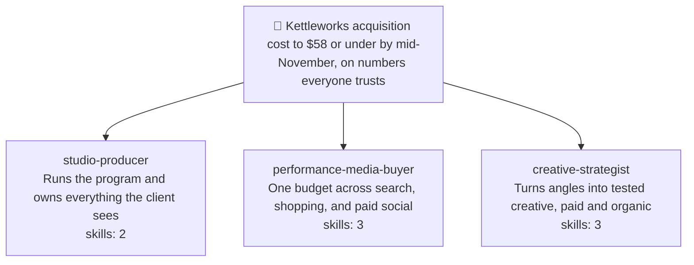
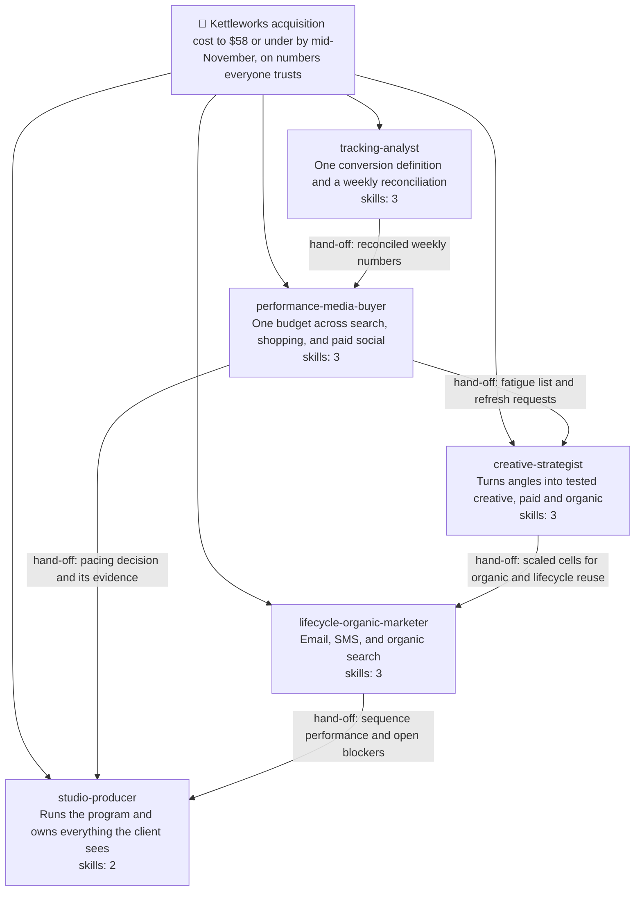

# Worked example — a full-funnel marketing agency squad (Multi-use)

A walkthrough of using **cheeky-squad-os** to build a five-seat marketing agency for a
direct-to-consumer brand. This is the flagship example for two behaviors that landed
together: the **5-seat cap** (hard rule #16) and **skill onboarding** (`squad-role`'s Q8).

What this example is here to show:

- A decomposition that honestly produces **eight** workstreams, the cap firing at Step 5,
  and the consolidation that follows — including the moment the builder asks for a sixth
  seat and does not get one.
- **Q8 in full for two seats** — the **two-dimension** research pass (knowledge *and*
  execution), the numbered proposal with its `(knowledge)` / `(execution)` labels, and the
  auto-approval record — and summarized for the other three. Fourteen skills are onboarded
  in total: eleven knowledge, three execution.
- **A declared capability gap.** One seat researches its execution dimension honestly and
  comes back half-empty: it can operate Google Ads, but nothing connects it to Meta. It
  onboards what it found, declares the rest as a gap in its role goal, and routes the
  proposed fix through `squad-env` — instead of quietly shipping a role that looks
  capable and is not.
- **The step-further check.** A role, mid-run, spending one bounded step asking whether a
  better method exists than the one it was handed, and recording the answer either way.
- The **squad card** (text plus mermaid squad map) printed twice: mid-build at three
  seats with no hand-off edges, and as final state after dispatch with the hand-off edges
  the manifests actually justify.
- The `# Your onboarded skills` section of a real spawn prompt, with the kind labels and
  the absolute-path convention.

Everything the transcript below claims exists as a real artifact in
[`full-funnel-agency/`](full-funnel-agency/) — the roster, all fourteen adapted skills
(each ending in the mandatory `## Provenance & limits` block), the role goal carrying the
declared gap, and a one-command validation of the roster against this repo's own contract
loader.

Guided domain research is deliberately **skipped** in this run; it is worked end to end,
both gates included, in [`klaviyo-audit.md`](klaviyo-audit.md). This example spends its
attention on the cap and on skill onboarding instead.

---

## 1. The client and the ask

Kettleworks sells specialty coffee equipment direct to consumer — grinders, kettles,
scales. Average order value sits around $185. They have been running paid search and
paid social themselves for two years, inherited a Meta account from a former contractor,
and are about to enter their heaviest quarter. Their new-customer acquisition cost has
drifted from the mid-forties to the low seventies, and nobody can say whether that is
real or a reporting artifact — the ad platforms and the store disagree by a margin
large enough to make every meeting an argument about numbers.

Dana runs the agency engagement. Three weeks in, she has a channel plan, a creative
backlog, and no way to hold them together. She installs `cheeky-squad-os` in the client
working directory (`/Users/dana/work/kettleworks`) and opens Claude Code.

---

## 2. Onboarding (`/cheeky-squad-os:squad-onboard`)

```text
User: /cheeky-squad-os:squad-onboard

squad-onboard: Do you have a goal?

Tell me what you want to accomplish. A sentence is enough. I'll
reformulate it as a measurable outcome, then propose the squad to
deliver it.

User: I need to run Kettleworks' whole funnel — paid, creative,
lifecycle, the reporting — as one program instead of five people
guessing in five tabs.

squad-onboard: Let me reformulate that as an outcome so the squad has
something concrete to chase:

  "Stand up Kettleworks' full-funnel acquisition program so that by
   2026-11-14, blended new-customer acquisition cost is at or below
   $58 on at least $120,000 of monthly tracked spend, with every
   channel reporting into one reconciled attribution basis."

Does that match what you want?

User: Yes — and the reconciled part is the important half. If the
numbers aren't trustworthy the rest is theatre.

squad-onboard: Inferred mode: Multi-use.

Why: this is a build with several workstreams running at once —
media, creative, measurement, lifecycle — iterating over a
quarter, not a bounded deliverable with a single hand-in. One-time
would work: it would spawn every role once as a subagent, each
producing its artifact, and end. But this program's whole shape is
weekly — a pacing decision on Monday that depends on a
reconciliation that landed Friday, a creative refresh triggered by
a fatigue signal a different seat noticed. Multi-use gives the
roles a shared task list and a mailbox, so those hand-offs happen
between teammates instead of through you. Override if you want.

Skill onboarding: approve each role's skills yourself, or
auto-approve?

User: auto. And Multi-use is right.

squad-onboard: Recorded — `skill_onboarding: auto` in the goal's
frontmatter. Every role's Q8 will still research, still propose,
and still show you exactly what it onboarded and from where; it
just won't stop for a yes on each one.

Want me to check the domain before I decompose?

  1. What is the current bulk-sender complaint threshold that would
     bind Kettleworks' lifecycle sends? (source: web search+fetch)
  2. Which conversion actions are the inherited accounts currently
     optimizing toward? (source: connected MCP tools)
  3. Is there anything already on record about the platform-versus-
     store discrepancy? (source: this codebase and project files)

Say `skip` to decompose from what I already know, or `go` to run
this as written — or tell me what to cut or add first.

User: skip. I already know the answer to all three and the squad is
going to re-derive them properly anyway.

squad-onboard: Skipped. Nothing runs, nothing is written to
.squad/world/, and the decomposition below comes from priors —
no citations, no delta line.
```

Two things were decided in that one message that matter for the rest of this example.
**Multi-use** determines how the squad is dispatched in section 7. **`skill_onboarding:
auto`** is one of exactly two channels that can auto-approve an onboarded skill — the
other is a standing constraint in `.squad/partner.md`, which this project does not have
yet. Neither is ever inferred mid-flow; the builder said it here, once, and every Q8
below reads it off the goal file.

---

## 3. Goal saved — `.squad/goal.md`

```markdown
---
mode: multi-use
created: 2026-08-15T08:12:00Z
target: 2026-11-14
skill_onboarding: auto
---

# Squad goal

Stand up Kettleworks' full-funnel acquisition program so that by 2026-11-14,
blended new-customer acquisition cost is at or below $58 on at least $120,000
of monthly tracked spend, with every channel reporting into one reconciled
attribution basis.

## Definition of done

- Blended new-customer acquisition cost is at or below $58, measured over a
  trailing 28-day window, on at least $120,000 of tracked monthly spend.
- Platform-reported conversions and store-of-record orders agree within 3% for
  14 consecutive days, on a written and unchanging attribution basis.
- At least 12 distinct creative concepts have shipped across paid search and
  paid social, each with a written hypothesis and a stated kill-or-scale
  criterion recorded before it launched.
- The lifecycle program is live — welcome, browse abandon, cart abandon,
  post-purchase, and winback — every sequence carrying a segment definition and
  all five exit conditions; email and SMS attributed revenue is at or above 22%
  of total revenue.
- A client-facing performance brief has been published every Monday for six
  consecutive weeks, each one naming that week's decisions and their owners.

## Out of scope

- Any promotional, discount, coupon, or price-led message, in any channel,
  paid or owned. Margins do not support it and the brand does not do it.
- Website or theme development beyond landing-page copy changes.
- Influencer contracts, creator sponsorships, or any paid partnership.
- Changes to product pricing, bundling, or packaging.
```

The first Out-of-scope bullet is load-bearing for the rest of this example. It reaches
every role as a derived `stop:` bullet, and it survives all the way down into the
onboarded skills themselves — the lifecycle spec's carried-over source template leaned on
an incentive in its winback sequence, and the adaptation had to replace it rather than
inherit it. Section 9 comes back to this.

---

## 4. Decomposition — and the cap

```text
squad-onboard: Proposed workstreams:

  1. Orchestrate the program and own client reporting — sequencing,
     the weekly decision cadence, every client-facing artifact.
  2. Architect and run search, shopping, and Performance Max buying.
  3. Architect and run paid social buying across Meta and TikTok.
  4. Build the creative testing system — hypotheses, hooks, briefs,
     kill and scale criteria.
  5. Produce the creative assets and the organic content that carries
     them.
  6. Build the measurement foundation — events, consent, dedup,
     one conversion definition.
  7. Audit the inherited accounts for structural waste and defects.
  8. Build the lifecycle engine — email and SMS sequences — plus
     organic search.

Does this decomposition cover the goal? Any to merge, split, or
drop?

User: That's the whole agency, yes. Generate all eight.

squad-onboard: I can't, and I'd rather say why than quietly drop
three.

A squad is capped at 5 active seats (hard rule #16). This isn't a
budget limit — it's a coordination one. Every additional seat adds
a hand-off surface, a file-ownership boundary to keep disjoint, and
another place for two roles to reach different conclusions from the
same data. Eight seats spends more of the program's attention on
staying in sync than on the funnel.

So: a squad that needs a sixth seat needs a better decomposition,
not a bigger roster. Here are the merges, one line of reasoning
each:

  2 + 3 → performance-media-buyer
     There is one budget. Search and social are not two decisions,
     they are one reallocation decision with two destinations —
     split across two seats, each proposes a change to money the
     other half also claims, and neither can settle it.

  4 + 5 → creative-strategist
     The hypothesis and the asset are the same artifact at two
     stages. A brief that crosses a seat boundary arrives with the
     hypothesis stripped off it, which is exactly how a concept
     ships that nobody can later say what it was testing.

  6 + 7 → tracking-analyst
     The audit's top finding is always tracking. Both seats read
     the same conversion tables to do their job, and the auditor
     cannot grade a bid strategy without knowing whether the
     conversion definition behind it is sound.

  1 → studio-producer (unchanged)
  8 → lifecycle-organic-marketer (unchanged)

Five seats. Re-split anything you like within that number.

User: I want the auditor separate. The audit is a one-off up front
and I don't want it competing with weekly reconciliation for
attention. Six seats, just for the first month?

squad-onboard: No — the cap doesn't have a temporary mode, and a
sixth seat added "just for a month" is a sixth seat with a
file-ownership boundary and a hand-off surface for as long as the
squad exists.

But the thing you actually want is available at five. The audit is
not one job, it's two that were bundled in the source material:
a structural audit (account architecture, bidding, budget, targeting,
creative coverage) and a measurement audit (events, dedup, consent,
attribution basis). They have different readers and different first
actions. Give the structural half to performance-media-buyer — it
audits the account it is about to spend money in, which is where the
findings were going anyway — and keep the measurement half with
tracking-analyst.

You lose nothing but the seat. And it removes the hand-off where an
auditor writes a finding the buyer has to re-derive before acting on
it.

User: Fine — that's better than what I asked for. Go.

squad-onboard: Final squad:

  - studio-producer            — runs the program, owns client comms
  - performance-media-buyer    — one budget across search + social;
                                 audits the account it spends in
  - creative-strategist        — hypothesis → asset → organic
  - tracking-analyst           — one conversion definition, weekly
                                 reconciliation
  - lifecycle-organic-marketer — email/SMS + organic search

Handing off to squad-role to generate each role interactively.
```

That last exchange is the whole rule working as intended. The cap did not just refuse —
refusing alone would have cost the builder something real. It refused, and then found the
seam inside the workstream that made the refusal free. The 200-checkpoint audit framework
these two seats end up sharing was one file in the source material; splitting it by reader
is what let five seats do eight seats' work. You can see the result in the two skills'
scope-boundary sections, which explicitly disclaim each other's checkpoints.

---

## 5. Role generation (`/cheeky-squad-os:squad-role`, one seat at a time)

Five invocations. **Q8 is shown in full for two of them** — `performance-media-buyer`
(section 5.2) and `lifecycle-organic-marketer` (section 5.5) — and summarized for the
other three.

### 5.1 `studio-producer` (Q8 summarized)

Q1–Q7 in the usual shape: purpose, file scope `deliverables/program/**` (excluding
`deliverables/program/archive/**`), tools `Read, Write, Edit, Glob, Grep`, model `opus`,
no sandbox.

**Q8 in one paragraph.** The **knowledge** pass found nothing usable in
`anthropics/skills` (document and office-format skills), `addyosmani/agent-skills`
(frontend and web performance), or `obra/superpowers` (engineering workflow). It found one
strong match in `msitarzewski/agency-agents`:
[`project-management/project-management-studio-producer.md`](https://github.com/msitarzewski/agency-agents/blob/main/project-management/project-management-studio-producer.md).
Two skills were distilled from that single file, because it bundles two different jobs:
**`weekly-client-brief`** (its Strategic Portfolio Review template, dropped from
quarterly-executive altitude to a one-page weekly brief where every section is a decision
rather than a status) and **`program-risk-register`** (its Risk Management and Contingency
section, rewritten so every row carries an observable trigger and a response agreed
*before* the trigger fires — the source stated both in prose, which ages into something
nobody can check). Both auto-approved off `skill_onboarding: auto`, recorded at
`2026-08-15T08:19:41Z`.

**The execution dimension was skipped outright, and said so.** Q8 researches two
dimensions — how a role thinks and how a role *acts* — but this seat operates no platform:
it writes a page and keeps a register, both inside its own file scope. So the flow printed
*"execution dimension: not applicable — this role operates no platform, so no execution
search was run"* and moved on. Saying it is the point. A silent single-dimension search
looks identical to a thorough one that found nothing, and the execution-gap check in step
5 never fires for a role like this precisely because there is no platform to name.

### 5.2 `performance-media-buyer` — Q8 in full

```text
User: /cheeky-squad-os:squad-role

squad-role: Preflight: goal found, roster has 1 active role. Under
the 5-seat cap, proceeding.

Q1 — What does this role do, in one line?

User: Own every paid dollar across search, shopping, and paid social —
one budget, one pacing decision, one weekly reallocation. And audit
the inherited accounts before spending in them.

squad-role: Q2 — name? (kebab-case)

User: performance-media-buyer

squad-role: Q3 — file scope?

User: deliverables/media/**

squad-role: Q4 — tools? (default: Read, Edit, Write, Glob, Grep)

User: Add Bash, WebSearch, WebFetch. It needs to work through exports
and read platform documentation.

squad-role: Q5 — model?

User: opus. Budget decisions with real money behind them.

squad-role: Q6 — worktree isolation? Q7 — sandbox?

User: No worktree. Yes to a sandbox — it'll be handling CSV exports
and I don't want them landing in the deliverables directory.

squad-role: Sandbox provisioned at
.squad/workspaces/performance-media-buyer with exports/, pacing/,
and reference/; PACING_WINDOW_DAYS=28; goal copied into reference/;
jq verified present. The workspace glob is added to this role's file
scope so in-sandbox writes auto-approve.

Q8 — Skill onboarding.

Rule of this step: don't reinvent the wheel. I search for an
existing open-source skill before authoring anything original, and
attribution stays on whatever I adapt. Two dimensions, always both —
how this role THINKS, and how it ACTS.

── Dimension 1: knowledge (frameworks, logic, domain practice)

  anthropics/skills — https://github.com/anthropics/skills
    Document, spreadsheet, and presentation skills. Nothing on
    paid media. No match.

  addyosmani/agent-skills — https://github.com/addyosmani/agent-skills
    Web performance, frontend, accessibility. No match.

  msitarzewski/agency-agents —
  https://github.com/msitarzewski/agency-agents
    Three direct hits under paid-media/:
      - paid-media-auditor.md (a 200+ checkpoint audit framework)
      - paid-media-ppc-strategist.md (account architecture, bidding,
        budget pacing)
      - paid-media-paid-social-strategist.md (cross-platform social
        buying, frequency, budget split)

  obra/superpowers — https://github.com/obra/superpowers
    Engineering workflow — TDD, debugging, worktrees. No match.

  Web search beyond the four repos: nothing that beats the
  agency-agents set. Several paid-media "prompt packs" exist; all are
  thinner than what's already found and none carry a licence I can
  attribute cleanly.

── Dimension 2: execution (how this role actually operates the
   platforms its purpose names — Google Ads and Meta Ads)

  Your Q1 says this seat OWNS every paid dollar. That means applying
  changes, not just recommending them, so I searched for how those
  changes actually get made.

  The same four repos first — an execution skill sometimes lives
  there too. It doesn't here: agency-agents' paid-media agents
  mention API access in passing but document no mechanics, and the
  other three have nothing advertising-related at all.

  Google Ads — official documentation, three entry points:
    https://developers.google.com/google-ads/api/docs/start
    https://developers.google.com/google-ads/api/docs/reporting/overview
    https://developers.google.com/google-ads/scripts/docs/start
  Enough to distil real mechanics: reporting queries, change-history
  reads, staged bulk edits, learning-period behavior, what the
  platform refuses.

  Meta Ads — https://developers.facebook.com/docs/marketing-apis
  The documentation exists and is good. The problem is access: I
  checked the MCP servers connected to this project and there is no
  Meta Marketing API server among them. A skill describing writes
  this squad cannot perform is a skill that will be believed and then
  fail. Flagging it at step 5 rather than writing it.

Proposed, 3 skills:

  1. paid-media-audit  (knowledge)
     Source: https://github.com/msitarzewski/agency-agents/blob/main/paid-media/paid-media-auditor.md
     Purpose: pre-flight an inherited ad account on structure,
     bidding, budget, targeting, and creative coverage before a
     dollar moves.
     Adapted: split — the source audits structure AND measurement in
     one 200-checkpoint pass; every tracking, tagging, and
     conversion-counting checkpoint is removed here and lives in
     tracking-analyst's conversion-tracking-audit, per the
     decomposition decision at Step 5. Then cut to the checks where a
     failure has a named consequence and a first action, because 200
     checkpoints is a deliverable in search of a reader.

  2. budget-pacing-review  (knowledge)
     Source: https://github.com/msitarzewski/agency-agents/blob/main/paid-media/paid-media-ppc-strategist.md
     Also drawn from: https://github.com/msitarzewski/agency-agents/blob/main/paid-media/paid-media-paid-social-strategist.md
     Purpose: run the weekly cross-channel pacing and reallocation
     decision from one table, with a written rule for when spend does
     NOT move.
     Adapted: merges the two sources, because this seat holds the
     halves they each solve separately — search reasons about pacing
     and diminishing returns, social about frequency and platform
     split, and held apart they produce two budget recommendations
     that can't both be acted on. Then adds what neither source has:
     a two-window rule and a 20% cap on any single move, so the
     weekly cadence can't reallocate on noise.

  3. google-ads-operations  (execution)
     Source: https://developers.google.com/google-ads/api/docs/start
     Also drawn from: the reporting overview and Ads Scripts docs above
     Purpose: operate the account safely — read current state and
     change history first, stage every change with its rollback,
     verify by reading back.
     Adapted: distilled from reference documentation into a decision
     procedure. Adds three things the docs don't say in one place:
     which instrument to reach for at which scale, read-before-write
     as a rule rather than advice, and the escalate-don't-improvise
     list. Deliberately reproduces no endpoint signature or API
     version — those change per release, and a stale signature in a
     skill file is worse than none.

Goal frontmatter has skill_onboarding: auto — approving all three
without asking. Here's the record.

  ✓ paid-media-audit        (knowledge)  auto  2026-08-15T08:31:07Z
  ✓ budget-pacing-review    (knowledge)  auto  2026-08-15T08:31:07Z
  ✓ google-ads-operations   (execution)  auto  2026-08-15T08:31:07Z

  Approved via .squad/goal.md frontmatter (skill_onboarding: auto),
  set during onboarding. Not inferred here.

Onboarded:
  .squad/skills/performance-media-buyer/paid-media-audit/SKILL.md
  .squad/skills/performance-media-buyer/budget-pacing-review/SKILL.md
  .squad/skills/performance-media-buyer/google-ads-operations/SKILL.md

Each ends with its mandatory ## Provenance & limits block — sources
searched including the empty ones, intake date, known limits, and the
standing line that this is the best found at intake and not the best
that exists. squad-roster refuses to register an entry whose file
lacks that block, so it isn't a courtesy.

All three appended to this role's onboarded_skills via squad-roster;
roster.md regenerated.

── Execution-gap check

performance-media-buyer operates Meta Ads, but no execution skill was
found or approved for it. Declaring this as a capability gap: no MCP
server is connected for the Meta Marketing API, so the account can be
read from manual exports but no change can be pushed from this squad.
I can propose connecting a Meta Marketing API MCP server for you to
approve via squad-env.

  → Written to .squad/role-goal-performance-media-buyer.md under
    ## Declared capability gaps
  → Proposed fix handed to squad-env's global_needs channel — the
    same one that proposes a missing CLI. Not a second channel.

User: Right — the client's Meta access is still with the old
contractor. Leave the gap, don't block on it.

squad-role: Left declared. Until it closes, Meta changes get staged
as a table here and applied by a human in the platform, which the
skill's scope boundary says out loud.
```

Two details in that pass are worth pulling out.

**The gap is the honest half of the answer.** This seat could have had a
`meta-ads-operations` skill in about the same effort it took to write the Google one — the
documentation is public and good. It would also have been fiction: a role carrying a
confident procedure for writes it has no credential to perform. Q8's execution-gap check
exists so that the difference between *"we didn't find one"* and *"we can't do this yet"*
survives into the role's own goal file, where `squad-spawn` bakes it into every dispatch
and `squad-roster`'s Refresh can later clear it. The real
[`role-goal-performance-media-buyer.md`](full-funnel-agency/role-goal-performance-media-buyer.md)
is in this repo; its last section is that one bullet.

**Two source URLs on one entry.** The roster's `onboarded_skills` entry carries a single
`source_url` — the primary — and the skill file's own `Source:` attribution block names
every source it drew on. Attribution follows the text, not the schema field.

### 5.3 `creative-strategist` (Q8 summarized) — and the first squad card

Q1–Q7: file scope `deliverables/creative/**`, tools `Read, Write, Edit, Glob, Grep,
WebSearch, WebFetch`, model `opus`, no sandbox.

**Q8 in one paragraph.** Same four-repo sweep; the match again was `agency-agents`, this
time three files, which is what the Step-5 merge predicted — this seat absorbed three
source roles. **`hook-matrix`** comes from
[`paid-media/paid-media-creative-strategist.md`](https://github.com/msitarzewski/agency-agents/blob/main/paid-media/paid-media-creative-strategist.md);
the source is right that every asset is a hypothesis but never says where the hypothesis
gets *written down*, so the adaptation makes the matrix the artifact and requires kill and
scale criteria before production. **`creative-brief`** comes from
[`marketing/marketing-content-creator.md`](https://github.com/msitarzewski/agency-agents/blob/main/marketing/marketing-content-creator.md),
narrowed hard from broad content strategy to one job — one matrix cell becomes one
shippable spec — with exact copy fields and character limits checked at brief time.
**`organic-social-plan`** comes from
[`marketing/marketing-instagram-curator.md`](https://github.com/msitarzewski/agency-agents/blob/main/marketing/marketing-instagram-curator.md)
with its core assumption inverted: the source plans organic as its own creative universe
with its own testing, which in this squad would be a second, slower, less-instrumented
test of questions paid is already answering with real money — so organic inherits from
paid, and a concept earns a slot by having survived a matrix cell. Three knowledge skills,
all auto-approved, recorded at `2026-08-15T08:44:20Z`.

**Execution dimension: none, and the reason is a seam, not an oversight.** This seat
produces briefs and plans; the assets are uploaded by whoever owns the platform, which in
this squad is `performance-media-buyer`. It names no platform it must operate, so no
execution search ran and the gap check never fired. That is a different outcome from
`performance-media-buyer`'s Meta result, and the distinction is worth keeping: one seat has
nothing to operate, the other has something to operate and no way to reach it.

The three skills deduplicate against each other explicitly: each one's scope-boundary
section names what the other two own and refuses to restate it. That is what stops three
skills in one seat from becoming three overlapping opinions about the same brief.

**Squad card — mid-build, three seats:**

```text
Squad: Kettleworks acquisition cost to $58 or under by mid-November, on numbers everyone trusts
Seats: 3/5

- studio-producer — runs the program and owns everything the client sees (skills onboarded: 2)
- performance-media-buyer — one budget across search, shopping, and paid social (skills onboarded: 3)
- creative-strategist — turns angles into tested creative, paid and organic (skills onboarded: 3)
```



No role-to-role edges here, and that is the specification, not an omission: hand-off edges
are derived from `.squad/role-comm-<from>--<to>.md` manifests, and nothing has run yet, so
no manifest exists to derive one from. Drawing the arrows you *expect* would be inventing
them. Section 8 shows the same map after dispatch, when there is something real to draw.

### 5.4 `tracking-analyst` (Q8 summarized)

Q1–Q7: file scope `deliverables/measurement/**`, tools `Read, Write, Edit, Bash, Glob,
Grep, WebFetch`, model **`fable`** at `xhigh` effort — this is the one seat whose work is
larger than a single sitting: it investigates a discrepancy across change history,
platform exports, and store records, and has to self-verify before it publishes a number
four other seats will act on.

**Q8 in one paragraph.** Two skills, both from `agency-agents`.
**`conversion-tracking-audit`** comes from
[`paid-media/paid-media-tracking-specialist.md`](https://github.com/msitarzewski/agency-agents/blob/main/paid-media/paid-media-tracking-specialist.md),
reorganized from the source's technology-by-technology shape into a per-conversion-path
walk — a discrepancy is never located *in* a technology, it is located where two
technologies disagree about one event — plus a stated pass bar (within 3%, zero
double-counted events) so an audit ends in a verdict. **`attribution-reconciliation`**
takes the measurement and change-history-forensics half of
[`paid-media/paid-media-auditor.md`](https://github.com/msitarzewski/agency-agents/blob/main/paid-media/paid-media-auditor.md)
— the same source file `performance-media-buyer` took the structural half of — and adds
what a one-off audit does not need and a weekly program does: a standing reconciliation,
an authority rule (store of record for revenue, platforms for spend, nothing else
authoritative for anything), and a root-cause order that puts "genuine attribution
difference" last precisely because it is unfalsifiable and therefore the most comfortable
place to stop looking.

**Execution dimension: one skill, and it changed what the seat can honestly claim.** This
role's purpose is to *prove* numbers, which means observing what the site actually sends —
so the execution search ran against the collection documentation itself:
[GA4 collection](https://developers.google.com/analytics/devguides/collection/ga4),
[DebugView](https://support.google.com/analytics/answer/7201382),
[the Measurement Protocol](https://developers.google.com/analytics/devguides/collection/protocol/ga4),
and [Meta's Conversions API](https://developers.facebook.com/docs/marketing-api/conversions-api).
The result is **`ga4-event-audit-operations`**, which contributes the one thing no
framework can: an ordering rule (data layer → container preview → debug view → platform
event tool → store of record, stop at the first break) and a procedure for *proving*
deduplication rather than trusting two dashboards that both report success. Its hard line
— observation only, never a write, never test traffic into a production stream — is what
keeps an audit from becoming the incident. Three skills, all auto-approved, recorded at
`2026-08-15T08:58:52Z`.

### 5.5 `lifecycle-organic-marketer` — Q8 in full

```text
User: /cheeky-squad-os:squad-role

squad-role: Preflight: goal found, roster has 4 active roles. One seat
left under the cap.

Q1 — What does this role do, in one line?

User: Own the compounding half of the funnel — lifecycle email and SMS
plus organic search — so paid isn't the only thing holding acquisition
cost down.

squad-role: Q2 — name?

User: lifecycle-organic-marketer

squad-role: Q3 — file scope?

User: deliverables/lifecycle/**

squad-role: Q4 — tools?

User: Read, Write, Edit, Glob, Grep, WebSearch, WebFetch.

squad-role: Q5 — model?

User: sonnet.

squad-role: Q6 — worktree? Q7 — sandbox?

User: Neither.

squad-role: Q8 — Skill onboarding.

Two dimensions again — knowledge, then execution.

── Dimension 1: knowledge

  anthropics/skills — https://github.com/anthropics/skills
    No lifecycle or search marketing content. No match.

  addyosmani/agent-skills — https://github.com/addyosmani/agent-skills
    No match.

  msitarzewski/agency-agents —
  https://github.com/msitarzewski/agency-agents
    The paid-media/ directory I've used for three seats now has
    nothing for this one — it's entirely paid. Before concluding
    the repo has no match, I checked the whole tree rather than
    the directory I already knew:

      curl -s https://api.github.com/repos/msitarzewski/agency-agents/git/trees/main?recursive=1

    The marketing/ directory has 35 files. Three are candidates:

      marketing/marketing-email-strategist.md   — lifecycle
        sequences, segmentation, deliverability, post-privacy
        measurement. Substantial and opinionated.
      marketing/marketing-seo-specialist.md     — technical SEO,
        content clusters, cannibalization prevention. Substantial.
      marketing/marketing-growth-hacker.md      — read and
        rejected. Mostly identity and success metrics; there is no
        procedure in it to distill. Onboarding it would produce a
        skill that says "be growth-minded."

  obra/superpowers — https://github.com/obra/superpowers
    No match.

  Note: "don't reinvent the wheel" cost one extra API call here.
  The eight files I already had in context covered paid media and
  project management; concluding from those that the repo had
  nothing for lifecycle would have been an authoring decision
  disguised as a research result.

── Dimension 2: execution

  Your Q1 says this seat OWNS the lifecycle program. Owning it means
  reading live flows and staging changes to them, not just writing
  specs, so: what platform, and can this squad reach it?

  Curated repos first — nothing. The four have no ESP mechanics
  between them.

  Connected MCP servers for this project: a Klaviyo server IS
  connected, with flow, segment, profile, and metric access. That
  settles the platform question — this seat can actually touch the
  system it owns.

  Official documentation, for the mechanics the MCP surface doesn't
  explain on its own:
    https://developers.klaviyo.com/en/reference/api_overview
    https://developers.klaviyo.com/en/reference/get_flows

  Organic search, same question: the cannibalization check needs
  search-console data. There's no console MCP server connected and
  no CLI; the check is run by a human through the console UI and
  handed over. That's a limitation of the knowledge skill rather
  than a missing execution skill, so it's recorded in that skill's
  Known limits, not declared as a gap — nothing about the role's
  purpose says it operates the console.

Proposed, 3 skills:

  1. lifecycle-sequence-spec  (knowledge)
     Source: https://github.com/msitarzewski/agency-agents/blob/main/marketing/marketing-email-strategist.md
     Purpose: specify a sequence so it can't ship without a trigger,
     a segment definition, exit conditions, and a click-based
     success bar.
     Adapted: four of the source's critical rules carried through
     intact because they're correct and routinely violated
     (segmentation over broadcast, respect the lifecycle, clicks
     over opens, exit conditions non-negotiable). Re-anchored from
     the source's long-cycle service-business framing onto a DTC
     purchase cycle, platform-specific detail dropped (it dates
     fast and the ESP is a project fact, not a skill fact), and
     measurement narrowed to one pass bar so a review ends in ships
     or doesn't ship. One addition from the goal: the source's
     winback and cart templates lean on an incentive, which this
     program's Out of scope forbids — the adaptation replaces the
     incentive rather than inheriting it.

  2. organic-search-brief  (knowledge)
     Source: https://github.com/msitarzewski/agency-agents/blob/main/marketing/marketing-seo-specialist.md
     Purpose: run the cannibalization check and cluster-ownership
     map before proposing any on-page change.
     Adapted: the source's technical-crawl, link-authority, and
     page-experience sections are dropped — that's site engineering
     this squad doesn't own and can't ship. What's kept is the part
     that is pure marketing judgement and the most frequently
     skipped: deciding which page owns which query before writing
     anything. The source states that check as a mandatory
     precondition; that framing is preserved literally, including
     an explicit "mark the brief unverified" path for when the
     check can't be run, so it can't be silently skipped.

  3. klaviyo-flow-operations  (execution)
     Source: https://developers.klaviyo.com/en/reference/api_overview
     Also drawn from: https://developers.klaviyo.com/en/reference/get_flows
     Purpose: inspect and stage changes to running flows and
     segments without breaking the profiles currently inside them.
     Adapted: distilled from reference documentation into the one
     thing the docs never state in one place — what each kind of
     change does to people who are ALREADY mid-sequence. Adding a
     message at the end is safe; shortening a delay can fire two
     messages back-to-back at someone who was already waiting.
     Carries a bright line the API itself does not impose: this
     skill never triggers a real send. Read, inspect, stage, hand
     the send to a human. An accidental send cannot be recalled.

Goal frontmatter has skill_onboarding: auto — approving all three.

  ✓ lifecycle-sequence-spec   (knowledge)  auto  2026-08-15T09:11:36Z
  ✓ organic-search-brief      (knowledge)  auto  2026-08-15T09:11:36Z
  ✓ klaviyo-flow-operations   (execution)  auto  2026-08-15T09:11:36Z

  Approved via .squad/goal.md frontmatter (skill_onboarding: auto).

Onboarded:
  .squad/skills/lifecycle-organic-marketer/lifecycle-sequence-spec/SKILL.md
  .squad/skills/lifecycle-organic-marketer/organic-search-brief/SKILL.md
  .squad/skills/lifecycle-organic-marketer/klaviyo-flow-operations/SKILL.md

All three carry ## Provenance & limits.

── Execution-gap check

This role operates the ESP, and it has an execution skill for it —
the MCP server is connected and klaviyo-flow-operations is onboarded.
No gap to declare. Nothing written to the role goal.

Squad is at the 5-seat cap — deactivate or consolidate a role via
squad-roster before generating another.
```

Two things in that pass are the honest part.

**The rejected third candidate.** `growth-hacker` is a real file with a real name that
sounds exactly like something this seat should have; onboarding it would have produced a
skill with plausible frontmatter and nothing underneath. Naming what was checked and
rejected is what makes the ones that *were* onboarded mean something — and it is why the
`## Provenance & limits` block records empty searches alongside successful ones.

**The gap check that correctly did not fire.** Compare with `performance-media-buyer`:
same check, same platform-operating purpose, opposite outcome, because a Klaviyo MCP
server is connected and a Meta one is not. The check is not a ritual disclaimer — it
returns a different answer per seat based on what is actually reachable. And note the
third case in the same message: the search-console limitation is recorded in a skill's
**Known limits** rather than declared as a gap, because operating the console was never
part of this role's purpose. Three outcomes, three different places to put the truth.

---

## 6. The roster after generation

`.squad/roster.json` — schema version 2, five roles, fourteen onboarded skills. The full
file is in this repo at
[`full-funnel-agency/roster.json`](full-funnel-agency/roster.json); here is the
`performance-media-buyer` entry, which is the one carrying both a sandbox and onboarded
skills:

```json
{
  "id": "performance-media-buyer",
  "purpose": "Own every paid dollar across search, shopping, and paid social — one budget, one pacing decision, one weekly reallocation.",
  "description": "Use when the squad needs paid campaign structure, a bidding or budget-pacing decision, a spend reallocation across channels, or a pre-flight audit of an inherited ad account.",
  "file_ownership": {
    "include": [
      "deliverables/media/**",
      ".squad/workspaces/performance-media-buyer/**"
    ],
    "exclude": []
  },
  "capabilities": [
    "filesystem.edit", "filesystem.read", "filesystem.write",
    "shell.execute", "web.fetch", "web.search"
  ],
  "reasoning": {"profile": "deep", "effort": "high"},
  "active": true,
  "goal_ref": ".squad/role-goal-performance-media-buyer.md",
  "environment": {
    "workspace": ".squad/workspaces/performance-media-buyer",
    "directories": ["exports", "pacing", "reference"],
    "variables": {"PACING_WINDOW_DAYS": "28"},
    "context": [
      {"source": ".squad/goal.md", "target": "reference", "kind": "copy"}
    ],
    "tools": [{"name": "jq", "kind": "system", "verify": "command -v jq"}]
  },
  "provider_overrides": {
    "claude": {
      "model": "opus",
      "tools": ["Read", "Write", "Edit", "Bash", "Glob", "Grep", "WebSearch", "WebFetch"],
      "agent_file": ".claude/agents/performance-media-buyer.md"
    }
  },
  "onboarded_skills": [
    {
      "name": "paid-media-audit",
      "kind": "knowledge",
      "source_url": "https://github.com/msitarzewski/agency-agents/blob/main/paid-media/paid-media-auditor.md",
      "local_path": ".squad/skills/performance-media-buyer/paid-media-audit/SKILL.md",
      "purpose": "Pre-flight an inherited ad account on structure, bidding, budget, targeting, and creative coverage before a single dollar moves.",
      "approval_mode": "auto",
      "approved_at": "2026-08-15T08:31:07Z"
    },
    {
      "name": "budget-pacing-review",
      "kind": "knowledge",
      "source_url": "https://github.com/msitarzewski/agency-agents/blob/main/paid-media/paid-media-ppc-strategist.md",
      "local_path": ".squad/skills/performance-media-buyer/budget-pacing-review/SKILL.md",
      "purpose": "Run the weekly cross-channel pacing and reallocation decision from one table, with a written rule for when spend moves and when it does not.",
      "approval_mode": "auto",
      "approved_at": "2026-08-15T08:31:07Z"
    },
    {
      "name": "google-ads-operations",
      "kind": "execution",
      "source_url": "https://developers.google.com/google-ads/api/docs/start",
      "local_path": ".squad/skills/performance-media-buyer/google-ads-operations/SKILL.md",
      "purpose": "Operate the Google Ads account safely — read current state and change history first, stage every change with its rollback, and verify by reading back.",
      "approval_mode": "auto",
      "approved_at": "2026-08-15T08:31:07Z"
    }
  ],
  "created": "2026-08-15T08:31:07Z"
}
```

Skills by seat and kind:

| Seat | Knowledge | Execution | Total |
|---|---|---|---|
| `studio-producer` | 2 | 0 (no platform to operate) | 2 |
| `performance-media-buyer` | 2 | 1 (+1 declared gap: Meta) | 3 |
| `creative-strategist` | 3 | 0 (no platform to operate) | 3 |
| `tracking-analyst` | 2 | 1 | 3 |
| `lifecycle-organic-marketer` | 2 | 1 | 3 |

**Fourteen**, every one adapted from a named source — an open-source file or official
platform documentation — with attribution preserved in the skill body and a
`## Provenance & limits` block at the end of every single one. The `kind` field is
serialized explicitly on all fourteen entries even though `knowledge` is the contract's
default: a reader of the roster should not have to know the default to know what a role
can actually do.

The roster in this repo validates against the plugin's own contract loader; the exact
command is in [`full-funnel-agency/README.md`](full-funnel-agency/README.md).

---

## 7. Spawn (`/cheeky-squad-os:squad-spawn`, Multi-use path)

Multi-use dispatches the five roles as Agent Teams teammates — shared task list, direct
messaging, one Claude session each. What matters for this example is one section of the
spawn prompt. Here is the `creative-strategist`'s, excerpted:

```text
You are the creative-strategist role on a cheeky-squad-os squad.

# Squad goal (binding north-star)
<full contents of .squad/goal.md — pasted verbatim, including the
 Out of scope bullet forbidding promotional and discount messaging>

# Your role's goal
<full contents of .squad/role-goal-creative-strategist.md>

# Your onboarded skills
- hook-matrix — (knowledge) — /Users/dana/work/kettleworks/.squad/skills/creative-strategist/hook-matrix/SKILL.md — Lay out hook x audience x format as a matrix where every cell is a written hypothesis with a kill or scale criterion attached before it ships.
- creative-brief — (knowledge) — /Users/dana/work/kettleworks/.squad/skills/creative-strategist/creative-brief/SKILL.md — Turn one hook-matrix cell into a production brief a designer, editor, or writer can execute without asking a follow-up question.
- organic-social-plan — (knowledge) — /Users/dana/work/kettleworks/.squad/skills/creative-strategist/organic-social-plan/SKILL.md — Plan the 30-day organic format mix from concepts paid has already validated, so organic tests nothing paid has not paid for first.

Read each of these before starting; they are part of your role.

Before executing, one step-further check: ask yourself — "could one more
research step find a better way than my onboarded method?" If yes, and the
step is cheap (one search, one doc lookup, one MCP introspection call —
never a second research pass), take it. Record the answer either way in
your engagement record's ## Assumptions (hard rule #11): [confirmed] if you
checked and your onboarded method still holds, or [inferred]/[assumed] with
if wrong → <what breaks> if you took the step and found something better, or
didn't check. Never spiral — one step, bounded, then proceed with whichever
method you're using.

# Your role's file ownership
Includes:
- deliverables/creative/**
Excludes (these win over every include):
- (none)

# Step 0 — publish your engagement record (hard rule #11)
...
```

Four things about that block:

- **The kind label rides along.** A role reads `(knowledge)` or `(execution)` next to each
  skill and knows, without opening the file, which ones tell it how to think and which
  ones tell it how to act on a live system. For a seat with a declared gap, the absence is
  just as informative: `performance-media-buyer`'s prompt lists one execution skill for
  Google and nothing for Meta, and the gap bullet from its role goal is right there in the
  section above.
- **Absolute paths, always.** The roster stores `local_path` relative
  (`.squad/skills/creative-strategist/hook-matrix/SKILL.md`) because a roster is portable
  and a portable file cannot contain someone's home directory. The spawn prompt resolves
  every one of them against the project root before baking it in, because a teammate
  running in a git worktree will not have `.squad/skills/**` on disk unless it is tracked —
  and a relative path that silently resolves to nothing is worse than a missing section.
- **The section is per-role, not per-dispatch.** Unlike the world-model and partner-model
  blocks, which are decided once for the whole dispatch, this one is read straight from
  each role's own `onboarded_skills`. A role with none gets no heading at all — never an
  empty one.
- **It is baked, not referenced.** Same reason as the goal (hard rule #4): the prompt is
  the only channel from parent to worker that survives every mode and every isolation
  setting.

### The step further, actually taken

Week one. `performance-media-buyer` is about to run its first pacing review, and the
step-further instruction above is sitting in its prompt. Here is what one bounded step
looks like in practice — from its engagement record, `.squad/role-plan-performance-media-buyer.md`:

```markdown
## Assumptions

- [confirmed] The two-window rule in `budget-pacing-review` (require two
  consecutive 28-day windows at or under target before moving spend) is
  still the right call at this spend level. Step-further check taken: one
  doc lookup on the platform's current bid-strategy learning behavior,
  since a shorter learning period would justify a faster cadence. It has
  not changed — a strategy edit still re-enters learning, and a weekly
  reallocation on one window would keep campaigns learning permanently.
  Proceeding with the onboarded method.
- [assumed] Meta spend can be reallocated on the same weekly cadence as
  Google despite being applied by hand. if wrong → the pacing decision
  ships on time but lands late on half the budget, and the 28-day
  comparison in week 3 straddles two different application dates.
```

Three things that beat is deliberately *not*. It is not a second research pass — one
lookup, one answer, done. It is not a licence to override the onboarded method — the check
confirmed it and the role proceeded. And it is not optional narration: had the role skipped
the check, the same section would carry an `[inferred]` or `[assumed]` bullet saying so,
because "I didn't check" is a recordable answer and a silent skip is not.

The second bullet is the more interesting one. The declared Meta gap is not an abstraction
by the time work starts — it shows up as a graded assumption with a named blast radius,
which is exactly the shape `squad-verify`'s forcing rule can act on later.

---

## 8. The squad card — final state

After the first week's dispatch, five hand-off manifests exist under `.squad/`. Now the
map has edges, and each one is derived from a file rather than from an assumption about
who probably talks to whom.

```text
Squad: Kettleworks acquisition cost to $58 or under by mid-November, on numbers everyone trusts
Seats: 5/5

- studio-producer — runs the program and owns everything the client sees (skills onboarded: 2)
- performance-media-buyer — one budget across search, shopping, and paid social (skills onboarded: 3)
- creative-strategist — turns angles into tested creative, paid and organic (skills onboarded: 3)
- tracking-analyst — one conversion definition and a weekly reconciliation (skills onboarded: 3)
- lifecycle-organic-marketer — email, SMS, and organic search (skills onboarded: 3)
```



Read the graph and the seat count together and the merges from section 4 are visible in
the shape: `tracking-analyst` feeds the buyer rather than arguing with it, the buyer's
fatigue signal reaches creative as a request rather than as a complaint, and everything
client-facing converges on one seat. Eight seats would have drawn roughly twice the edges
for the same funnel.

One thing the card deliberately does not show: the declared Meta gap. The card is a
plain-language status a non-technical stakeholder can read cold, and `skills: 3` is that.
The gap lives where it can actually act — in the role goal, baked into every dispatch, and
on `squad-roster`'s Refresh list. A card that tried to carry both would be a status dump,
which is the one thing its spec forbids.

---

## 9. What just happened — one-line lessons

- **The cap is a decomposition tool, not a budget.** It refused a sixth seat and then
  found the seam — splitting one 200-checkpoint audit framework by reader — that made the
  refusal cost nothing.
- **"A better decomposition, not a bigger roster" is checkable.** The test is whether the
  merge removes a hand-off. Search plus social share one budget; hypothesis and asset are
  one artifact; the audit's top finding is always tracking. Three merges, three removed
  arguments.
- **Skill onboarding is research first, authoring last.** Fourteen skills, zero authored
  from scratch, every one attributed. The seat that nearly authored from scratch
  (`lifecycle-organic-marketer`) was one API call away from having the sources all along.
- **Knowledge without hands is trivia.** A seat that knows what a good pacing decision
  looks like and cannot apply one is a consultant, not a teammate. Q8 researches both
  dimensions every time, and a platform-operating seat closes with either an execution
  skill or a declared gap — never with silence.
- **Three seats, three different honest answers about execution.** `creative-strategist`
  operates no platform, so no search ran and none was needed. `lifecycle-organic-marketer`
  operates one it can reach, so it onboarded the mechanics.
  `performance-media-buyer` operates one it cannot reach, so it declared a gap and routed
  the fix. Collapsing those three into one reassuring sentence is what the check exists to
  prevent.
- **Every skill ends by admitting what it isn't.** The `## Provenance & limits` block
  records the searches that came back empty, the intake date, what the skill does not
  cover, and the standing line that this is the best found at intake rather than the best
  that exists. `squad-roster` refuses to register a skill without it, which is the only
  reason a humility contract survives contact with a deadline.
- **The step-further check is cheap on purpose.** One lookup, one recorded answer,
  proceed. Its value is not finding a better method — usually it does not. Its value is
  that "I did not check" becomes a graded assumption with a named blast radius instead of
  an invisible default.
- **`auto` approves; it does not hide.** Auto-approval skipped the yes, not the record —
  every entry still shows its source URL, its approval mode, and its timestamp, and the
  proposal was printed in full before anything was written.
- **Adaptation means the source got shorter and sharper, not longer.** Every skill here
  states what it dropped and why: technology-first ordering, quarterly-executive altitude,
  crawl-health sections this squad cannot ship, 160 checkpoints that could not fail loudly.
- **Sibling skills in one seat must disclaim each other.** Three skills on
  `creative-strategist` each name what the other two own. Without that, one seat with three
  skills is three overlapping opinions about the same brief.
- **A goal constraint travels all the way into an onboarded skill.** The Out-of-scope
  bullet forbidding promotional messaging changed the lifecycle spec's carried-over winback
  template — the incentive was replaced, not inherited. A skill onboarded without reading
  the goal would have shipped the source's default and been rejected at first review.
- **Hand-off edges are derived, never assumed.** The three-seat card has none because
  nothing had run. That is the difference between a map and a diagram of an intention.

---

## 10. How this squad grows

A squad that onboarded fourteen skills in one afternoon has fourteen snapshots of what
research could find on 2026-08-15. That is the honest description, and it is why every
skill file ends by saying so rather than presenting itself as settled.

`squad-roster`'s **Refresh skills** operation is the other half of that contract. It
re-runs Q8's two-dimension research against a role's *existing* set and diffs the result
four ways: a better source found, the same source materially changed since `approved_at`,
a `Known limits` line that no longer applies, or a **declared gap that now has a
candidate**. Worth running on a Multi-use squad's natural cadence, because a
quarter-long program's context goes stale faster than a one-week audit's.

For this squad the first Refresh has an obvious job waiting for it. The day Kettleworks'
Meta access comes back from the old contractor and an MCP server is connected,
`performance-media-buyer`'s declared gap stops being true — the execution dimension that
came back empty at intake now has something in it. Refresh is what notices: it re-runs the
search, finds the reachable platform, proposes a `meta-ads-operations` skill **through the
same approval gate Q8 used** (nothing upgrades silently, no matter how the original entry
was approved), and on approval removes the bullet from the role goal's
`## Declared capability gaps` and notes the resolution.

Note what that means for the gap itself: it is not a permanent apology in a file. It is a
tracked item with a defined closing condition, sitting in the one place a later operation
knows to look.

---

## 11. The artifacts

Everything above is backed by real files in [`full-funnel-agency/`](full-funnel-agency/):

- `roster.json` — the five-role v2 roster with all fourteen `onboarded_skills` entries,
  each carrying an explicit `kind`.
- `skills/<role-id>/<skill-name>/SKILL.md` — the fourteen adapted skills (eleven
  knowledge, three execution), mirroring the `.squad/skills/` layout a live squad would
  have on disk. Every one ends with `## Provenance & limits`.
- `role-goal-performance-media-buyer.md` — the role goal carrying the declared Meta
  capability gap, in the shape `templates/role-goal.md` defines.
- `README.md` — the directory map and the one-command roster validation.

The partner model was never offered during this run's Step 3 because
`.squad/partner.md` does not exist in this project; onboarding's Step 7 mentioned it once,
at the end, and Dana skipped it. Nothing above depends on it — `skill_onboarding: auto`
came from the goal frontmatter, which is the other of the two channels that can authorize
an auto-approval.
