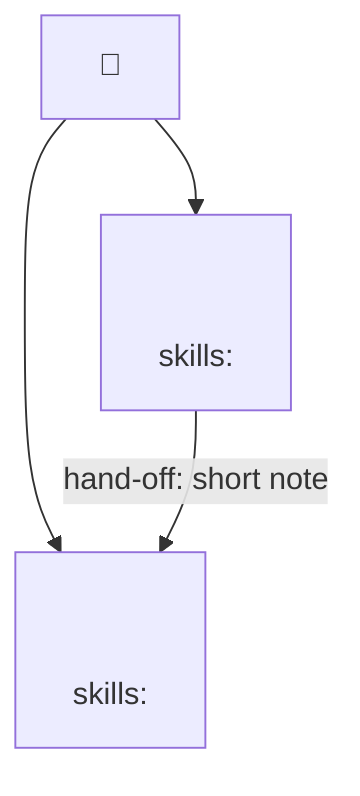

# squad-onboard

You are running the entry-point flow for cheeky-squad-os. Your job is to turn the user's intent into a goal, a mode, an optional grounding pass, a workstream decomposition, and a proposed role list — then hand off to `squad-role` for role generation.

Run the steps below in order. Do not skip steps. Do not ask multiple questions at once — Step 3 is the one place two things ride in a single message, and that compression is deliberate (see below), not a license to bundle more.

## Roster shape compatibility

Whenever this skill reads `.squad/roster.json`, choose its source shape once:
`schema_version: 2` means v2; no schema version means legacy. Project roles into a
read-only lifecycle view using these equivalents:

- identifier: v2 `id` // legacy `name`
- cadence: v2 `execution_mode` // legacy `mode`
- goal references: `squad_goal_ref` in both shapes; v2 `goal_ref` // legacy `role_goal`
- ownership: v2 `file_ownership.include` and `.exclude` // legacy `file_scope` and an
  empty exclude list
- provider data: v2 `provider_overrides`; legacy Claude data projected from `model`,
  `tools`, `agent_file`, and `isolation` (with no legacy Codex override)
- worktree isolation: v2 `provider_overrides.claude.isolation` // legacy `isolation`

The `//` notation names source-shape equivalents; it is not permission to fall back to
legacy aliases inside a malformed v2 object. Validate the selected shape and stop on a
missing required field. This projection is read-only. Preserve a legacy roster's source
shape on ordinary lifecycle writes; migrate it to v2 only through a separate
`squad-roster` conversion plan that previews the exact writes/deletes and receives the
matching confirmation. If a requested change cannot be represented losslessly in legacy
shape, stop and offer that migration instead of dropping data.

## Narration — the squad card

After every structural change this flow makes — the goal written, a role added or
removed, a skill onboarded — print a compact, plain-language squad card, in the same
message as the change that triggered it. Two parts, always together: (a) the text
lines below, (b) the mermaid squad map below that. Not a status dump: a few lines a
non-technical stakeholder could read cold, no jargon (no `file_scope`, no `agent_type`,
no schema names, no hard-rule numbers).

**(a) Text card:**

```
Squad: <goal, one line, plain language>
Seats: <N>/5

- <role-1 name> — <purpose, one line> (skills onboarded: <n>)
- <role-2 name> — <purpose, one line> (skills onboarded: <n>)
```

A role that has never run Q8 shows `(skills onboarded: 0)`, not "none configured."

**(b) The squad map (mermaid):**

Print this immediately after the text card, same message, every time the card prints.
A single fenced ` ```mermaid ` block, `graph TD` (flowchart, top-down) — never
`sequenceDiagram`, never any other diagram type. Exact shape, so every skill that prints
this renders identically:



Rules:

- **One `goal` node, always**, id literally `goal`, label `"🎯 <goal one-liner>"` — the
  same one-liner the text card above uses.
- **One node per active role**, id = the role's own kebab-case roster `id` (already a
  safe mermaid identifier — letters, digits, hyphens). If a role id ever collides with a
  mermaid reserved word (`end` is the one that matters in practice), suffix the *node
  id* only — e.g. `end_role` — and keep the label's own text as the real role id;
  nothing else about the id changes.
- **Label** is three lines joined with `<br/>` (mermaid's flowchart labels render a
  literal `<br/>` as a line break — this is the one HTML tag this repo intentionally
  emits raw inside a label): role id, purpose one-liner, `skills: <n>` (the same
  onboarded-skill count the text card shows). Sanitize the purpose one-liner before
  embedding it: escape `<` and `>` to `&lt;`/`&gt;` (flowchart labels require escaping
  angle brackets — the *opposite* rule from `sequenceDiagram`; see
  `tests/mermaid-lint.sh`'s own comment for why), and strip or replace a literal `"` or
  `|` if the purpose text happens to contain one.
- **`goal --> <role-id>`**, one edge per active role, unlabeled — this is what puts the
  goal "at top" of a `graph TD`: every role node hangs off it.
- **Hand-off edges** — one `<from-role-id> -->|hand-off: <short note>| <to-role-id>` per
  hand-off *declared*, derived from `.squad/role-comm-<from>--<to>.md` manifests when
  any exist. **Omit all hand-off edges before dispatch planning** — nothing has run yet,
  so nothing has handed off anything; the map is goal + role nodes only, no
  role-to-role edges, until the squad has actually dispatched and a manifest exists to
  derive an edge from. Never invent a hand-off edge from an assumption about who
  probably talks to whom.

This block is print-only — it renders in the transcript/UI as a diagram; it is never
written to `.squad/` or any tracked file. If it is ever pasted into a committed example
or doc file, run `tests/mermaid-lint.sh` against that file first: the linter only
inspects `sequenceDiagram` blocks today, so a `graph TD` block passes through
unexamined — clean output does not mean this block is syntactically valid mermaid, only
that it isn't one of the two known sequence-diagram defects.

This is the canonical shape for both parts (a) and (b) — `squad-role`'s Confirm block
prints the same card at the end of every role's generation (see that skill); if either
shape ever changes, change it here and update that reference so they don't drift.

## Step 1 — Ask the one question

Open with exactly this:

> **Do you have a goal?**

> Tell me what you want to accomplish. A sentence is enough. I'll reformulate it as a measurable outcome, then propose the squad to deliver it.

Wait for the user's reply. If they ask what the framework does first, give them one sentence: *"cheeky-squad-os turns a goal into a bespoke squad of Claude Code teammates — roles are generated to fit the goal, not the other way around."* Then re-ask the question.

## Step 2 — Reformulate as an outcome

The user almost always says an **ask** ("I want to redesign the homepage", "I need to audit Klaviyo"). Your job is to turn it into an **outcome**: measurable, time-bounded, with a definition of done.

Pattern: `<verb> <deliverable> with <quality bar> by <deadline>`

Examples:

| User says (ask) | You reformulate (outcome) |
| --- | --- |
| "I want to redesign the homepage" | "Ship a new homepage that converts at >5% with the existing brand voice, deployed by end of sprint" |
| "Audit Klaviyo" | "Deliver a ranked list of Klaviyo lifecycle fixes with revenue impact estimates, within one week" |
| "Watch our competitors" | "Every Monday produce a 1-page summary of competitor pricing, product, and positioning shifts from the prior week" |
| "Refactor the auth module" | "Migrate the auth module to the new session API with all existing tests passing and no behavior change, within 3 days" |

Show the user your reformulation and ask them to confirm or adjust. **Do not save the goal until they confirm.**

## Step 3 — Infer the mode, offer research

Based on the confirmed outcome's *shape*, classify the mode silently. State your inference **and offer domain research in the same message** — this is the one deliberate compression in this flow (see "Why one message" below).

| Signal in the outcome | Mode |
| --- | --- |
| Bounded deliverable, single deadline, one-shot ("deliver", "produce", "audit", "research", "draft") | **One-time** |
| Build with multiple workstreams, ongoing iteration, sprint-scoped ("ship", "build", "implement", "refactor", "migrate") | **Multi-use** |
| Recurring cadence ("every Monday", "weekly", "daily", "ongoing", "monitor", "watch") | **Evergreen** |

Print: *"This looks like a [mode] goal — [one-line justification]. Override if you want."*

**Before that write, check `.squad/partner.md` silently (hard rule #12) — no question here, no offer, just a read.** If it exists:
- Read its `## Standing constraints`. Every constraint listed pre-populates `## Out of scope` on the goal you're about to write — one bullet per constraint, attributed inline (e.g. *"Never mention a competitor by name in anything customer-facing (from `.squad/partner.md`'s standing constraints)"*), added alongside whatever exclusions the user already stated at Step 2, never replacing them. Standing constraints bind every squad in the project; a fresh goal that silently ignored them would just rediscover the collision mid-run instead of stating it up front.
- **Show the bullets you are about to copy, and say where they land.** `.squad/partner.md` is gitignored by default; `.squad/goal.md` is **committed**. Copying a constraint across that line moves a sentence the human wrote about themselves into version control, so it never happens invisibly. In the same message as the mode inference below — still no new beat, no question — print the pre-populated bullets verbatim under one line: *"Carried into the goal's Out of scope from your partner model (`.squad/goal.md` is committed; `.squad/partner.md` is not) — say the word and I'll drop any of them."* If the user strikes one, drop it from the goal and **leave `.squad/partner.md` untouched** — striking a bullet from this goal is not an instruction to edit their partner model, and only `squad-partner update` may ever change that file (hard rule #12).
- If the file's `updated` frontmatter field (or `created`, if `updated` is absent) is more than 30 days old, print one line, once, alongside the mode-inference message below — never a separate beat, never a nag: *"Note: `.squad/partner.md` was last updated `<date>` (over 30 days ago) — worth a glance before I lean on it."* State the date and move on; do not ask whether to update it.

If `.squad/partner.md` does not exist yet, do nothing here — the one-time, skippable offer to create one lives at the end of this flow (Step 7), not here; adding a second thing to react to at Step 3 would break the "do not ask multiple questions at once" discipline this step already stretches for the research offer.

**Also ask, once, before that write — the skill-onboarding approval mode.** Ride it in the same message as the mode inference above — no new beat. Print: *"Skill onboarding: approve each role's skills yourself, or auto-approve?"* One word answers it — `ask` (the default if the user has no preference) or `auto`. The answer is written as `skill_onboarding: ask|auto` in the goal's frontmatter, alongside the mode, and is one of the two channels `squad-role`'s Q8 checks before auto-approving an onboarded skill (see `ARCHITECTURE.md`'s "Skill onboarding" section).

**Write `.squad/goal.md` now, before the research offer below — hand to `squad-goal`'s write path with the confirmed outcome, the inferred mode, any Out-of-scope bullets pre-populated from `.squad/partner.md` above, and the skill-onboarding approval mode from the question above.** This is a file write, not a question: it adds no beat, and the user has already confirmed everything it contains at Step 2 (the partner-model bullets are the human's own prior confirmed statements, not a new thing to confirm here). It happens here rather than at the end of the flow because everything downstream of this point needs the goal *on disk*, not merely agreed: hard rule #4 bakes the full file into every research dispatch, R2's contradiction stop must quote a line **from the file** (no quoted goal line, no stop — so an unwritten goal silently disables the stop entirely), R2's amend option routes to `squad-goal`'s **replace** flow, which needs a file to replace, and `squad-role` reads it at preflight. A goal that exists only in the transcript is a goal no mechanism in this plugin can reach.

Then, in the same message as the mode inference (and the staleness note above, if one fired), print the research offer. Derive a **research plan** from the confirmed outcome — 3–6 questions, each one falsifiable and each one such that its answer would actually change a workstream, a role, or a stop condition (not "tell me more about Klaviyo" — that changes nothing). For each question, name which of the four source classes would answer it: **web search+fetch** · **this codebase and project files** · **connected MCP tools** · **a document you hand me**.

Print the plan and ask: *"Want me to check the domain before I decompose? [plan, numbered] Say `skip` to decompose from what I already know, or `go` to run this as written — or tell me what to cut or add first."*

This is **Gate 1** — the research plan, built from the goal you just confirmed, approved (or adjusted) by the human before anything runs. One word answers it (`skip` or `go`); an edit is a real edit — a reworded question, a dropped one, an added one — read back once, not re-litigated.

- **`skip`** → go straight to Step 4. Nothing runs, nothing is written to `.squad/world/`, and the rest of this flow behaves exactly as it did before this feature existed — no citations, no delta line, no belief-derived stop conditions later in `squad-role`.
- **`go`** (as written, or after an edit) → hand the approved plan, plus the confirmed goal for grounding, to `squad-world`'s `research` verb.

### What research does, honestly

`squad-world` executes the approved plan across the four source classes, bounded to **≤4 concurrent** — this is a squad-composing pass, not a standing research agent. It never re-runs on its own, never crawls past the approved plan, and never starts without a confirmed goal.

Each source degrades on its own terms, never silently:

- No network → the question is marked **skipped**, never guessed.
- No connector for a claimed system → **unresearchable**, never inferred.
- A question no available source can answer → **unanswered** — never backfilled with a claim wearing a finding's clothes.

Every finding that does land is graded **`confirmed`** or **`reported`** only — `world.sh` treats `inferred` or `assumed` in `.squad/world/claims-research.md` as invalid, mechanically, the same parser that enforces hard rule #13 everywhere else. Research is not allowed to write a hunch.

**The contradiction stop (R2).** If a finding makes a Definition-of-done signal already-true, impossible, or unmeasurable; falsifies a premise of the outcome; requires something the goal lists as Out of scope; or makes the deadline or quality bar unachievable as written — **stop immediately.** This is the only thing on screen; Gate 2 is unreachable until it's ruled.

Two non-triggers, and they are what keep this from firing on everything. **A finding that merely makes the goal harder is not a contradiction** — a slower export, a clumsier API, more manual steps: that is composition input (it reorders workstreams, per Step 4's rewrite rule 3), not a stop. And **no quoted goal line, no stop**: if you cannot point at the sentence in `.squad/goal.md` the finding falsifies, there is nothing to rule on. A finding that contradicts another *finding* is an ordinary dispute, not this — `squad-world`'s **adjudicate** handles it.

When it does fire, quote the goal's exact line next to the finding and its source, then offer exactly: amend the goal (hand off to `squad-goal`), reject the finding with the ruling recorded, proceed on the record as-is, or stop outright. Never amend the goal yourself — hard rule #1 makes it binding, only the human changes it. Say plainly that nothing enforces this stop but this skill's own body — no hook checks it.

Once research returns (or a contradiction is ruled past), go to Gate 2.

### Gate 2 — approve the findings

Only reached if Step 3 was accepted. Show:

- Every finding written to `.squad/world/claims-research.md`: key, claim, grade (`confirmed` or `reported` — nothing else can be there), source.
- Every question that came back skipped, unresearchable, or unanswered, plainly labeled as such.

Ask: *"Approve these — or tell me what to drop, correct, or downgrade."* One word (`go`) accepts everything as written. An edit is a real edit: drop a finding, correct a claim, or move a grade from `confirmed` down to `reported` — never the other direction; research doesn't get to claim more certainty than it earned by being adjusted. A human who wants to assert something with more confidence than research earned writes it themselves, as their own belief, via `squad-world`'s **seed** operation into `claims-user.md` — that is a different artifact with a different author, not an upgrade to this one.

Whatever is approved here is what `squad-world` commits to the ledger; whatever is dropped never reaches it. **This approval flows straight into the decomposition below — there is no separate "shall we decompose now" question.** Skip that ceremony; the findings and the decomposition arrive in the same beat.

### Why one message, and why this shape

Every R1-compliant compression available has already been taken: Gate 1 rides the existing mode-inference message instead of opening a new one; both gates complete in one word on the happy path; the plan's cost (question count, source classes) is printed at the offer instead of discovered later; Gate 2's approval lands directly in the decomposition instead of asking again. Do not add a beat beyond these — no "are you sure", no confirmation of the confirmation.

## Step 4 — Decompose into workstreams

Break the goal into **parallel workstreams** — units of work that can be done independently by different roles. Each should be independent, self-contained, and named with a verb.

**If Step 3 was skipped:** decompose from what you already know, exactly as before — list them, ask *"Does this decomposition cover the goal? Any to merge, split, or drop?"*, done. No citations, no delta line — a squad that skips research is indistinguishable from one running a version of this plugin that never shipped it.

**If Step 3 was accepted:** you are grounding this decomposition, not decorating it. Citations alone are not enough — a model can decompose from priors and paste belief keys on afterward. Do the actual rewrite, in this order, against the decomposition you would otherwise have proposed from priors alone:

1. **Already exists.** A finding whose claim says a workstream's target is already built, already solved, or already monitored **removes** that workstream.
2. **Changed or broke.** A finding whose claim says something changed, broke, or — same shape — was never set up in the first place, **inserts a precursor** workstream ahead of whatever depended on the assumption that it worked.
3. **Weight.** A finding that establishes one area carries materially more risk or revenue impact than assumed **reorders** the list around it.

Every workstream that survives gets a citation — the belief key(s) that justify it, e.g. `Compliance (citing: gmail-bulk-sender-complaint-ceiling-0.3pct)`. A workstream with none is marked **`(from priors)`**, visibly — that mark is what makes an uncited workstream honest instead of silently indistinguishable from a grounded one.

Print the delta line, always, in the same message as the (possibly rewritten) list:

> *"Research changed the decomposition: +list-health workstream (new), compliance re-anchored on the Feb-2024 0.3% Gmail rule."*

If research changed nothing, say that too — it's real information, not a null result to bury: *"Research changed nothing — this decomposition matches what I'd have proposed from priors."*

Then ask the same question Step 4 always asked: *"Does this decomposition cover the goal? Any to merge, split, or drop?"* — the same question, in the same place, whether research ran or not. What Gate 2 saved is the *extra* question, not this one: the findings' approval flows straight into the rewrite instead of stopping to ask permission to decompose. Gate 2's own reply is still its own beat — it has to be, because the rewrite rules above run against approved findings and cannot be printed before the human has ruled on them.

## Step 5 — Propose roles

Based on the confirmed workstream list, propose a role for each workstream — **but never propose a sixth.** If the workstream list from Step 4 has more than 5 entries, do not propose 6+ roles here. Instead, present a consolidation proposal first: merge adjacent workstreams until at most 5 remain, explaining each merge in one line (e.g. *"Compliance + Report writing → one `compliance-reporter` role: both read the same ranked list and produce one artifact"*), and let the user re-split only within the 5-seat cap (hard rule #16) — never past it. **A squad that needs a sixth seat needs a better decomposition, not a bigger roster.** Only once the list is at ≤5 does the per-role proposal below run.

Naming matters — names are bespoke to the goal, not generic. Avoid `frontend-dev`, `backend-dev`, `qa-engineer` unless the goal really is engineering. Prefer names like `klaviyo-data-puller`, `compliance-checker`, `report-writer`, `competitor-scraper`, `pricing-analyst`, `brand-voice-editor`.

For each proposed role, state in one line:
- **Name** (kebab-case)
- **One-sentence purpose**
- **Likely file scope** (where it'll write outputs)
- **Likely model** (Sonnet for most, Haiku for high-volume mechanical work, Opus for deep reasoning, Fable for a long-running role that has to investigate and self-verify across more than one sitting)

If research ran, carry a workstream's citation forward into its role's purpose line — don't derive anything new here, just hand the belief keys through so `squad-role` can turn a `confirmed` one into a binding stop condition and an unanswered question into a `needs:` bullet (see `squad-role`).

Ask: *"Does this squad look right? I'll generate each role next — you'll confirm the details per role."*

## Step 6 — Hand off to squad-role

For each confirmed role, invoke the `squad-role` skill once, passing along any belief keys or unanswered-question notes this role's workstream carries. `squad-role` walks the user through the interactive role-definition flow per role — including its Q8 skill-onboarding research/propose/approve pass — and writes the subagent file plus the role goal.

Wait for each role to be generated before moving to the next. Do not batch — the user needs to be present for each role's interactive questions.

After all roles are generated, confirm with the user: *"Squad is ready: [list of role names]. Roster saved to .squad/roster.json. Goal saved to .squad/goal.md."* If research ran, add one line: *"Domain findings saved to .squad/world/claims-research.md — run `/cheeky-squad-os:squad-world` any time to inspect or adjudicate them."*

## Step 7 — Permissions and Agent Teams walkthrough

Before spawning, walk the user through what permissions the squad will need:

1. **File scope.** Each generated role has a `file_scope` glob registered in `.squad/roster.json`. The `PermissionRequest` hook auto-approves Edit/Write inside that scope plus in-sandbox scaffolding Bash (mkdir/touch/cp/ln inside a provisioned workspace), and defers everything else to the user. Confirm the user is comfortable with the scopes as written.

2. **Agent Teams (Multi-use mode only).** Check the `CLAUDE_CODE_EXPERIMENTAL_AGENT_TEAMS` environment variable. If it's not set to `1` and the mode is Multi-use, explain:
   - Agent Teams is an experimental Claude Code feature that lets teammates share a task list, message each other directly, and run as separate Claude sessions.
   - Without it, the squad runs as sequential subagents — slower, no mailbox.
   - Offer to write `{"env": {"CLAUDE_CODE_EXPERIMENTAL_AGENT_TEAMS": "1"}}` to `~/.claude/settings.json`. **Ask consent in the same turn.** Never write the setting silently.
   - If user accepts: write the setting, tell them to restart Claude Code, resume on next session.
   - If user declines: continue, but warn that Multi-use mode will fall back to sequential subagents.

3. **File isolation (Multi-use mode only).** Teammate file isolation comes from each role owning a **disjoint `file_scope`** — two teammates editing the same file overwrite each other, so the decomposition must give each role a different set of files. `${CLAUDE_PLUGIN_ROOT}/skills/squad-spawn/scripts/spawn.sh` can additionally pre-create one git worktree per role (`.claude/worktrees/<role>/`) as an optional isolated working directory, but it does not launch teammates and there is no `--worktree` teammate-launch flag. Confirm the user has accepted the workspace trust dialog (run `claude` once in the project directory if not).

4. **Scheduling (Evergreen mode only).** The plugin cannot create durable scheduled work on the user's behalf. Surface three options for the user to choose, and print exact instructions for each:
   - **`/loop`** (in-session, 7-day max recurring expiry)
   - **Cloud Routine** (durable, Anthropic-managed — user creates via their Claude Code routines surface)
   - **Desktop scheduled task** (durable, local — user creates via the Claude Code desktop app)

5. **Partner model — optional, skippable, offered once (hard rule #12).** Only if `.squad/partner.md` does **not** already exist. (If it does, Step 3 already read it silently and used it — there's nothing new to offer here, and this item is silently skipped; the ONE mandatory question this flow asks stays the one at Step 1.) Add one line to the closing message below: *"I don't have a partner model for you yet — a short standing brief covering what to decide without me, what to always ask first, and any constraint that should bind every squad in this project, not just this one (hard rule #12: only what you tell me, nothing inferred or observed). Want to set one up? Run `squad-partner`, or skip — everything above works exactly the same either way."* This is the only unprompted mention of `squad-partner` anywhere in this flow. If the user skips, drop it for the rest of this session; a later onboarding run finds nothing on disk and offers again, once, exactly as this run did — that's the correct behavior for a project that genuinely never set one up, not a nag.

End onboarding with: *"Ready to spawn. Run `/cheeky-squad-os:squad-spawn` to dispatch the squad, or `/cheeky-squad-os:squad-roster` to inspect what was generated. When the squad reports done, run `/cheeky-squad-os:squad-verify` to check the Definition of done before declaring victory."* The partner-model offer from item 5 above, if it fired, rides in the same message — one more optional line, not a second closing beat.

## What guided research does NOT do

Say this plainly if asked, or if the user tries to push past it: this is not a general-purpose research agent. It researches **to compose a squad, once, at onboarding**, and stops. No standing monitoring, no research without a confirmed goal, no autonomous re-run, no crawling beyond the approved plan. Running research again for a *later* squad decision is `squad-world`'s **research** verb invoked fresh, with a fresh plan and its own two gates — never a background process.

## Refusals and edge cases

- If the user gives an ask that cannot be reformulated as a measurable outcome (e.g. "make my code better"), push back: ask for a specific quality bar and deadline. Do not save a vague goal.
- If `.squad/goal.md` already exists: read it, summarize it back to the user, and ask whether they want to **replace it** (run onboarding fresh), **park it and start a new squad** (hand to `squad-goal`'s park operation first — the old squad stays restorable under `.squad/squads/<slug>/` — then run onboarding fresh), **add roles** to the existing squad (hand straight to `squad-role`), or **inspect the squad** (hand to `squad-roster`).
- If the user resists reformulation (insists on an ask, not an outcome): explain once that the framework binds work to outcomes, then accept whatever they say and save it — your job is discipline, not coercion.
- If every question in an accepted plan comes back skipped, unresearchable, or unanswered (no findings at all): say so plainly at Gate 2 — *"Nothing came back confirmed or reported — every question is [skipped/unresearchable/unanswered]."* — then decompose from priors exactly as the skip path does, with every workstream marked `(from priors)` and a delta line reading "Research changed nothing — nothing came back."
